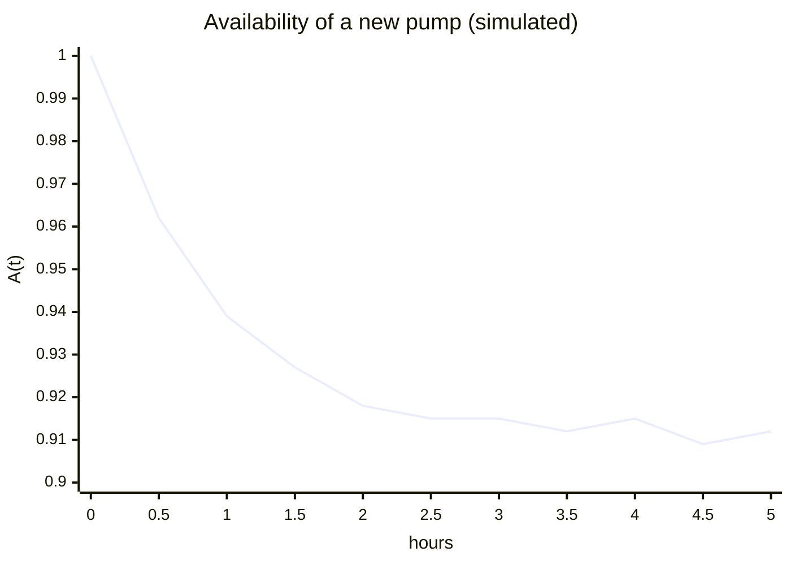
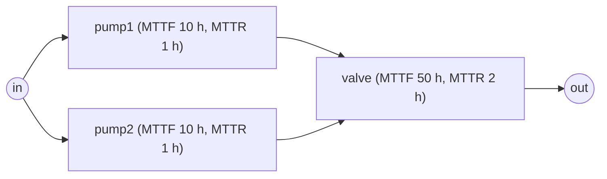

# Lesson 6: Repair and availability

!!! abstract "In this lesson"
    You will learn:

    - why repair changes the question, from "has it failed yet?" to "what
      fraction of the time does it work, how often does it stop, and for how
      long?";
    - the long-run availability and failure frequency of a repaired
      component, $A = \text{MTTF}/(\text{MTTF} + \text{MTTR})$ and
      $\omega = 1/(\text{MTTF} + \text{MTTR})$;
    - how availability changes after start-up, and how to simulate it and
      judge the simulation's error;
    - how to simulate until an answer is precise enough, and how to compare
      two designs far more precisely (common random numbers);
    - the availability of a system, how often it fails (from Birnbaum
      importance) and how long its outages last;
    - the pitfalls: availability is not reliability, and the long run is not
      the first few hours.

    **Before you start:** Lessons 1 to 4: [lifetimes and the
    MTTF](lifetimes.md), [series and parallel systems](systems.md), [the
    exact system probability](structure.md) and [Birnbaum
    importance](importance.md). About 40 minutes.

## The question

Your pumping station, the two pumps in parallel feeding a valve of the
earlier lessons, runs around the clock. A failed part is not thrown away: a
technician repairs it and puts it back into service. So far you have asked
about reliability: "has the system failed by time $t$?". For this plant the
answer is certain. Over any long stretch it fails many times, and each time
it comes back.

The useful questions are different. What fraction of the time does the plant
deliver? How often does it stop, and when it stops, for how long?
Production targets, contracts and staffing rest on these numbers. This lesson
answers all three, first for one component and then for the plant.

To keep the arithmetic small, the numbers are illustrative: each pump fails
on average every 10 hours and takes 1 hour to repair; the valve fails every
50 hours and takes 2 hours.

## One repairable component

### Up, down, up again

Follow one pump. It runs for a while, fails, is repaired, runs again, fails
again. Its life is a sequence of cycles, each an **up time** $U$ followed by
a **down time** $D$:

```text
      |<------ U1 ------>|<-- D1 -->|<---------- U2 ---------->|<-- D2 -->|<--- U3 ...
 up   +------------------+          +--------------------------+          +----------
                         |          |                          |          |
down                     +----------+                          +----------+
      0                fails     repaired                    fails     repaired    time
```

RePyability assumes, and so will you, that:

- each up time is drawn from the pump's lifetime distribution (its
  **reliability model**, [Lesson 1](lifetimes.md)), whose mean is the MTTF;
- each down time is drawn from its **repairability model**, the
  distribution of the time to repair, whose mean is the **MTTR** (mean time
  to repair);
- every repair leaves the pump **as good as new**, and all these times are
  independent.

After each repair the pump starts afresh, so its future looks like its past.
A process like this is called an **alternating renewal process**.

### What fraction of the time is it up?

The **availability** is the fraction of time the component is up. Over a long
time $T$ the pump completes about $T/(\text{MTTF} + \text{MTTR})$ cycles,
since that is the average length of one. Each cycle contributes on average
MTTF hours of up time, so the total up time is about
$T \cdot \text{MTTF}/(\text{MTTF} + \text{MTTR})$. Dividing by $T$:

$$
A = \frac{\text{MTTF}}{\text{MTTF} + \text{MTTR}}
$$

This is the **renewal-reward theorem**, stated intuitively: when a process
starts afresh after every cycle, the long-run fraction of time it spends in a
state is the expected time per cycle in that state divided by the expected
length of a cycle. Notice two things. It is a ratio of means, not the average
of each cycle's own up fraction: long cycles fill more of the timeline, so
they count for more. And only the means matter: two pumps with the same MTTF
and MTTR have the same long-run availability, whatever the shapes of their
distributions.

### How often does it fail?

Each cycle contains exactly one failure, and a cycle lasts
$\text{MTTF} + \text{MTTR}$ on average, so the component fails

$$
\omega = \frac{1}{\text{MTTF} + \text{MTTR}}
$$

times per unit time. This is its **failure frequency**.

For the pump, with MTTF = 10 hours and MTTR = 1 hour:

$$
A = \frac{10}{10 + 1} = 0.9091, \qquad
\omega = \frac{1}{11} = 0.0909 \text{ per hour}.
$$

The pump is up 90.9% of the time and down 9.1%, about 2.2 hours a day
($0.0909 \times 24 = 2.18$). It fails about 2.2 times a day, once every 11
hours on average.

!!! note "Failure frequency is not the failure rate"
    An exponential lifetime has the constant hazard (failure rate)
    $\lambda = 1/\text{MTTF} = 0.1$ per hour ([Lesson 1](lifetimes.md)).
    That counts failures per hour of *running*. The failure frequency counts
    them per hour of *calendar* time, and the pump cannot fail while it is
    being repaired: $\omega = A/\text{MTTF}$, here
    $0.9091 \times 0.1 = 0.0909$.

### In RePyability

A `RepairableRBD` is a block diagram of repairable components. Each
component is a dict holding its `"reliability"` (time-to-failure) and
`"repairability"` (time-to-repair) models. In practice both are fitted with
[surpyval](https://github.com/derrynknife/SurPyval) from failure and repair
records; here a helper builds exponential ones from their rates:

```python
import numpy as np
import surpyval as surv
from repyability import RepairableRBD

def unit(failure_rate, repair_rate):
    """A repairable component with exponential failure and repair times."""
    return {
        "reliability": surv.Exponential.from_params([failure_rate]),
        "repairability": surv.Exponential.from_params([repair_rate]),
    }

one_pump = RepairableRBD([("in", "pump"), ("pump", "out")], {"pump": unit(0.1, 1.0)})
one_pump.mean_availability()          # -> 0.9091    10 / (10 + 1)
one_pump.system_failure_frequency()   # -> 0.09091   failures per hour: 1 / 11
```

The rates are per hour: a failure rate of 0.1 means an MTTF of 10 hours, and
a repair rate of 1.0 an MTTR of 1 hour. Both results are exact long-run
values, computed from the formulas above with no simulation.

## Availability over time

### A new component starts up

The long-run value describes a pump that has been in service for a long
time. A brand-new pump is up at time 0, and for a while it is more likely
than usual to be up, because it has not yet had time to fail. So define the
**point availability** $A(t)$: the probability that the component is up at
time $t$. It starts at $A(0) = 1$ and settles towards the long-run
availability, which is both its limit and the fraction of a long stretch of
time spent up.

For an exponential component, with failure rate $\lambda = 1/\text{MTTF}$
and repair rate $\mu = 1/\text{MTTR}$, there is an exact formula:

$$
A(t) = \frac{\mu}{\lambda + \mu} + \frac{\lambda}{\lambda + \mu}\,e^{-(\lambda + \mu)t}
$$

The first term is the long-run availability, since
$\mu/(\lambda + \mu) = \text{MTTF}/(\text{MTTF} + \text{MTTR})$. The second
is the start-up **transient**, which dies away at the rate $\lambda + \mu$.
For the pump, $A(t) = 0.9091 + 0.0909\,e^{-1.1t}$: after three hours the
transient term is down to 0.003.

### Simulating the curve

For most distributions there is no such formula. RePyability can still
compute the curve without simulation, by solving the renewal equation behind
it numerically (`point_availability`, below), but a simulation shows where
the curve comes from, and gives more besides. It estimates
$A(t)$ by **Monte Carlo simulation**. `availability()` plays out
`mc_samples` independent histories of the system from time 0, every component new. For
each component it draws a time to failure, then a time to repair, then
another time to failure, and so on; it merges the components' events in time
order and checks the system after each one. The fraction of histories in
which the system is up at time $t$ estimates $A(t)$.

```python
result = one_pump.availability(t_simulation=5.0, mc_samples=10_000, seed=0)
result.availability[0]                                 # -> 1.0      every history starts up
np.interp(1.0, result.timeline, result.availability)   # -> 0.939    up at t = 1 h
np.interp(5.0, result.timeline, result.availability)   # -> 0.9123   up at t = 5 h
```

`t_simulation` is the length of each history. `result.timeline` holds the
times at which some history changed state, and `result.availability` the
fraction of histories up from each of those times until the next;
`np.interp` reads the curve at any time. Here it is every half hour, beside
the exact formula:

```python
hours = np.arange(0.0, 5.5, 0.5)
simulated = np.interp(hours, result.timeline, result.availability)
lam, mu = 0.1, 1.0
exact = mu / (lam + mu) + lam / (lam + mu) * np.exp(-(lam + mu) * hours)
simulated.round(3)
# array([1.   , 0.962, 0.939, 0.927, 0.918, 0.915, 0.915, 0.912, 0.915,
#        0.909, 0.912])
exact.round(3)
# array([1.   , 0.962, 0.939, 0.927, 0.919, 0.915, 0.912, 0.911, 0.91 ,
#        0.91 , 0.909])
```



The simulation follows the exact curve down from 1 and levels off near 0.91.
It is not perfectly smooth, though: between 3.5 and 4 hours it even rises a
little, which the exact curve never does.

`point_availability` computes the exact curve for any distributions, and
`mission_availability` its mean over a window, with no simulation:

```python
one_pump.point_availability(hours).round(3)
# array([1.   , 0.962, 0.939, 0.927, 0.919, 0.915, 0.912, 0.911, 0.91 ,
#        0.91 , 0.909])
one_pump.mission_availability(5.0)   # -> 0.92555  the mean over the first 5 hours
```

### How much to trust a simulation

That wobble is **sampling error**. Each point is a proportion of $N$
histories, so its standard error is $\sqrt{A(1 - A)/N}$: at $A \approx 0.91$
and $N = 10\,000$, about 0.003. A 95% confidence band reaches roughly two
standard errors either side, and `availability_interval()` computes it at
every point (by the Wilson method, which stays sensible near 0 and 1):

```python
result.availability_se[-1]   # -> 0.0028   standard error at t = 5 h
lower, upper = result.availability_interval(confidence=0.95)
lower[-1]   # -> 0.9066
upper[-1]   # -> 0.9177   the exact A(5) = 0.9095 lies inside
```

Two arguments govern the error. `mc_samples`, the number of histories $N$,
sets its size: the error shrinks like $1/\sqrt{N}$, so halving it takes four times as many histories. The `seed`
makes a run reproducible: the same seed gives the same numbers, and another
seed gives different numbers that are equally valid, within the same error.

### Precise enough, sooner

The band says how precise a run turned out to be. You can instead say how
precise it must be, and let the simulation decide how long to run. Suppose
you need the pump's **mean availability over its first 5 hours**, the
fraction of those hours it is up, to within ±0.001 at 95% confidence. Each
history has its own fraction up. Over 10 000 histories those fractions have
a standard deviation of about $s = 0.14$, so their mean has a standard error
of $s/\sqrt{N}$, and its 95% interval reaches $1.96\,s/\sqrt{N}$ either
side. For ±0.001 you need

$$
N \ge \left(\frac{1.96 \times 0.14}{0.001}\right)^2 \approx 75\,700.
$$

`tolerance` does this for you: it runs `mc_samples` histories, checks the
interval, and runs another `mc_samples` until the interval is narrow enough.
(A pump on its own has an exact mean availability, worked out below, and by
default a run takes it, so one to a tolerance stops at once; to watch the
simulation converge, `control_variate=False` makes it simulate, and keeps
the simulations' own mean.)

```python
precise = one_pump.availability(t_simulation=5.0, mc_samples=10_000, seed=0,
                                tolerance=0.001, control_variate=False)
precise.n_simulations            # -> 80000
window = precise.mean_availability_interval()
window.estimate                  # -> 0.9267
window.upper - window.estimate   # -> 0.00096
```

The exact answer is the average of the formula for $A(t)$ over the window,

$$
\frac{1}{5}\int_0^5 A(t)\,dt
= \frac{\mu}{\lambda + \mu}
+ \frac{\lambda}{5(\lambda + \mu)^2}\left(1 - e^{-5(\lambda + \mu)}\right)
= 0.9091 + 0.0165 = 0.9256,
$$

just below the interval, which starts at 0.9258. A 95% interval misses the
true value about one run in twenty, and this is one of them: the tolerance
bounds the interval's width, not the error of every run.

Two ideas get more precision out of each history, without changing what is
estimated.

**Comparing designs with the same random numbers.** Would a crew that
repairs the pump in half an hour on average, instead of an hour, be worth
it? Simulate each design separately and each estimate carries its own error,
so their difference carries both. Instead, simulate both with the *same*
random numbers: in each history the pump runs for the same up times in both
designs, and only the repairs differ. The chance in the histories is then
common to both designs and cancels in the difference. This is called
**common random numbers**, and `compare` does it:

```python
quick = RepairableRBD([("in", "pump"), ("pump", "out")], {"pump": unit(0.1, 2.0)})
gain = quick.compare(one_pump, t_simulation=5.0, mc_samples=10_000, seed=0)
gain.estimate         # -> 0.0314   exactly: 0.9569 - 0.9256 = 0.0314
gain.standard_error   # -> 0.00063
```

Two separate runs of 10 000 histories each give the difference with a
standard error of about 0.0017: to match `compare` they would need about
seven times as many histories.

**Antithetic pairs.** A history is built from random numbers $u$ between 0
and 1: a small $u$ gives a short time, a large one a long time. Run the
histories in pairs, the second using $1 - u$ wherever the first used $u$:
where the first had an early failure, the second has a late one. Both are
genuine histories, but they tend to err in opposite directions, so a pair's
average is closer to the truth than two unrelated histories' would be:

```python
paired = one_pump.availability(t_simulation=5.0, mc_samples=10_000, seed=0,
                               antithetic=True, control_variate=False)
paired.mean_availability_interval().standard_error   # -> 0.0012   0.0014 without pairs
```

Here the pairs are worth about 1.4 times as many histories. A system's
lifetime, which rises with every component's lifetime, gains more. The user
guide's [Simulation precision and speed](../guide/simulation.md) has every
option, including running the histories on several processor cores at once.

## The availability of a system

Now the plant:



Each component follows its own up-down cycle, independently of the others.
In the long run, at a moment chosen at random, component $i$ is up with
probability $A_i$, independently of the rest. The plant is up if its working
components connect input to output: the question Lessons 2 and 3 answered
for reliabilities. So the system's long-run availability is the same system
probability, evaluated at the availabilities:

$$
A_{\text{sys}} = h(A_1, \dots, A_n)
$$

Here $h(p_1, \dots, p_n)$ is the probability that the system works when each
component $i$ works with probability $p_i$, independently: $\prod_i p_i$ in
series, $1 - \prod_i (1 - p_i)$ in parallel, and the exact engine of
[Lesson 3](structure.md) in general.

=== "By hand"

    - Each pump: $A_P = 10/11 = 0.90909$.
    - The valve: $A_V = 50/52 = 0.96154$.
    - The pumps in parallel: $1 - (1/11)^2 = 120/121 = 0.99174$.
    - In series with the valve: $A_{\text{sys}} = 0.99174 \times 0.96154 = 0.9536$.

=== "In RePyability"

    ```python
    edges = [("in", "pump1"), ("in", "pump2"),
             ("pump1", "valve"), ("pump2", "valve"), ("valve", "out")]
    plant = RepairableRBD(
        edges,
        {"pump1": unit(0.1, 1.0), "pump2": unit(0.1, 1.0), "valve": unit(0.02, 0.5)},
    )
    plant.node_availability()
    # {'pump1': 0.9091, 'pump2': 0.9091, 'valve': 0.9615, 'in': 1.0, 'out': 1.0}
    plant.mean_availability()     # -> 0.9536
    plant.mean_unavailability()   # -> 0.04641
    ```

The plant is up 95.4% of the time and down 4.6%, about 1.1 hours a day. The
valve limits it despite its longer MTTF, because it has no backup; the
pumps' redundancy turns two 91% components into a 99.2% pair.

## How often does the system fail?

### A failure of a critical component

Availability does not say whether the lost 4.6% comes as one long outage a
month or as many short ones. For that you need the system's failure
frequency, $\omega_{\text{sys}}$.

The plant goes down at the moment a component fails while it is
**critical**, that is, while the rest of the plant is in a state where this
component alone decides the outcome ([Lesson 4](importance.md)). If `pump1`
fails while `pump2` runs, nothing happens; if it fails while `pump2` is under
repair and the valve works, the plant stops. Component $i$ fails $\omega_i$
times per hour. Whether it is critical depends only on the other components,
which are independent of it, so a fraction $I_B(i)$ of its failures find it
critical, where $I_B(i)$ is its Birnbaum importance (the probability that it
is critical), evaluated at the availabilities. Adding over the components:

$$
\omega_{\text{sys}} = \sum_i I_B(i)\,\omega_i
$$

=== "By hand"

    | Component | $\omega_i$ per hour | Critical when | $I_B(i)$ | $I_B(i)\,\omega_i$ |
    |---|---|---|---|---|
    | pump1 | $1/11 = 0.0909$ | pump2 down, valve up | $0.0909 \times 0.9615 = 0.0874$ | 0.00795 |
    | pump2 | $1/11 = 0.0909$ | pump1 down, valve up | $0.0874$ | 0.00795 |
    | valve | $1/52 = 0.0192$ | at least one pump up | $1 - 0.0909^2 = 0.9917$ | 0.01907 |
    | **plant** | | | | **0.03497** |

=== "In RePyability"

    ```python
    plant.birnbaum_importance()        # {'pump1': 0.0874, 'pump2': 0.0874, 'valve': 0.9917}
    plant.system_failure_frequency()   # -> 0.03497   plant failures per hour
    ```

The plant fails 0.035 times an hour, about 0.84 times a day. The last column
also says where those failures come from. Each pump fails nearly five times
as often as the valve, but a pump failure stops the plant only 8.7% of the
time: redundancy absorbs the rest. The valve, critical 99% of the time,
causes 55% of the plant's failures ($0.01907/0.03497$).

### Up time, down time and MTBF

The plant's own history alternates between up periods and outages. Over a
long time $T$ it is up for about $A_{\text{sys}}T$ in total, spread over
about $\omega_{\text{sys}}T$ up periods, and down for
$(1 - A_{\text{sys}})T$, spread over as many outages. Dividing:

$$
\text{MUT} = \frac{A_{\text{sys}}}{\omega_{\text{sys}}}, \qquad
\text{MDT} = \frac{1 - A_{\text{sys}}}{\omega_{\text{sys}}}, \qquad
\text{MTBF} = \text{MUT} + \text{MDT} = \frac{1}{\omega_{\text{sys}}}
$$

These are the **mean up time**, the **mean down time** (the average outage)
and the **mean time between failures**, from one failure to the next. For
the plant, $\text{MUT} = 0.9536/0.03497 = 27.27$ hours,
$\text{MDT} = 0.04641/0.03497 = 1.327$ hours and $\text{MTBF} = 28.60$
hours:

```python
plant.mean_up_time()                 # -> 27.27   hours up after each restoration
plant.mean_down_time()               # -> 1.327   hours per outage
plant.mean_time_between_failures()   # -> 28.6    1 / 0.03497
```

You can check the MDT against intuition. An outage caused by the valve lasts
about its 2-hour repair. An outage caused by the second pump failing ends as
soon as either pump is back, which with exponential repairs takes half an
hour on average (the faster of two 1-hour repairs). Weighting by the shares
above, $0.55 \times 2 + 0.45 \times 0.5 \approx 1.3$ hours.

!!! warning "The MTBF is not an MTTF"
    The MTBF belongs to the repairable system as a whole: 28.6 hours here,
    neither a pump's MTTF (10 hours) nor the valve's (50 hours). Even for a
    single component it is $\text{MTTF} + \text{MTTR}$ (11 hours for the
    pump), not the MTTF. Nor is it how long the plant would last without
    repair: from new, with no repairs, it would last
    $\int_0^\infty (2e^{-0.12t} - e^{-0.22t})\,dt = 2/0.12 - 1/0.22 = 12.1$
    hours on average (Lessons 1 and 2). With repair it runs 27.3 hours
    between outages, because a failed pump is usually back before its partner
    fails.

### The same numbers by simulation

The simulation estimates the same quantities by counting: `failure_frequency`
is the number of system failures divided by the total simulated time,
`mean_up_time` the total up time divided by the number of failures, and
`mean_down_time` the total down time divided by the number of restorations.

```python
sim = plant.availability(t_simulation=100.0, mc_samples=2_000, seed=0)
sim.failure_frequency   # -> 0.035155  exact: 0.03497
sim.mean_up_time        # -> 27.15     exact: 27.27
sim.mean_down_time      # -> 1.309     exact: 1.327
```

They agree to within sampling error. They also carry a small bias, because
every history starts new and its last period is cut short by the end of the
window. The exact methods have neither problem, so prefer them for long-run
values.

## What the simulation adds

If the exact methods give the long-run answers, why simulate? For two things
they cannot give.

**The start-up transient.** A new plant is up more often, at first, than in
the long run. Over its first 8-hour shift:

```python
first_shift = plant.availability(t_simulation=8.0, mc_samples=10_000, seed=0)
np.interp(1.0, first_shift.timeline, first_shift.availability)   # -> 0.9813   at 1 h
np.interp(8.0, first_shift.timeline, first_shift.availability)   # -> 0.9565   at 8 h
first_shift.system_uptime / (first_shift.n_simulations * 8.0)    # -> 0.964    over the shift
```

A new plant is up 96.4% of its first shift, against 95.4% in the long run,
and by the end of the shift it has settled; exactly,
`plant.mission_availability(8.0)` is 0.9640. With slow repairs or wear-out
lifetimes the transient lasts longer, and it can dip below the long-run
value (Exercise 5).

!!! tip "A check by hand"
    Independence holds at every instant, not only in the long run, so
    $A_{\text{sys}}(t) = h(A_1(t), \dots, A_n(t))$. With the exponential
    formula, at $t = 1$ hour each pump is at 0.9394 and the valve at
    $0.9615 + 0.0385\,e^{-0.52} = 0.9844$, so the plant is at
    $(1 - 0.0606^2) \times 0.9844 = 0.9808$. The simulation's 0.9813 is
    within its error.

**Criticality from the histories.** The simulation records which
component's failure took the plant down each time. Two of its measures are
the terms of the frequency formula, counted rather than computed:

```python
fci = sim.criticalities.failure_criticality_index
fci.per_system_failure      # {'pump1': 0.2189, 'pump2': 0.2243, 'valve': 0.5568}
fci.per_component_failure   # {'pump1': 0.0851, 'pump2': 0.0853, 'valve': 0.9934}
```

`per_system_failure` is each component's share of the plant's failures, an
estimate of $I_B(i)\,\omega_i/\omega_{\text{sys}}$ (exactly 0.227 for each
pump and 0.545 for the valve). `per_component_failure` is the fraction of the
component's own failures that stopped the plant, an estimate of the
probability that a failure finds it critical, $I_B(i)$ (0.0874 and 0.9917).
The guide covers these and the time-based measures in [Criticality
measures](../guide/repairable.md#criticality-measures).

## Instant repair, nested systems and planned outages

**Instant repair.** When a repair takes seconds and your question is about
hours, or when there is no repair-time data, give
`"repairability": "instant"`. The component still fails, and each failure
counts (as a zero-length outage, and in the costs of [Lesson 7](costs.md)),
but it is never down: its availability is exactly 1.

```python
quick_valve = RepairableRBD(
    edges,
    {
        "pump1": unit(0.1, 1.0),
        "pump2": unit(0.1, 1.0),
        "valve": {"reliability": surv.Exponential.from_params([0.02]),
                  "repairability": "instant"},
    },
)
quick_valve.mean_availability()          # -> 0.9917   only the pumps take it down
quick_valve.system_failure_frequency()   # -> 0.03636  more failures than before
```

The availability rises from 0.9536 to 0.9917, yet the plant fails *more*
often. The valve, never under repair, now fails every 50 hours instead of
every 52, and with the valve always up, each pump is critical whenever its
partner is down.

**Nested systems.** A `RepairableRBD` can itself be a component of another,
for example the pump pair as one subsystem node; the results are the same.
See [Nested repairable RBDs](../guide/repairable.md#nested-repairable-rbds).

**Planned outages.** Preventive maintenance ([Lesson 8](maintenance.md))
takes components down on purpose. That downtime counts against availability
and ends up periods, but it is not a failure: `system_failure_frequency()`
leaves it out, and the simulation counts it separately, in
`system_planned_outages`. The guide shows how to schedule it in [Preventive
maintenance](../guide/costs.md#preventive-maintenance).

## Pitfalls

!!! warning "Availability is not reliability"
    A component with MTTF 10 hours and MTTR 6 minutes is 99% available; so
    is one with MTTF 1000 hours and MTTR 10 hours. The first fails a hundred
    times as often. For a task that must not be interrupted (a production
    batch, a flight), what matters is the probability of no failure during
    it, which is reliability. Availability says only how much of the time
    you have the system, so report the failure frequency and the MDT beside
    it.

!!! warning "The long run is not the first few hours"
    The point availability starts at 1, and the long-run value is a limit.
    Over a short window after start-up, or after an overhaul, the average
    availability can differ from it: the plant's first shift averaged 0.964,
    not 0.9536. Compute the window you care about, with
    `mission_availability`, or simulate it.

!!! warning "Every component has its own repair crew"
    The model starts each repair the moment the component fails, and runs
    it independently of every other repair, as if each component had its
    own technician on site. With one shared crew, waiting for spares or
    travel time, outages last longer and overlap more, so the model is
    optimistic. `repair_crews` shares a number of crews (see [Repair
    crews](../guide/repairable.md#repair-crews)): the simulation follows
    the queue, and with exponential lives and repairs the long-run values
    stay exact, and the values over time numerical, from a Markov chain of
    the queue. The model also lets components keep running, and failing,
    while the system is down; in a real plant a pump that stops with the
    plant may not.

!!! warning "Simulated numbers carry sampling error"
    Everything `availability()` returns is an estimate. Quote it with its
    standard error or confidence band, increase `mc_samples` when the error matters,
    and compare with the exact long-run methods where they exist.

## Summary

!!! success "Key ideas"
    - With repair, the questions become how much of the time the system is
      up (availability), how often it fails (failure frequency), and for how
      long (mean down time).
    - A repaired component is up a fraction
      $A = \text{MTTF}/(\text{MTTF} + \text{MTTR})$ of the time in the long
      run and fails $\omega = 1/(\text{MTTF} + \text{MTTR})$ times per unit
      time; only the means matter.
    - A system's long-run availability is its system probability evaluated
      at the components' availabilities.
    - A system fails when a component fails while critical:
      $\omega_{\text{sys}} = \sum_i I_B(i)\,\omega_i$, and then
      $\text{MUT} = A/\omega$, $\text{MDT} = (1 - A)/\omega$ and
      $\text{MTBF} = 1/\omega$.
    - The point availability $A(t)$ starts at 1 and settles to the long-run
      value; `point_availability` computes it exactly, and a simulation
      estimates it, with an error that shrinks like $1/\sqrt{N}$.
    - `tolerance` simulates until an answer is precise enough; `compare`
      simulates two designs with the same random numbers, so the chance in
      the histories cancels in their difference; antithetic pairs make each
      history count for more.
    - High availability can hide frequent failures: report the failure
      frequency and MDT too.

## Exercises

**1.** A compressor has an MTTF of 200 hours and an MTTR of 5 hours. What are
its long-run availability and failure frequency? About how many hours a year
(8760 hours) is it down, and in how many outages?

??? success "Answer"
    $A = 200/205 = 0.9756$ and $\omega = 1/205 = 0.00488$ per hour. In a
    year it is down $8760 \times 5/205 = 214$ hours, in about
    $8760/205 = 43$ outages of 5 hours on average.

    ```python
    compressor = RepairableRBD([("in", "c"), ("c", "out")], {"c": unit(1 / 200, 1 / 5)})
    compressor.mean_availability()            # -> 0.9756
    compressor.system_failure_frequency()     # -> 0.004878   per hour
    8760 * compressor.mean_unavailability()   # -> 213.7      hours down a year
    ```

**2.** Two such compressors run in parallel: either can carry the load, and
each has its own repair crew. Find the availability, failure frequency, MDT
and MTBF of the pair.

??? success "Answer"
    The pair is down only when both are: $A = 1 - (5/205)^2 = 0.999405$.
    Each compressor is critical when the other is down, which has probability
    $I_B = 5/205 = 0.0244$, so
    $\omega_{\text{sys}} = 2 \times 0.0244 \times 0.00488 = 0.000238$ per
    hour: one failure every 4202.5 hours, about every six months, twenty
    times less often than one compressor. The MDT is
    $(1 - 0.999405)/0.000238 = 2.5$ hours, half a repair: when the second
    unit fails, the first is already partway through its repair, and the
    outage ends when either is back.

    ```python
    pair = RepairableRBD(
        [("in", "a"), ("in", "b"), ("a", "out"), ("b", "out")],
        {"a": unit(1 / 200, 1 / 5), "b": unit(1 / 200, 1 / 5)},
    )
    pair.mean_availability()            # -> 0.999405
    pair.system_failure_frequency()     # -> 0.000238
    pair.mean_down_time()               # -> 2.5
    pair.mean_time_between_failures()   # -> 4202.5
    ```

**3.** You can halve one repair time in the plant: the valve's (2 hours to
1) or one pump's (1 hour to 30 minutes). Which raises the plant's
availability more? Explain with Birnbaum importance.

??? success "Answer"
    The valve's. Its availability rises from $50/52 = 0.9615$ to
    $50/51 = 0.9804$ (up 0.0189), a pump's from $10/11 = 0.9091$ to
    $10/10.5 = 0.9524$ (up 0.0433). The system availability is a straight
    line in each component's availability, with slope $I_B(i)$
    ([Lesson 4](importance.md)), so the plant gains
    $0.9917 \times 0.0189 = 0.0187$ from the valve but only
    $0.0874 \times 0.0433 = 0.0038$ from the pump: five times less, although
    the pump's own gain is larger. The valve has no backup; the pump does.

    ```python
    faster_valve = RepairableRBD(
        edges, {"pump1": unit(0.1, 1.0), "pump2": unit(0.1, 1.0), "valve": unit(0.02, 1.0)}
    )
    faster_pump = RepairableRBD(
        edges, {"pump1": unit(0.1, 2.0), "pump2": unit(0.1, 1.0), "valve": unit(0.02, 0.5)}
    )
    faster_valve.mean_availability()   # -> 0.9723   from 0.9536
    faster_pump.mean_availability()    # -> 0.9574
    ```

**4.** In the simulation `sim` above (100 hours, $N = 2000$), the curve ends
at 0.9575, above the exact long-run availability of 0.9536. Is the plant still
settling, is something wrong, or is it noise?

??? success "Answer"
    Noise. The transient decays at the rates $1.1$ per hour (pumps) and
    $0.52$ per hour (valve), so it has long gone by 100 hours, and the true
    $A(100)$ is 0.9536. With $N = 2000$ the standard error is
    $\sqrt{0.954 \times 0.046/2000} = 0.0045$: the difference, 0.0039, is
    less than one standard error, and the 95% band contains 0.9536. The
    fraction of the whole window the plant was up, which averages over time
    as well as over histories, is closer still: 0.9545.

    ```python
    sim.availability[-1]      # -> 0.9575
    sim.availability_se[-1]   # -> 0.0045
    lower, upper = sim.availability_interval(confidence=0.95)
    lower[-1]   # -> 0.9477
    upper[-1]   # -> 0.9655
    sim.system_uptime / (sim.n_simulations * sim.time_simulated_to)   # -> 0.9545
    ```

**5.** A pump that wears out has a Weibull lifetime with shape 3 and an MTTF
of 10 hours, and is repaired as before. What is its long-run availability?
Simulate it over 40 hours: why does its availability dip below the long-run
value around 12 hours?

??? success "Answer"
    The long-run availability is still $10/11 = 0.9091$: only the means
    matter. The start-up is different. New pumps that wear out fail at
    similar ages, most of them between 5 and 15 hours, so around 12 hours an
    unusually large share is under repair: $A(12) = 0.889$. The repaired
    pumps are as good as new, and young pumps that wear out rarely fail, so
    a few hours later the curve swings above the long-run value (0.922 at 18
    hours). The swings fade as the pumps' cycles drift out of step. An
    exponential pump, whose failures do not depend on age, settles without
    swinging.

    ```python
    worn = RepairableRBD(
        [("in", "pump"), ("pump", "out")],
        {"pump": {"reliability": surv.Weibull.from_params([11.2, 3.0]),   # MTTF 10.0 h
                  "repairability": surv.Exponential.from_params([1.0])}},
    )
    worn.mean_availability()   # -> 0.9091
    curve = worn.availability(t_simulation=40.0, mc_samples=10_000, seed=0)
    np.interp(12.0, curve.timeline, curve.availability)   # -> 0.889
    np.interp(18.0, curve.timeline, curve.availability)   # -> 0.922
    ```

**6.** (a) Compare the pump with itself, `one_pump.compare(one_pump, 5.0)`.
What difference and standard error do you get, and why? What would two
separate runs give? (b) How many histories would it take to know the pump's
mean availability over its first 5 hours to within ±0.0005?

??? success "Answer"
    (a) A difference of exactly 0, with a standard error of 0: with the same
    random numbers the two (identical) designs have identical histories, so
    every history's difference is zero. Two separate runs of 10 000
    histories would differ by chance, typically by about their combined
    standard error, $\sqrt{2} \times 0.0014 = 0.002$.

    ```python
    same = one_pump.compare(one_pump, 5.0, mc_samples=1_000, seed=0)
    same.estimate          # -> 0.0
    same.standard_error    # -> 0.0
    ```

    (b) Halving the tolerance takes four times the histories:
    $(1.96 \times 0.14/0.0005)^2 \approx 4 \times 75\,700 \approx 303\,000$.
    With `tolerance=0.0005` (and `mc_samples=10_000`) the simulation stops at its
    first check past that, after 310 000 histories.

## Where next

[Lesson 7](costs.md) puts a price on all this: repairs, replacements and
lost production, over the long run and over a finite window. The user guide's
[Repairable systems](../guide/repairable.md) page has every option of
`RepairableRBD`, including conditioning on components held working or
broken, and [Concepts](../concepts.md#availability) summarises the theory.
To go the other way, from an availability target for this plant to the
MTTF or MTTR each pump and the valve needs, see
[Availability allocation](../guide/design.md#availability-allocation).
