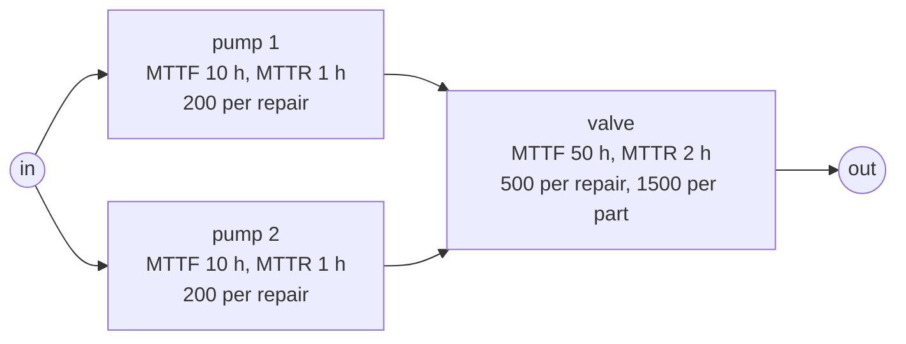
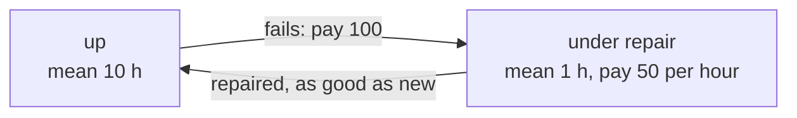
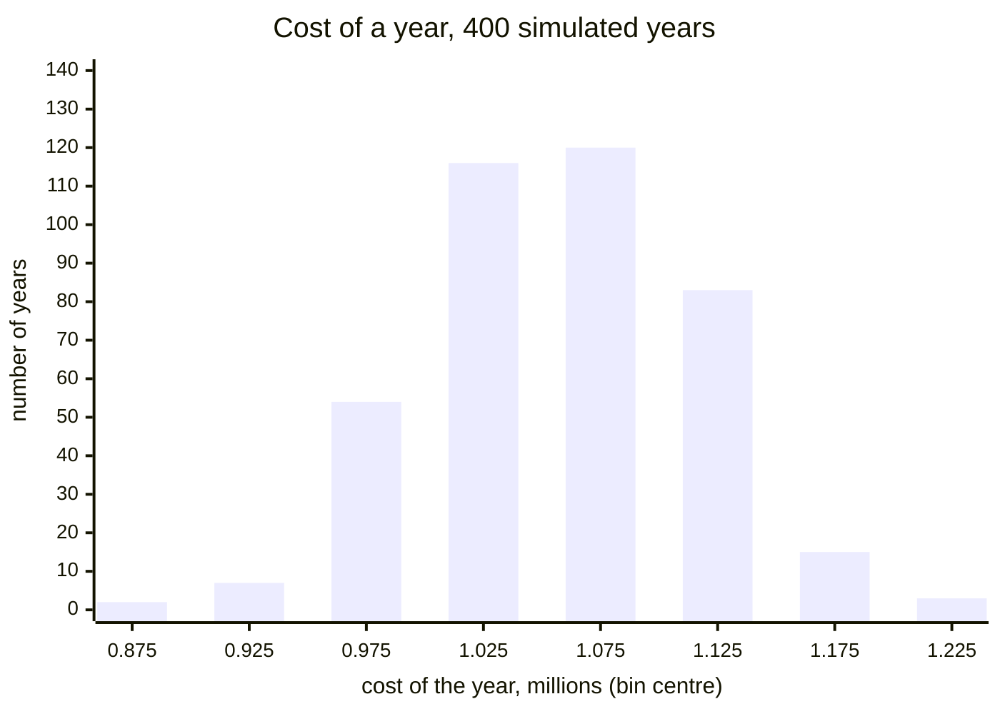

# Lesson 7: What it costs

!!! abstract "In this lesson"
    You will learn:

    - the three things a repairable system makes you pay for, and how to
      price each in RePyability;
    - the **renewal-reward** idea: a long-run cost per hour is the cost of a
      cycle divided by its length;
    - to work out a system's long-run cost rate by hand, check it with
      `expected_cost_rate()`, and see where the money goes;
    - to simulate a year's cost with `cost()` and budget with its
      percentiles;
    - to tell how much a year's cost varies from how precisely its mean is
      known, and what uncertain prices change;
    - to add the price of buying the system, and to find how much
      redundancy gives the lowest **total cost of ownership**.

    **Before you start:** [Lesson 6](availability.md). About 35 minutes.

## The question

You look after the repairable plant from [Lesson 6](availability.md): two
pumps in parallel feeding a valve, each part repaired whenever it fails. You
know it is up about 95% of the time. At the budget meeting nobody asks for a
percentage. The plant manager wants two numbers: what does running the plant
cost in a year, on average? And how much should be set aside so that a bad
year does not overrun the budget?

Availability cannot answer either question, because an hour of lost
production, a repair callout and a spare part all cost different amounts.
This lesson puts prices on the events Lesson 6 counted, turns them into an
exact cost per hour, and then simulates how much one year's cost can vary.

## What you pay for

A repairable component costs money in two ways: at each failure (someone is
called out, a part is fitted), and for as long as it is down. The system adds
a third: while the whole system is down, production is lost. RePyability has
a key for each:

| You pay for | Charged | Key |
|---|---|---|
| A repair: labour, a callout | at every failure of the component | `repair_cost`, in the component's dict |
| A replacement part | at every failure of the component | `replace_cost`, in the component's dict |
| The component being down: a hired stand-in, a penalty | per hour *that component* is down, even while the system runs | `downtime_cost`, in the component's dict |
| Lost production | per hour the *system* is down | `downtime_cost_rate=`, an argument of the RBD |

`repair_cost` and `replace_cost` fall due together; keeping them apart shows
labour and parts separately in the results. The two downtime prices differ in
*whose* downtime counts, which matters with redundancy: while one pump is
down, the other keeps the plant running.

Here is the plant, priced. Prices are plain numbers in whatever currency you
use, and times are in hours:

```python
import numpy as np
import surpyval as surv
from repyability import RepairableRBD

def unit(mttf, mttr, **prices):
    """An exponential component with the given MTTF and MTTR, and its prices."""
    return {
        "reliability": surv.Exponential.from_params([1 / mttf]),
        "repairability": surv.Exponential.from_params([1 / mttr]),
        **prices,
    }

edges = [("s", "pump1"), ("s", "pump2"), ("pump1", "valve"),
         ("pump2", "valve"), ("valve", "t")]
plant = RepairableRBD(
    edges,
    {
        "pump1": unit(10, 1, repair_cost=200),
        "pump2": unit(10, 1, repair_cost=200),
        "valve": unit(50, 2, repair_cost=500, replace_cost=1500),
    },
    downtime_cost_rate=1000,   # lost production per hour the plant is down
)
plant.has_costs   # True
```



MTTF and MTTR are the mean times to failure and to repair (an exponential
model takes the rate, one over the mean). Every price defaults to 0, so you
price only what you know; `has_costs` says whether anything is priced. A
misspelt key such as `repair_costs` raises a `ValueError` rather than pricing
nothing.

## One component: the cost of a cycle

Start smaller, with one pump working alone, so that its downtime is the
system's downtime. It has an MTTF of 10 h and an MTTR of 1 h, a repair costs
100, and each hour it is down loses 50 of production.

Its life is a string of **cycles**: up for a while (10 h on average), then it
fails (pay 100), is down under repair (1 h on average, paying 50 an hour),
and comes back as good as new. Because each repair makes it new, every cycle
is a fresh, independent copy of the same random experiment.



A cycle lasts 10 + 1 = 11 h on average and costs 100 + 50 × 1 = 150 on
average. Over a long time $t$ the pump completes about $t/11$ cycles, costing
about $150\,t/11$ in all: 150/11 = 13.64 per hour. This is the
**renewal-reward theorem**: when a process repeats in independent cycles, its
long-run cost per unit time is the expected cost of a cycle divided by the
expected length of a cycle. For one component,

$$
\text{cost rate}
= \frac{\operatorname{E}[\text{cost of a cycle}]}{\operatorname{E}[\text{length of a cycle}]}
= \frac{c_{\text{fail}} + c_{\text{down}} \cdot \text{MTTR}}{\text{MTTF} + \text{MTTR}},
$$

where $c_{\text{fail}}$ is the price of a failure and $c_{\text{down}}$ the
price of an hour down. Divide the two means: the average of each cycle's own
cost per hour is a different number, usually larger, because short cycles
have a huge cost per hour.

Split the fraction, and two quantities from Lesson 6 appear:

$$
\frac{100 + 50 \times 1}{11}
= \underbrace{\frac{1}{11}}_{\omega} \times 100
+ \underbrace{\frac{1}{11}}_{1 - A} \times 50
= 9.09 + 4.55 = 13.64.
$$

The pump fails $\omega = 1/(\text{MTTF} + \text{MTTR}) = 1/11$ times per hour,
and each failure costs 100. It is down a fraction
$1 - A = \text{MTTR}/(\text{MTTF} + \text{MTTR}) = 1/11$ of the hours, and
each such hour costs 50. Every cost term has this shape: **a rate times a
price**.

```python
one = RepairableRBD(
    [("s", "pump"), ("pump", "t")],
    {"pump": unit(10, 1, repair_cost=100)},
    downtime_cost_rate=50,
)
one.expected_cost_rate()   # -> 13.64   per hour: (100 + 50 × 1) / 11
```

Only the means entered: the long-run rate depends on the lifetime and
repair-time distributions only through MTTF and MTTR (their shapes matter for
the spread). A repair fast enough to ignore can be modelled with
`"repairability": "instant"`: the part still fails and pays its per-failure
prices, but is never down.

## The whole plant: rates times prices

In a system each price is charged at its own rate, and because the expected
value of a sum is the sum of the expected values, the expected costs add.
RePyability's long-run cost rate is

$$
\text{cost rate} =
\underbrace{c_{\text{sys}}\,(1 - A_{\text{sys}})}_{\text{lost production}}
+ \underbrace{\sum_i \omega_i \left(c^{\text{repair}}_i + c^{\text{replace}}_i\right)}_{\text{corrective actions}}
+ \underbrace{\sum_i (1 - A_i)\,c^{\text{down}}_i}_{\text{component downtime}},
$$

where $c_{\text{sys}}$ is `downtime_cost_rate` and $A_{\text{sys}}$ the
system's long-run availability; for each component $i$, $A_i$ is its
availability, $\omega_i$ its failure frequency, and $c^{\text{repair}}_i$,
$c^{\text{replace}}_i$ and $c^{\text{down}}_i$ its three prices. Each term is
still a rate times a price.

=== "By hand"

    From Lesson 6, $A_{\text{pump}} = 10/11 = 0.9091$ and
    $A_{\text{valve}} = 50/52 = 0.9615$. The plant is up when the valve is
    up and at least one pump is:

    $$
    A_{\text{sys}} = 0.9615 \times \left(1 - (1/11)^2\right) = 0.95359,
    \qquad 1 - A_{\text{sys}} = 0.04641.
    $$

    | Term | Rate | Price | Per hour |
    |---|---|---|---|
    | Lost production | 0.04641 of the hours | 1000 | 46.41 |
    | Pump 1 repairs | 1/11 = 0.0909 failures per hour | 200 | 18.18 |
    | Pump 2 repairs | 1/11 = 0.0909 failures per hour | 200 | 18.18 |
    | Valve repairs and parts | 1/52 = 0.0192 failures per hour | 500 + 1500 | 38.46 |
    | Component downtime | | none priced | 0 |
    | **Total** | | | **121.23** |

    A penalty of 30 per hour while a pump is in the workshop
    (`downtime_cost=30`) would add $2 \times (1/11) \times 30 = 5.45$ per
    hour through the third term.

=== "In RePyability"

    ```python
    plant.expected_cost_rate()               # -> 121.23   per hour, in the long run
    1000 * (1 - plant.mean_availability())   # -> 46.41    lost production
    200 / (10 + 1)                           # -> 18.18    each pump's repairs
    (500 + 1500) / (50 + 2)                  # -> 38.46    the valve's repairs and parts
    plant.expected_cost_rate() * 8760        # -> 1062003.8   a year of running
    ```

The plant costs 121.23 per hour, about 1.06 million over a year of
continuous running (8,760 hours). That answers the manager's first question,
exactly and without simulation.

The terms also show where the money goes: 38% lost production, 32% the
valve's bills, 30% the pumps'. Split the lost production by cause: the plant
stops when the valve is down (2/52 = 0.0385 of the hours: 38.46 per hour) or
when both pumps are down while the valve is up
($(1/11)^2 \times 0.9615 = 0.0079$: 7.95 per hour). Each pump fails almost
five times as often as the valve, yet the pumps cause only a sixth of the
lost production: their redundancy absorbs their failures, so they cost mostly
repair bills. The valve, a single point of failure, costs both.

## What would a perfect part be worth?

`expected_cost_rate` accepts `working_nodes`: components held working, which
never fail and so cost no repairs and no downtime. The difference from the
normal rate is what a perfect version of the part would be worth:

```python
plant.expected_cost_rate(working_nodes=["pump1"])   # -> 95.1
plant.expected_cost_rate(working_nodes=["valve"])   # -> 44.63
```

A pump that never failed would save 121.23 − 95.10 = 26.13 per hour: its own
18.18 of repairs, plus the 7.95 of lost production when both pumps are down.
A valve that never failed would save 121.23 − 44.63 = 76.61 per hour: its
38.46 of bills plus 38.14 of lost production, about 671,000 a year.

No real improvement makes a part perfect, so these are ceilings: the
improvement potential of [Lesson 4](importance.md), in money. A better
valve, condition monitoring or a spare on the shelf can save at most 76.61
per hour, and is not worth buying for more. `broken_nodes` asks the opposite
question, what an hour costs while a part is out of action:

```python
plant.expected_cost_rate(broken_nodes=["pump1"])   # -> 182.52   pump 1 away for overhaul
```

Each hour pump 1 is away costs 61.29 more than a normal hour.

## A year is not an average year

The exact rate is a long-run average, but a budget covers one year, in which
the number of failures and the length of each outage are random. The
manager's second question needs the **distribution** of a year's cost.

`cost(t_simulation, mc_samples=..., seed=...)` simulates `mc_samples`
independent windows of
`t_simulation` hours, each starting with every component new and working. It
charges every price as it falls due and returns a
[`CostResult`][repyability.CostResult] holding one total cost per window in
`samples`. Take `N = 400` years:

```python
year = plant.cost(t_simulation=8760.0, mc_samples=400, seed=0)
year.mean              # -> 1058918.3   mean cost of a year
year.cost_rate         # -> 120.88      the mean per hour, against the exact 121.23
year.std               # -> 58061.7     how much one year's cost varies
year.percentile(90)    # -> 1132614.9   nine years in ten cost less than this
```

The **90th percentile** is the cost that 90% of the simulated years stay
below. Grouping the 400 years into bins 50,000 wide shows the shape:

```python
counts, bins = np.histogram(year.samples, bins=np.linspace(0.85e6, 1.25e6, 9))
counts         # array([  2,   7,  54, 116, 120,  83,  15,   3])
counts.sum()   # -> 400   every simulated year falls in a bin
```



The mean, 1.059 million, agrees with the exact 1.062 million within the
simulation's error (next section). The spread is the new information: a
typical year lands within about 58,000 of the mean, and one year in ten costs
more than 1.133 million. That is the budget to set if you can accept an
overrun one year in ten; a budget equal to the mean is overrun about every
other year.

The result also breaks the mean down:

```python
year.by_category
# {'repair': 401813.5, 'replace': 252105.0, 'preventive': 0.0,
#  'inspection': 0.0, 'component_downtime': 0.0,
#  'system_downtime': 404999.82, 'setup': 0.0}
year.by_component
# {'pump1': 158658.0, 'pump2': 159120.5, 'valve': 336140.0}
sum(year.by_category.values())   # -> 1058918.3   the categories add up to the mean
```

The categories agree, within simulation error, with the exact terms times
8,760 (lost production: 46.41 × 8,760 ≈ 406,500). `by_component` holds each
component's own charges; lost production belongs to the system and is not
split among components. (`plant.availability(...)` runs the same simulation
and carries this result as its `cost`.)

## Two different uncertainties

The simulation holds two uncertainties that are easy to confuse:

- **How much a year's cost varies**: `std` and `percentile`. This is a
  property of the plant, since years genuinely differ. More simulations
  estimate it better but do not make it smaller.
- **How precisely the mean is known**: `mean_se`, the *standard error*
  $\text{std}/\sqrt{N}$, and `mean_interval(confidence)`, the range
  mean ± 1.96 × `mean_se` for 95% confidence. This comes from simulating
  only $N$ years, and shrinks like $1/\sqrt{N}$.

Run a quick 100 years with the same seed, which are the first 100 of the
400, and compare them with the 400:

```python
quick = plant.cost(t_simulation=8760.0, mc_samples=100, seed=0)
quick.std              # -> 56910.1
quick.percentile(90)   # -> 1128018.5
quick.mean_se          # -> 5691.0
year.mean_se           # -> 2903.1
interval = year.mean_interval(0.95)
interval.lower         # -> 1053228.4
interval.upper         # -> 1064608.3
interval.lower < plant.expected_cost_rate() * 8760 < interval.upper   # True
```

| | N = 100 | N = 400 | Shrinks as N grows? |
|---|---|---|---|
| `std` | 56,910 | 58,062 | no |
| `percentile(90)` | 1,128,018 | 1,132,615 | no |
| `mean_se` | 5,691 | 2,903 | yes, like $1/\sqrt{N}$ |
| `mean_interval(0.95)` | 1,039,510 to 1,061,819 | 1,053,228 to 1,064,608 | yes |

Four times the simulations halved the standard error and the width of the
interval, and left the spread where it was. The exact cost of an average
year, 1,062,004, lies inside the 400 years' interval, and just above the 100
years': a 95% interval misses the true value about one time in twenty. Check `mean_interval` before
quoting a simulated mean; quote a percentile when the question is about one
year.

## Short windows start new

Two things separate a simulated mean from rate × window. One is simulation
error, above. The other is the start: every simulated window begins with all
components new and working, not in the long-run mix of up and down.

The start pulls two ways. No outage is under way at time 0, so lost
production builds up only as the first failures arrive. Meanwhile failures
come slightly faster than on average: a pump that is up fails at 1/10 per
hour, whereas in the long run, counting its time under repair, it fails 1/11
per hour. For this plant the first effect is larger, so a short window costs
less per hour. An 8-hour shift shows it:

```python
shift = plant.cost(t_simulation=8.0, mc_samples=10_000, seed=0)
shift.cost_rate                             # -> 111.5   per hour, against 121.23
shift.by_category["system_downtime"] / 8    # -> 35.7    lost production per hour, against 46.41
shift_interval = shift.mean_interval(0.95)
shift_interval.upper / 8                    # -> 115.06  per hour, below 121.23
```

The whole 95% interval lies below 121.23, so the gap is real. Within a few
repair times (about ten hours here) the plant forgets how it started and
costs accrue at the long-run rate, so the start-up saving is a fixed sum
(about (121.23 − 111.5) × 8 ≈ 78 in the shift) that does not grow with the
window. Over a year it is lost in the noise: the year's mean came out 3,100
below rate × window, forty times the start-up saving, so that gap is
simulation error (1.1 standard errors).

Short windows also have lopsided distributions, in which the mean is not a
typical value:

```python
shift.percentile(50)   # -> 400.0    the median shift: two pump repairs
shift.mean             # -> 891.74
shift.percentile(90)   # -> 3018.3
```

## Prices that vary

Real invoices vary: one pump repair takes an hour, another needs a day and
parts. A per-failure price can therefore be a distribution instead of a
number, typically fitted to past invoices with
[surpyval](https://github.com/derrynknife/SurPyval) (fitting belongs there,
not in RePyability). Here a LogNormal stands in for such a fit. The logarithm
of an invoice is Normal with mean $\mu$ and standard deviation 0.5, so the
invoice's mean is $e^{\mu + 0.5^2/2}$, and $\mu = \ln 200 - 0.125$ makes it
200:

```python
invoices = surv.LogNormal.from_params([np.log(200) - 0.5**2 / 2, 0.5])
invoices.mean()        # -> 200.0
invoices.qf(0.05)      # -> 77.5    one invoice in twenty is below this
invoices.qf(0.95)      # -> 401.7   and one in twenty above this
variable = RepairableRBD(
    edges,
    {
        "pump1": unit(10, 1, repair_cost=invoices),
        "pump2": unit(10, 1, repair_cost=invoices),
        "valve": unit(50, 2, repair_cost=500, replace_cost=1500),
    },
    downtime_cost_rate=1000,
)
variable.expected_cost_rate()   # -> 121.23   unchanged
```

Three things follow:

- The exact rate uses only the price's mean (expected values add, again), so
  it is unchanged at 121.23.
- The simulation draws a fresh price at every failure, which widens the
  spread.
- The prices come from a random stream of their own, so with the same seed
  the failures and outages are exactly those simulated before. Only the
  prices differ, which makes the comparison fair.

```python
priced = variable.cost(t_simulation=8760.0, mc_samples=100, seed=0)
priced.by_category["system_downtime"] == quick.by_category["system_downtime"]   # True
priced.std             # -> 57088.0   against 56910.1 at a fixed 200
```

The spread barely moved. A year holds about 2 × 8,760/11 ≈ 1,600 pump
repairs, and their price variations largely cancel. Price uncertainty matters
more for rare, expensive events, where there are too few charges to average
out. Only the per-failure prices may be distributions: `downtime_cost` and
`downtime_cost_rate` must be numbers, since they are rates and the outage
lengths already make them random.

## Buying redundancy

So far the plant was already built. When you design one, the question is how
much redundancy to buy, and the answer depends on how long you will own it.
A redundant unit is bought once, and then it runs: it fails, is repaired
and costs money for as long as you own it, while it saves the lost
production of the outages it covers. The **total cost of ownership** over a
horizon $H$ counts both:

$$
\text{total} = \underbrace{\sum_i a_i}_{\text{buying}} + \underbrace{H \times \text{cost rate}}_{\text{running}},
$$

with $a_i$ each component's price, its `acquisition_cost`. Take a transfer
pump with an MTTF of 1000 h and an MTTR of 10 h, 500 per repair, bought for
20,000, where an hour without pumping loses 100. Is a second pump, in
parallel, worth buying?

=== "By hand"

    One pump is down $U = 10/1010 = 0.0099$ of the hours and fails
    $\omega = 1/1010$ times per hour. It costs $500/1010 = 0.495$ per hour
    in repairs and $100 \times 0.0099 = 0.990$ per hour in lost production:
    1.485 per hour. Over ten years (87,600 h) that is
    $20{,}000 + 87{,}600 \times 1.485 = 150{,}099$.

    Two pumps fail and are repaired independently, so both are down
    $U^2 = 9.8 \times 10^{-5}$ of the hours: lost production falls to
    $100 \times U^2 = 0.0098$ per hour, while the repairs double to 0.990.
    Over ten years: $40{,}000 + 87{,}600 \times 0.9999 = 127{,}591$. The
    second pump saves 22,508.

    Per hour it saves $100 \times (U - U^2) = 0.980$ of lost production and
    costs 0.495 of repairs, a net 0.485, which repays its 20,000 after
    $20{,}000 / 0.485 = 41{,}200$ hours, about 4.7 years. Over one year it
    does not pay.

    A third pump would cover only the times both others are down: it saves
    at most $100 \times U^2 (1 - U) = 0.0097$ per hour, less than the 0.495
    its own repairs cost. It never pays, whatever its price and however long
    you own the plant.

=== "In RePyability"

    ```python
    pump = {
        "reliability": surv.Exponential.from_params([1 / 1000]),
        "repairability": surv.Exponential.from_params([1 / 10]),
        "repair_cost": 500,
        "acquisition_cost": 20000,   # paid once
    }
    line = RepairableRBD([("s", "pump"), ("pump", "t")], {"pump": pump},
                         downtime_cost_rate=100)
    line.expected_cost_rate()   # -> 1.4851   per hour: buying is not a running cost
    line.total_cost(87600)      # -> 150099.0   one pump, ten years

    best = line.allocate_redundancy(87600)
    best.units                  # {'pump': 2}
    best.total_cost             # -> 127591.4
    best.acquisition_cost       # -> 40000.0
    line.allocate_redundancy(8760).units   # {'pump': 1}   one year
    ```

`allocate_redundancy` weighs every design this way: for each component that
has an `acquisition_cost`, how many copies give the lowest total over the
horizon. Each design is scored exactly, as you just did by hand, so it works
on any diagram.

The third pump shows why this is a harder search than the one in
[Lesson 9](design.md). There, a more reliable design was always better, and
only the budget stopped the copies. Here each copy costs as much as the one
before and saves a fraction $U$ of what the one before saved, so the total
falls and then rises. The rule you used for the third pump bounds the
search: the $k{+}1$-th copy of a unit down a fraction $U$ of the time saves
at most $H \times c_{\text{sys}} \times U^k (1 - U)$ (what it would save
were everything else perfect), so once that is less than a copy's price and
running cost, no further copy is worth trying. Within those bounds the
search is exhaustive, and its answer a proven optimum.

A contract may instead demand a minimum availability. Then the cheapest
design that meets it may need copies that do not pay for themselves:

```python
line.allocate_redundancy(87600, min_availability=0.99999).units   # {'pump': 3}
```

Two cautions. The copies are assumed to fail independently: a common cause
(Lesson 5) sets a floor that no number of copies gets below, so price it in
before trusting a design with many copies. And unless you give a
`discount_rate`, money spent in ten years counts the same as money spent now
(see the pitfall below).

## Pitfalls

!!! warning "Costs are not discounted unless you ask"
    By default a cost next year counts the same as one today. That is fine
    for a year's budget; to compare designs over a 20-year life, give
    `total_cost` and `allocate_redundancy` a `discount_rate`: a continuous
    rate per unit time of the models, `math.log(1.07) / 8760` for 7% a year
    with lives in hours. It can change which design wins, as a copy bought
    now saves money later. The rest (`expected_cost`, the cost rates, the
    simulated costs) stays undiscounted.

!!! warning "A mean alone hides risk"
    Designs with the same `expected_cost_rate()` can have very different bad
    years, and over a short window the mean is not even a typical value.
    Budget with a percentile from `cost()`.

!!! warning "Price lost production on the system, not on the parts"
    Lost production is often the largest cost, and how much of it a part
    causes depends on the structure. Pricing it on the pumps
    (`downtime_cost=1000` on each) would charge $1000/11 = 90.91$ per hour
    per pump, 181.82 in all, for outages that, thanks to the redundancy, lose
    7.95 per hour of production. Use `downtime_cost_rate`, and let the
    structure decide when production stops.

!!! warning "Simulated numbers carry error"
    `cost()` estimates what `expected_cost_rate()` computes exactly. Check
    `mean_interval` before quoting a simulated mean, and remember that every
    simulated window starts new.

## Summary

!!! success "Key ideas"
    - A repairable system costs money at each failure (`repair_cost`,
      `replace_cost`), per hour a component is down (`downtime_cost`), and
      per hour the system is down (`downtime_cost_rate`).
    - **Renewal-reward:** in the long run, cost per hour = expected cost of a
      cycle / expected length of a cycle. One component costs
      $(c_{\text{fail}} + c_{\text{down}} \cdot \text{MTTR}) / (\text{MTTF} + \text{MTTR})$
      per hour.
    - A system's long-run cost rate is a sum of rates times prices,
      $c_{\text{sys}}(1 - A_{\text{sys}}) + \sum_i \omega_i (c^{\text{repair}}_i + c^{\text{replace}}_i) + \sum_i (1 - A_i)\,c^{\text{down}}_i$.
      `expected_cost_rate()` computes it exactly; its terms show where the
      money goes, and `working_nodes` prices a perfect part.
    - One year's cost is random: `cost()` simulates its distribution. Budget
      with a percentile, not the mean.
    - `std` and `percentile` describe the plant and do not shrink with $N$;
      `mean_se` and `mean_interval` describe the simulation and shrink like
      $1/\sqrt{N}$.
    - An uncertain price enters the exact rate through its mean; in a
      simulation it widens the spread without changing the failures.
    - The **total cost of ownership** over $H$ hours is the price of buying
      the components (`acquisition_cost`) plus $H$ times the cost rate:
      `total_cost(H)`. A redundant copy pays when the lost production it
      saves over the horizon exceeds its price and its own running cost;
      `allocate_redundancy(H)` finds the design with the lowest total.

## Exercises

**1.** A conveyor drive runs alone: MTTF 200 h and MTTR 5 h, both
exponential. Each failure costs 300 in labour and 700 in parts, and each hour
it is down loses 400 of production. (a) What does it cost per hour in the
long run, and per year? (b) A spare drive kept on site would make each swap
so quick that you can treat repair as instant. What is the spare worth per
year?

??? success "Answer"
    (a) A cycle lasts 205 h on average and costs 300 + 700 + 400 × 5 = 3,000,
    so the rate is 3000/205 = 14.63 per hour, about 128,200 a year;
    two-thirds of it is lost production.

    (b) With instant repair the drive is never down, but it still fails
    every 200 h on average: 1000/200 = 5.00 per hour. The spare saves 9.63
    per hour, about 84,400 a year; holding it pays if it costs less.

    ```python
    drive = RepairableRBD(
        [("s", "drive"), ("drive", "t")],
        {"drive": unit(200, 5, repair_cost=300, replace_cost=700)},
        downtime_cost_rate=400,
    )
    drive.expected_cost_rate()          # -> 14.63
    drive.expected_cost_rate() * 8760   # -> 128195.1

    swap = RepairableRBD(
        [("s", "drive"), ("drive", "t")],
        {"drive": {"reliability": surv.Exponential.from_params([1 / 200]),
                   "repairability": "instant",
                   "repair_cost": 300, "replace_cost": 700}},
        downtime_cost_rate=400,
    )
    swap.expected_cost_rate()           # -> 5.0
    (drive.expected_cost_rate() - swap.expected_cost_rate()) * 8760   # -> 84395.1
    ```

**2.** For the plant, `year.percentile(90)` is about 1.133 million. What does
this number mean for the plant manager? How often would a budget equal to
the mean be overrun, and is 1.133 million the worst case?

??? success "Answer"
    Nine simulated years in ten cost less than 1.133 million, so a budget of
    that size is overrun about one year in ten. A year's cost is spread
    almost symmetrically about its mean, so a budget of the mean would be
    overrun about one year in two. It is not a worst case: one year in ten
    costs more, and the costliest simulated year reached 1.240 million. It
    is also an estimate from 400 years; another seed would move it by a few
    thousand.

    ```python
    np.mean(year.samples > year.percentile(90))   # -> 0.1
    np.mean(year.samples > year.mean)             # -> 0.5
    year.samples.max()                            # -> 1239572.6
    ```

**3.** How many simulated years would you need to know the plant's expected
yearly cost to within ±1,000, with 95% confidence? What would you do instead?

??? success "Answer"
    The interval's half-width is 1.96 × std/√N, so you need
    N ≥ (1.96 × 58,100/1,000)² ≈ 13,000 years, about thirty times the 400
    simulated. Use the exact rate instead: `plant.expected_cost_rate() * 8760`
    gives 1,062,003.8 with no simulation error at all. Simulate for the
    spread, which the exact rate cannot give.

    ```python
    round((1.96 * year.std / 1000) ** 2)   # -> 12951
    ```

**4.** Would a second valve, in parallel with the first, pay for itself in
this plant? At what price of lost production would it start to?

??? success "Answer"
    With two valves the plant stops only when both pumps or both valves are
    down: $1 - A_{\text{sys}} = 1 - (1 - (1/11)^2)(1 - (2/52)^2) = 0.00973$.
    Lost production falls from 46.41 to 9.73 per hour, a saving of 36.68,
    but the second valve fails as often as the first and adds 38.46 per hour
    of bills. Net, the plant costs 1.79 per hour more (123.02 against
    121.23), before paying for the valve. Availability rises from 0.954 to
    0.990, yet so does the running cost. The valve pays once an hour of lost
    production costs more than $38.46 / (0.04641 - 0.00973) \approx 1049$.

    ```python
    edges2 = [("s", "pump1"), ("s", "pump2"),
              ("pump1", "valve1"), ("pump1", "valve2"),
              ("pump2", "valve1"), ("pump2", "valve2"),
              ("valve1", "t"), ("valve2", "t")]
    valve = unit(50, 2, repair_cost=500, replace_cost=1500)
    two_valves = RepairableRBD(
        edges2,
        {"pump1": unit(10, 1, repair_cost=200),
         "pump2": unit(10, 1, repair_cost=200),
         "valve1": valve, "valve2": valve},
        downtime_cost_rate=1000,
    )
    two_valves.mean_availability()    # -> 0.9903
    two_valves.expected_cost_rate()   # -> 123.02
    (2000 / 52) / (plant.mean_unavailability() - two_valves.mean_unavailability())   # -> 1048.7
    ```

**5.** The plant's valve (MTTF 50 h, MTTR 2 h, 500 + 1500 per failure)
costs 30,000 to buy. Over ten years (87,600 h), is a second valve in
parallel worth buying (a) as priced, at 1000 per hour of lost production;
(b) at 5000? (c) From what price of lost production does it pay?

??? success "Answer"
    With both pumps as they are, a second valve lowers the plant's
    unavailability by $A_{\text{pumps}} (U_v - U_v^2) = 0.99174 \times
    (1/26 - 1/26^2) = 0.03668$, and adds $2000/52 = 38.46$ per hour of bills.
    Over $H$ hours it pays when $c_{\text{sys}} \times 0.03668 \times H$
    exceeds $30{,}000 + 38.46\,H$: for ten years, when
    $c_{\text{sys}} > (30{,}000/87{,}600 + 38.46) / 0.03668 = 1058$.

    (a) At 1000 per hour, no: it saves 36.68 per hour and costs 38.46 before
    its price (Exercise 4). (b) At 5000, yes: it saves 183.38 per hour,
    and pays for itself in about 207 hours. (c) From about 1058 per hour,
    only a little above Exercise 4's 1049: over ten years its price adds
    only 0.34 per hour. A third valve would save at most
    $5000 \times (1/26)^2 (25/26) = 7.11$ per hour, less than its bills,
    so even at 5000 two valves are best.

    ```python
    def plant_at(price_of_an_hour):
        return RepairableRBD(
            edges,
            {"pump1": unit(10, 1, repair_cost=200),
             "pump2": unit(10, 1, repair_cost=200),
             "valve": unit(50, 2, repair_cost=500, replace_cost=1500,
                           acquisition_cost=30000)},
            downtime_cost_rate=price_of_an_hour,
        )

    plant_at(1000).allocate_redundancy(87600).units   # {'valve': 1}
    plant_at(5000).allocate_redundancy(87600).units   # {'valve': 2}
    plant_at(1057).allocate_redundancy(87600).units   # {'valve': 1}
    plant_at(1059).allocate_redundancy(87600).units   # {'valve': 2}
    ```

## Where next

- [Lesson 8: Maintaining on purpose](maintenance.md). So far a part is
  touched only when it fails. Replacing it before it fails adds a fourth kind
  of cost, the planned replacement, and changes the other three: fewer
  failures, but planned stops. Lesson 8 prices that trade with the same two
  tools.
- [Costs](../guide/costs.md) in the user guide: every pricing option, costs
  drawn from distributions, instant repair, preventive maintenance and the
  total cost of ownership.
- [Concepts: Costs](../concepts.md#costs) for the theory in brief, and
  [Repairable systems](../guide/repairable.md) for the simulation that
  `cost()` runs.
