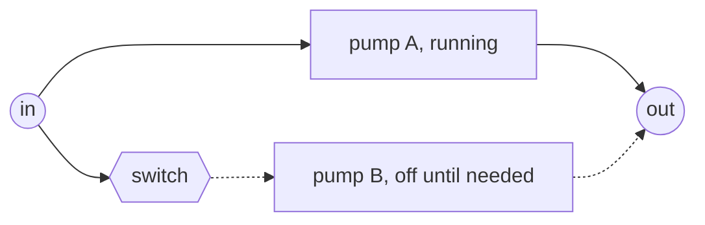
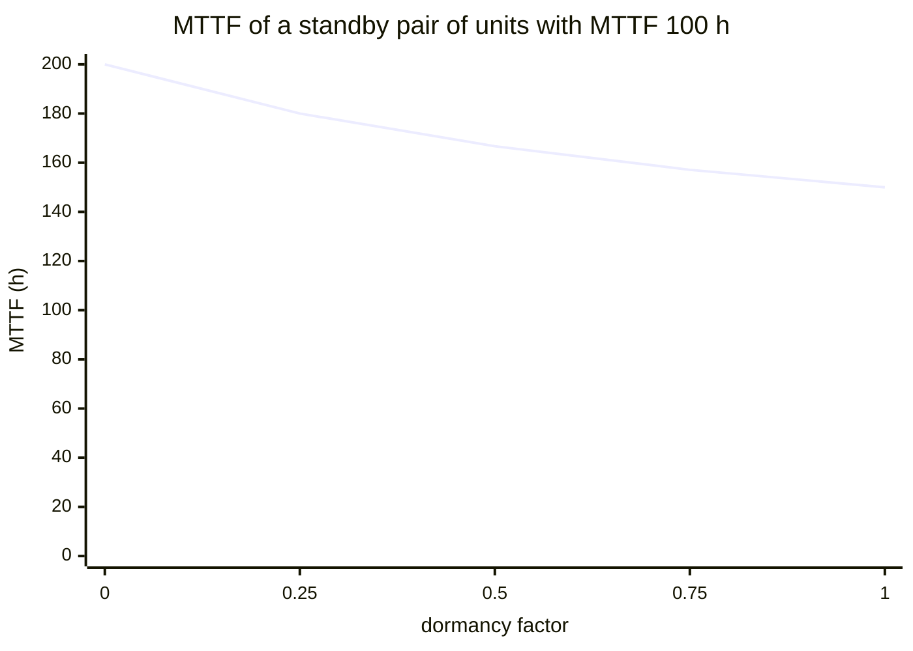
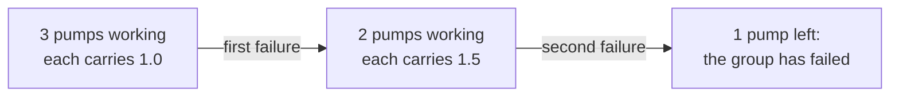
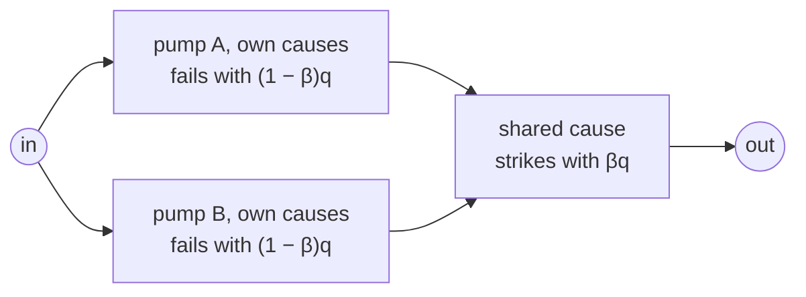

# Lesson 5: When redundancy disappoints

!!! abstract "In this lesson"
    You will learn:

    - the two assumptions behind the parallel formula of Lesson 2, and what
      happens when real redundancy breaks them,
    - how cold, warm and hot standby compare with active redundancy, and what
      an imperfect switch costs,
    - why units that share a load fail sooner,
    - how a common cause puts a floor under a redundant group's
      unreliability (the beta-factor model),
    - how to compute each case with `StandbyModel`, `LoadSharingModel` and
      `CCFGroup`, and the pitfalls of each.

    **Before you start:** [Lesson 1](lifetimes.md) (exponential lifetimes
    and MTTF) and [Lesson 2](systems.md) (series, parallel and
    *k*-out-of-*n*). About 35 minutes.

## The question

In [Lesson 2](systems.md) two pumps in parallel, each failing with
probability $q = 0.1$, failed together with probability $q^2 = 0.01$: ten
times less often than one pump. That multiplication hides two assumptions.
Both pumps run all the time (**active redundancy**), and they fail
**independently**: knowing that one has failed tells you nothing about the
other.

Real redundancy often breaks one of them. The second pump may wait switched
off until it is needed, so it does not wear, but something must then detect
the failure and switch it in. The pumps may share the flow, so that when one
fails the other runs at full load and wears faster. And two pumps of the same
model, from one batch, in one room, serviced by one technician, can be
stopped together by a single cause.

This lesson works out how much of the benefit of redundancy each case adds
or takes away. The code on this page uses these imports:

```python
import numpy as np
import surpyval as surv
from repyability import (
    BetaFactor,
    CCFGroup,
    LoadSharingModel,
    NonRepairableRBD,
    RegressionNode,
    StandbyModel,
)
```

## A spare that waits: standby redundancy

### Cold standby

Look at the active pair first. Both pumps start at time zero and both age,
so when the first fails the survivor is not new. The pair's life is the
*longer* of the two lifetimes, $\max(T_1, T_2)$.

In **cold standby** the second pump is off and does not age while it waits.
When the running pump fails, a **switch** (whatever detects the failure and
starts the spare: a controller, a changeover valve, an operator) brings the
spare in, and its life starts then. With a switch that always works, the
pair's life is the *sum* $T_1 + T_2$, never shorter than the longer of the
two.



The dotted path carries the flow only after pump A has failed, and only if
the switch works.

**The formula.** Take two identical units with exponential lives of rate
$\lambda$ (a constant hazard, and an MTTF of $1/\lambda$; see
[Lesson 1](lifetimes.md)) and a perfect switch. The pair survives to time
$t$ if the first unit survives, or if it fails at some earlier time $s$ and
the spare survives the remaining $t - s$:

$$
R(t) = e^{-\lambda t}
+ \int_0^t \underbrace{\lambda e^{-\lambda s}}_{\text{A fails at } s}\,
\underbrace{e^{-\lambda (t - s)}}_{\text{B survives the rest}}\,ds
= e^{-\lambda t} + \lambda t\, e^{-\lambda t}
= e^{-\lambda t}(1 + \lambda t).
$$

The integrand equals $\lambda e^{-\lambda t}$ whatever $s$ is, so the
integral is $\lambda t\, e^{-\lambda t}$. Equivalently, while one unit runs
at a time failures arrive at the constant rate $\lambda$, so their number by
time $t$ is Poisson with mean $\lambda t$, and the pair survives if it is 0
or 1.

The mean life follows from $T_1 + T_2$. Beside it, the active pair's from
Lesson 2:

$$
\text{MTTF}_{\text{cold}} = \frac{1}{\lambda} + \frac{1}{\lambda} = \frac{2}{\lambda},
\qquad
\text{MTTF}_{\text{active}} = \frac{1}{2\lambda} + \frac{1}{\lambda} = \frac{1.5}{\lambda}.
$$

Read both as two **stages**. While both active units run, failures come at
the combined rate $2\lambda$, so the first arrives after $1/(2\lambda)$ on
average; the survivor, which has no memory of its age, lasts another
$1/\lambda$. The cold pair has only one unit exposed in its first stage, so
that stage lasts $1/\lambda$. That is the whole advantage of standby: fewer
units exposed at once.

=== "By hand"

    Units with an MTTF of 100 h have $\lambda = 0.01$ per hour. At
    $t = 100$ h, $\lambda t = 1$:

    - one unit: $e^{-1} = 0.3679$,
    - active pair: $1 - (1 - e^{-1})^2 = 0.6004$,
    - cold standby: $e^{-1}(1 + 1) = 0.7358$.

    The MTTFs are 100 h, 150 h and 200 h.

=== "In RePyability"

    ```python
    unit = surv.Exponential.from_params([0.01])   # MTTF 100 h
    pair_edges = [("s", "a"), ("s", "b"), ("a", "t"), ("b", "t")]
    active = NonRepairableRBD(pair_edges, {"a": unit, "b": unit})
    cold = StandbyModel([unit, unit])   # one running, one cold spare

    active.sf(100)   # -> 0.6004
    cold.sf(100)     # -> 0.7358
    cold.mean()      # -> 200.0
    ```

A [`StandbyModel`][repyability.StandbyModel] takes the units in the order
they will be used and makes the arrangement, switch included, **one node**
for any RBD. By default one unit works at a time (`k=1`), the switch is
perfect (`switching_probability=1.0`) and the spare is cold
(`dormancy_factor=0`). For identical exponential units and a perfect switch
it uses the formula above (the Erlang distribution), so these numbers are
exact. Over 100 h the cold pair fails with probability 0.264 and the active
pair with 0.400: a third fewer failures from the same two pumps.

### An imperfect switch

The spare helps only if the switch works when called on. If it works with
probability $p$, the second term of $R(t)$ is multiplied by $p$:

$$
R(t) = e^{-\lambda t}\,(1 + p\,\lambda t),
\qquad
\text{MTTF} = \frac{1 + p}{\lambda}.
$$

With $p = 0.9$ at 100 h, $R = e^{-1}(1 + 0.9) = 0.6990$ and the MTTF is
190 h: still better than the active pair. On a short mission the picture
changes. For small $\lambda t$ the failure probabilities $F(t) = 1 - R(t)$
are approximately

$$
F_{\text{active}} \approx (\lambda t)^2,
\qquad
F_{\text{standby}} \approx (1 - p)\,\lambda t + \left(p - \tfrac{1}{2}\right)(\lambda t)^2 .
$$

A perfect switch ($p = 1$) halves the active pair's $(\lambda t)^2$, but a
switch that can fail adds a term in $\lambda t$ itself, far larger than
$(\lambda t)^2$ when $\lambda t$ is small.

=== "By hand"

    At $t = 10$ h, $\lambda t = 0.1$:

    ```python
    lt = 0.01 * 10                     # λt at 10 h
    1 - np.exp(-lt) * (1 + 0.9 * lt)   # -> 0.0137   standby, p = 0.9
    1 - np.exp(-lt) * (1 + lt)         # -> 0.0047   standby, perfect switch
    (1 - np.exp(-lt)) ** 2             # -> 0.0091   active pair
    ```

    The approximations give $0.01 + 0.4 \times 0.01 = 0.014$, $0.005$ and
    $0.01$.

=== "In RePyability"

    ```python
    switch90 = StandbyModel([unit, unit], switching_probability=0.9)
    switch90.sf(100)   # -> 0.699    the formula gives 0.6990
    switch90.mean()    # -> 190.0    the formula gives 190
    ```

    With an imperfect switch the library cannot use the Erlang formula: it
    convolves the lifetimes numerically on a time grid. That works for any
    lifetime model and is repeatable, and here it agrees with the formula to
    within about 0.00000003.

At 10 h the standby pair with a 90% switch fails more often than the active
pair (0.0137 against 0.0091), although over 100 h it is clearly better.

### Warm and hot standby

Many spares are neither off nor fully working: a generator kept warm, a pump
left idling. Such a **warm** spare ages while it waits, more slowly than
when it works. The **dormancy factor** $\kappa$ (`dormancy_factor`) is the
ratio: a waiting spare ages at $\kappa$ times the operating rate. $\kappa = 0$
is cold standby; $\kappa = 1$ is **hot** standby, where the spare ages as
fast as the running unit: the active pair again. A warm spare can fail while
it waits (a **dormant** failure), unnoticed until it is needed; the library
then skips it.

The stage picture covers all three. In stage 1 the running unit fails at
rate $\lambda$ and the waiting spare at $\kappa\lambda$, so the first failure
comes at rate $(1 + \kappa)\lambda$. Then one unit is left, at rate
$\lambda$ (the exponential has no memory, so it does not matter which one
failed):

| Arrangement | Rate of the first failure | Mean of stage 1 | Mean of stage 2 | MTTF, $\lambda = 0.01$ |
|---|---|---|---|---|
| Active, or hot ($\kappa = 1$) | $2\lambda$ | $1/(2\lambda)$ | $1/\lambda$ | 150 h |
| Warm ($\kappa = 0.5$) | $1.5\lambda$ | $1/(1.5\lambda)$ | $1/\lambda$ | 166.7 h |
| Cold ($\kappa = 0$) | $\lambda$ | $1/\lambda$ | $1/\lambda$ | 200 h |

The same integral as before, with the first failure at rate
$(1 + \kappa)\lambda$, gives

$$
R(t) = e^{-\lambda t}\,\frac{(1 + \kappa) - e^{-\kappa\lambda t}}{\kappa},
\qquad 0 < \kappa \le 1,
$$

which is the active pair's $2e^{-\lambda t} - e^{-2\lambda t}$ at
$\kappa = 1$ and tends to $e^{-\lambda t}(1 + \lambda t)$ as
$\kappa \to 0$. At 100 h with $\kappa = 0.5$:
$e^{-1}(1.5 - e^{-0.5})/0.5 = 0.6574$.

```python
warm = StandbyModel([unit, unit], dormancy_factor=0.5)
hot = StandbyModel([unit, unit], dormancy_factor=1.0)
warm.sf(100)    # -> 0.6574
warm.mean()     # -> 166.67
hot.sf(100)     # -> 0.6004   the active pair
```

For identical exponential units the library uses exactly these stages (the
hypoexponential distribution), so the results are exact. How much does a
little dormant ageing cost?

```python
kappas = [0, 0.25, 0.5, 0.75, 1]
[round(StandbyModel([unit, unit], dormancy_factor=kappa).mean(), 1) for kappa in kappas]
# [200.0, 180.0, 166.7, 157.1, 150.0]
```



The curve falls fastest at the start: a spare ageing at a quarter of the
operating rate already gives up 20 of the 50 hours that cold standby gains
over the active pair.

### Comparing the arrangements

```python
t = np.array([10, 50, 100, 200])
for name, model in [("one unit", unit), ("active", active), ("cold", cold),
                    ("cold, p=0.9", switch90), ("warm, 0.5", warm)]:
    print(f"{name:12}", np.round(model.sf(t), 3))
# one unit     [0.905 0.607 0.368 0.135]
# active       [0.991 0.845 0.6   0.252]
# cold         [0.995 0.91  0.736 0.406]
# cold, p=0.9  [0.986 0.879 0.699 0.379]
# warm, 0.5    [0.993 0.875 0.657 0.306]
```

| $t$ (h) | $\lambda t$ | One unit | Active pair | Cold standby | Cold, $p = 0.9$ | Warm, $\kappa = 0.5$ |
|---|---|---|---|---|---|---|
| 10 | 0.1 | 0.905 | 0.991 | 0.995 | 0.986 | 0.993 |
| 50 | 0.5 | 0.607 | 0.845 | 0.910 | 0.879 | 0.875 |
| 100 | 1 | 0.368 | 0.600 | 0.736 | 0.699 | 0.657 |
| 200 | 2 | 0.135 | 0.252 | 0.406 | 0.379 | 0.306 |
| MTTF (h) | | 100 | 150 | 200 | 190 | 166.7 |

- Cold standby with a perfect switch is the best at every time: never more
  than one unit is exposed.
- The warm spare sits between cold standby and the active pair.
- The imperfect switch costs little late in life, but at 10 h it is the
  worst pair of all.

How `StandbyModel` gets its answer depends on the case:

| Arrangement | Method |
|---|---|
| Identical exponential units, perfect switch, any $\kappa$ | Exact formula |
| Cold, one unit working at a time (`k=1`): any lifetimes, any switch | Numerical convolution: repeatable, accurate to a few decimals |
| Anything else, such as warm Weibull units, or `k=2` or more non-exponential units working together | Simulation: pass `seed=0` for repeatable results; `sf` then returns a one-element array |

An imperfect switch is supported for cold standby with `k=1` only. The
[guide](../guide/redundancy-models.md#standby-cold-warm-and-hot) has every
option.

!!! note "Wearing-out units gain even more"
    The running example's pumps wear out (Weibull, with scale 100 h and
    shape 2). A cold spare starts new at the moment the first pump is worn
    out, so at 150 h the cold pair survives with probability 0.634 against
    0.200 for the active pair.

    ```python
    pump = surv.Weibull.from_params([100, 2])
    NonRepairableRBD(pair_edges, {"a": pump, "b": pump}).sf(150)   # -> 0.1997
    StandbyModel([pump, pump]).sf(150)                            # -> 0.6342
    ```

## A shared load

Now let redundant units share the work. Three pumps each carry a third of
the flow, and the system needs any two. When one fails, the other two carry
half each instead of a third; working harder, they wear faster and fail
sooner. Each failure brings the next closer, so the redundancy is worth less
than the *k*-out-of-*n* formula of Lesson 2 says.



To model this you need a unit's life as a function of its load. An
**accelerated-failure-time** (AFT) model says that load speeds up the unit's
clock: under load $\ell$ it ages $\phi(\ell)$ times as fast as its baseline,
so its life is divided by $\phi(\ell)$. The model is fitted in
[surpyval](https://github.com/derrynknife/SurPyval) to lives observed at
several loads; RePyability takes the fitted model. With the guide's
illustrative data:

```python
# Illustrative field data: lives at various loads (higher load, shorter life).
rng = np.random.default_rng(0)
load = rng.uniform(0.5, 2.0, size=800)
life = rng.exponential(scale=100.0 / np.exp(0.6 * (load - 1.0)), size=800)
unit_aft = surv.ExponentialAFT.fit(life + 1e-3, Z=load.reshape(-1, 1))   # surpyval's job

# Three units share a total load of 3.0; the group needs two.
group = LoadSharingModel([unit_aft, unit_aft, unit_aft], load=3.0, k=2)
group.sf(50)          # -> 0.5842
group.mean()          # -> 70.4
group.is_simulated    # False: exact for identical exponential units
```

A [`LoadSharingModel`][repyability.LoadSharingModel] takes one fitted AFT
model per unit, the total `load` $L$, and `k`, the number of units the group
needs; while $s$ units survive, each carries $L/s$. For identical
exponential units the result is exact; otherwise it is simulated (pass
`seed`).

**By hand**, the stage picture applies again. A `RegressionNode` holds a
fitted regression model at a fixed load, so it gives one unit's mean life at
each load:

```python
at_1 = RegressionNode(unit_aft, covariates=[1.0])     # one unit at load 1.0
at_15 = RegressionNode(unit_aft, covariates=[1.5])    # one unit at load 1.5
at_1.mean()                          # -> 100.8
at_15.mean()                         # -> 73.5
at_1.mean() / 3 + at_15.mean() / 2   # -> 70.4   the group's MTTF, by stages
```

Three units at load 1.0 lose the first of their number after
$100.8/3 = 33.6$ h on average; the two survivors, now at load 1.5, lose the
next after $73.5/2 = 36.8$ h: 70.4 h in all, the library's value. An
independent 2-out-of-3 group at the initial load (Lesson 2) would have had
$100.8/2 = 50.4$ h for the second stage:

```python
p = at_1.sf(50)                   # one unit at load 1.0 survives 50 h
3 * p**2 - 2 * p**3                  # -> 0.6608   independent 2-out-of-3
at_1.mean() / 3 + at_1.mean() / 2    # -> 84.0
```

The load transfer lowers the 50 h reliability from 0.661 to 0.584 and the
MTTF from 84.0 h to 70.4 h.

## A common cause

### One cause, every unit

Identical redundant units share more than a design: the same batch, the same
room, the same (possibly contaminated) fluid, the same maintenance procedure
and people. One such event, a **common cause**, can fail them all together,
and against it redundancy gives no protection.

A shared part you can name, such as one power supply feeding both pumps,
belongs in the diagram itself (see
[One component in several places](../guide/building.md#one-component-in-several-places)).
Common-cause models cover the many shared causes you cannot list one by one.

### The beta-factor model

The **beta-factor model** splits each unit's failure probability $q$ (over
the mission, as in Lesson 2) in two. A fraction $\beta$ comes from causes
shared by the whole group, which fail every unit at once; the rest,
$(1 - \beta)q$, is the unit's own, independent of the others. It is as if a
shared-cause block sat in series with a parallel pair of own-cause blocks:



The pair works if the shared cause does not strike and at least one pump
survives its own causes. With $Q_{\text{sys}} = 1 - R_{\text{sys}}$ the
pair's failure probability:

$$
R_{\text{sys}} = (1 - \beta q)\left[1 - \big((1 - \beta)q\big)^2\right],
$$

$$
Q_{\text{sys}} = \beta q + \big((1 - \beta)q\big)^2 - \beta q\,\big((1 - \beta)q\big)^2 .
$$

The terms are the shared cause, both pumps failing from their own causes,
and a correction for counting "both at once" twice. That correction is a
product of small numbers, so for small $q$

$$
Q_{\text{sys}} \approx \beta q + \big((1 - \beta)q\big)^2 ,
$$

with a relative error below $\beta q$ (under 0.1% whenever
$\beta q < 0.001$). The shared term $\beta q$ is the larger whenever $\beta$
exceeds about $q$ (exactly, $\beta > (1 - \beta)^2 q$): for good units, even
a small $\beta$ takes over.

=== "By hand"

    With $q = 0.01$ and $\beta = 0.1$:

    - shared cause: $\beta q = 0.001$,
    - own causes: $\big((1 - \beta)q\big)^2 = 0.009^2 = 0.000081$,
    - overlap: $0.001 \times 0.000081 = 8.1 \times 10^{-8}$,
    - $Q_{\text{sys}} = 0.001 + 0.000081 - 0.00000008 = 0.001081$.

    The independent model says $q^2 = 0.0001$.

    ```python
    q, beta = 0.01, 0.1
    1 - (1 - beta * q) * (1 - ((1 - beta) * q) ** 2)   # -> 0.001081
    ```

=== "In RePyability"

    ```python
    pump_q = surv.FixedEventProbability.from_params(0.01)   # q = 0.01
    independent = NonRepairableRBD(pair_edges, {"a": pump_q, "b": pump_q})
    common = NonRepairableRBD(
        pair_edges, {"a": pump_q, "b": pump_q},
        ccf_groups=[CCFGroup(["a", "b"], BetaFactor(0.1))],
    )
    independent.ff()   # -> 0.0001
    common.ff()        # -> 0.001081
    ```

The common cause makes the pair about 11 times as likely to fail, and 93% of
its failures are the shared cause. A [`CCFGroup`][repyability.CCFGroup]
names the coupled nodes and the model; `NonRepairableRBD` takes a list of
groups as `ccf_groups`. The library conditions on whether each shared cause
strikes, as the formula does, and evaluates each case exactly, so it returns
the exact $Q_{\text{sys}}$ above. `BetaFactor(0)` gives back the independent
answer and `BetaFactor(1)` a pair no better than one pump. A group's members
must carry identical models.

### A third unit barely helps

Under independence each extra pump multiplies the failure probability by
$q$, a hundredfold gain here. Under the beta factor the shared cause fails
every pump however many there are, so $\beta q$ is a floor: for $n$ pumps,
$Q_{\text{sys}} \approx \beta q + \big((1 - \beta)q\big)^n$.

```python
def parallel_pumps(n, beta=None):
    """n pumps in parallel, each failing with probability 0.01."""
    names = [f"p{i}" for i in range(1, n + 1)]
    edges = [("s", name) for name in names] + [(name, "t") for name in names]
    groups = [CCFGroup(names, BetaFactor(beta))] if beta else None
    return NonRepairableRBD(edges, {name: pump_q for name in names}, ccf_groups=groups)

parallel_pumps(3).ff()             # -> 1e-06
parallel_pumps(3, beta=0.1).ff()   # -> 0.0010007
```

| Pumps in parallel | Independent | Beta factor, $\beta = 0.1$ |
|---|---|---|
| 1 | $0.01$ | $0.01$ |
| 2 | $1 \times 10^{-4}$ | $1.081 \times 10^{-3}$ |
| 3 | $1 \times 10^{-6}$ | $1.0007 \times 10^{-3}$ |
| 4 | $1 \times 10^{-8}$ | $1.0000 \times 10^{-3}$ |

The third pump improves the pair by 7%, and the fourth by almost nothing.
The defences against a common cause are different: lower $\beta$ (separate
the units, stagger their testing and maintenance) or add a **diverse** unit,
of a different design, that does not share the cause.

The beta factor assumes a shared cause fails *every* unit. In a larger group
some causes fail only some units (two pumps of three), which matters when
the group needs more than one unit. The **Multiple Greek Letter** (MGL)
model generalises the beta factor with a parameter per level ($\gamma$ for
the chance that a shared failure takes a third unit, and so on); see
[Common-cause failures](../guide/common-cause.md#the-two-models).

## Pitfalls

!!! warning "Independence flatters redundancy"
    For identical units the independence of Lesson 2 is optimistic, and more
    so the better the units and the more of them: with $q = 0.01$ and
    $\beta = 0.1$ the independent model was 11 times too optimistic for a
    pair and 1,000 times for a triple. Load sharing errs the same way (0.661
    against 0.584 above).

!!! warning "β is an input you must justify"
    Take it from field data (the share of failures that hit more than one
    unit at once) or from a standard. IEC 61508-6, Annex D, scores a design's
    defences against common cause (separation, diversity, testing and so on)
    and turns the score into a $\beta$ of 1% to 10% for sensors and final
    elements such as valves, and 0.5% to 5% for logic subsystems. Record
    where your $\beta$ came from, and check how much the answer moves with
    it.

!!! warning "A spare must switch in, and must still work"
    The switch is in series with the spare, and on a short mission its
    failure dominates. A waiting spare can fail unseen: test it
    periodically, and model its dormant ageing with `dormancy_factor`
    instead of assuming it cold.

!!! warning "Split a probability only while q is small"
    By default the beta factor splits a probability, so use it over a
    mission or test interval where each unit's $q$ stays small; RePyability
    warns once a unit's $q$ passes 0.1. Over a whole life, split the
    failure rate, `BetaFactor(beta, basis="rate")`: the shared cause is a
    shock with reliability $R(t)^\beta$ and each unit's own causes have
    $R(t)^{1-\beta}$, so every unit keeps its own life, and the MTTF and
    the simulations include the group (see
    [Over a lifetime](../guide/common-cause.md#over-a-lifetime)).

## Summary

!!! success "Key ideas"
    - The parallel formula assumes every unit runs all the time and fails
      independently; real redundancy often does neither.
    - Cold standby exposes fewer units at once. Two exponential units with a
      perfect switch give $R(t) = e^{-\lambda t}(1 + \lambda t)$ and an MTTF
      of $2/\lambda$, against $1.5/\lambda$ active; a warm spare (dormancy
      factor $\kappa$) sits between the two.
    - A switch that works with probability $p$ gives
      $R(t) = e^{-\lambda t}(1 + p\lambda t)$: its failure adds a term in
      $\lambda t$, which dominates short missions.
    - Units that share a load fail sooner together, as each failure loads
      the survivors; `LoadSharingModel` takes the load-dependent lifetime
      fitted in surpyval.
    - A common cause fails every unit at once. Under the beta factor,
      $Q_{\text{sys}} \approx \beta q + \big((1 - \beta)q\big)^2$: once
      $\beta$ exceeds about $q$ the shared term dominates, and identical
      units cannot get below $\beta q$.

## Exercises

**1.** Two identical units have exponential lives with an MTTF of 500 h.
Find the MTTF and the 500 h reliability of an active pair and of a
cold-standby pair with a perfect switch.

??? success "Answer"
    $\lambda = 0.002$ per hour, so $\lambda t = 1$ at 500 h. Active: MTTF
    $1.5/\lambda = 750$ h and $R = 2e^{-1} - e^{-2} = 0.6004$. Cold: MTTF
    $2/\lambda = 1000$ h and $R = 2e^{-1} = 0.7358$.

    ```python
    unit500 = surv.Exponential.from_params([0.002])
    StandbyModel([unit500, unit500]).mean()                       # -> 1000.0
    StandbyModel([unit500, unit500]).sf(500)                      # -> 0.7358
    StandbyModel([unit500, unit500], dormancy_factor=1.0).mean()  # -> 750.0   hot = active
    ```

**2.** The switch in exercise 1 works with probability 0.95. Find the MTTF
and the 500 h reliability. Over a 25 h mission, which is more reliable: this
standby pair or the active pair?

??? success "Answer"
    MTTF $= 1.95/\lambda = 975$ h and $R(500) = 1.95\,e^{-1} = 0.7174$,
    still above the active pair's 0.6004. Over 25 h ($\lambda t = 0.05$) the
    standby pair fails with probability
    $1 - e^{-0.05}(1 + 0.95 \times 0.05) = 0.0036$ and the active pair with
    $(1 - e^{-0.05})^2 = 0.0024$. The active pair wins: the switch adds
    about $0.05 \times 0.05 = 0.0025$, more than the cold spare saves.

    ```python
    switch95 = StandbyModel([unit500, unit500], switching_probability=0.95)
    switch95.mean()     # -> 975.0    by hand: 975 (numerical convolution)
    switch95.sf(500)    # -> 0.717
    switch95.ff(25)     # -> 0.0036
    NonRepairableRBD(pair_edges, {"a": unit500, "b": unit500}).ff(25)   # -> 0.0024
    ```

**3.** Two units in parallel each fail with probability $q = 0.001$ over a
mission, with $\beta = 0.05$. What is the pair's failure probability with and
without the common cause?

??? success "Answer"
    Independent: $q^2 = 10^{-6}$. Beta factor:
    $\beta q = 5 \times 10^{-5}$ plus $0.00095^2 = 9.0 \times 10^{-7}$ gives
    $Q_{\text{sys}} \approx 5.09 \times 10^{-5}$ (the overlap is
    negligible): 51 times the independent value, 98% of it the shared cause.

    ```python
    unit_q = surv.FixedEventProbability.from_params(0.001)
    NonRepairableRBD(
        pair_edges, {"a": unit_q, "b": unit_q},
        ccf_groups=[CCFGroup(["a", "b"], BetaFactor(0.05))],
    ).ff()   # -> 5.09e-05
    ```

**4.** You add a third identical unit to the pair of exercise 3, in the same
group. How much does it help, and why? What would help more?

??? success "Answer"
    $Q_{\text{sys}} \approx 5 \times 10^{-5} + 0.00095^3 \approx 5.00 \times
    10^{-5}$: 1.8% better than the pair, where independence would promise a
    thousandfold gain. The shared cause fails every unit, so $\beta q$ is a
    floor. A diverse third unit, outside the group and sharing none of the
    pair's causes, gives $5.09 \times 10^{-5} \times 0.001 \approx 5.1
    \times 10^{-8}$.

    ```python
    triple = [("s", "a"), ("s", "b"), ("s", "c"), ("a", "t"), ("b", "t"), ("c", "t")]
    same = {"a": unit_q, "b": unit_q, "c": unit_q}
    NonRepairableRBD(
        triple, same, ccf_groups=[CCFGroup(["a", "b", "c"], BetaFactor(0.05))]
    ).ff()   # -> 5.00e-05
    NonRepairableRBD(
        triple, same, ccf_groups=[CCFGroup(["a", "b"], BetaFactor(0.05))]
    ).ff()   # -> 5.1e-08   c is diverse: outside the group
    ```

**5.** Two pumps share a flow, and either can carry all of it alone. Each has
an exponential life with a mean of 100 h at half the flow and 25 h at the
full flow. Use the stage picture to find the pair's MTTF, and compare it
with the MTTF you would get by ignoring the load transfer.

??? success "Answer"
    Stage 1: both pumps at half flow fail at $2 \times 0.01 = 0.02$ per
    hour, a mean of 50 h. Stage 2: the survivor at full flow fails at $1/25$
    per hour, a mean of 25 h. The MTTF is 75 h: half the $50 + 100 = 150$ h
    you would get by ignoring the transfer, though still three times one
    pump carrying the full flow (25 h).

    ```python
    1 / (2 * 0.01) + 1 / 0.04   # -> 75.0   sharing the load
    1 / (2 * 0.01) + 1 / 0.01   # -> 150.0  ignoring the transfer
    ```

## Where next

So far every failure has been final. [Lesson 6](availability.md) lets
components be repaired and asks what fraction of the time the system is up.

Every option is in the guide:
[Redundancy models](../guide/redundancy-models.md) (standby with several
working units, repeated nodes, load sharing) and
[Common-cause failures](../guide/common-cause.md) (the MGL model, and which
methods honour a group). The theory is summarised in
[Concepts](../concepts.md#standby-and-repeated-nodes).
