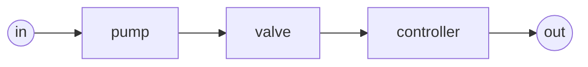
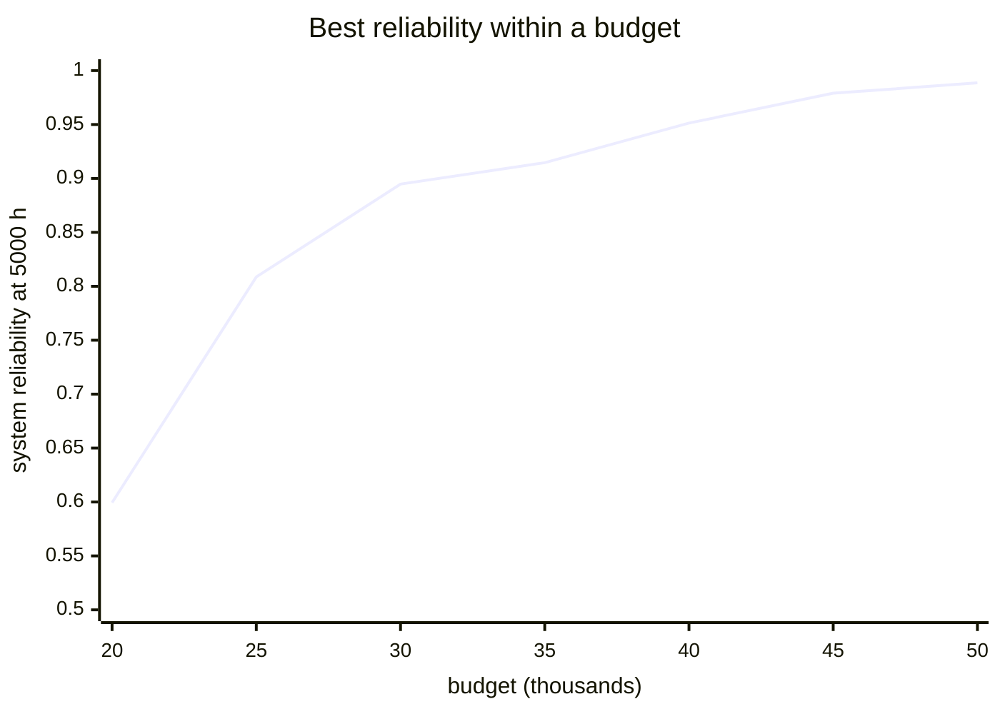

# Lesson 9: Designing for reliability

!!! abstract "In this lesson"
    You will learn:

    - the two design questions, and how they differ: **reliability
      allocation** (how reliable must each part be?) and **redundancy
      allocation** (where should the spare copies go?);
    - five ways to apportion a reliability target among components, and what
      information each one uses;
    - redundancy allocation as an optimisation, why the intuitive "best value
      first" method can miss the optimum, and how to check an answer by brute
      force;
    - how to read the whole cost–reliability trade-off (the Pareto front)
      instead of guessing a budget;
    - what these design methods assume, and where that flatters redundancy.

    **Before you start:** [Lesson 2](systems.md) (series, parallel and
    $k$-out-of-$n$), [Lesson 4](importance.md) (importance measures) and
    [Lesson 5](dependence.md) (common causes). About 35 minutes.

## The question

A process line has a pump, a valve and a controller in series. Over a
5,000-hour mission it must work with probability 0.95, and today it manages
0.53. There are two ways to close the gap:

- **Better components.** Ask the suppliers for more reliable parts. Then the
  question is *how reliable must each part be?* That is **reliability
  allocation**: turning one system target into a requirement for each
  component.
- **More components.** Keep the parts, and fit spare copies in parallel. Then
  the question is *how many copies of each, within the budget?* That is
  **redundancy allocation**.

Both are design decisions, made before the system exists, from the diagram
and whatever data you have. This lesson takes them in turn.



## Reliability allocation: how reliable must each part be?

Take a simpler case first: three components `a`, `b` and `c` in series, whose
reliabilities today are 0.99, 0.97 and 0.90 (0.864 for the system), and a
target of 0.95. Any three reliabilities whose product is 0.95 meet it, so a
method is needed to pick one allocation. Each method below is a rule, and the
rules differ in what they take into account.

```python
import numpy as np
import surpyval as surv
from repyability import RBD, NonRepairableRBD

fail = surv.FixedEventProbability.from_params
chain = NonRepairableRBD(
    [("in", "a"), ("a", "b"), ("b", "c"), ("c", "out")],
    {n: fail(0.05) for n in "abc"},   # models unused: allocation takes probabilities
)
current = {"a": 0.99, "b": 0.97, "c": 0.90}
chain.system_probability(current)[0]   # -> 0.8643
```

### Equal apportionment

Give every component the same reliability. In series, $R_i^3 = 0.95$, so each
needs $0.95^{1/3} = 0.98305$:

```python
chain.equal_allocation(0.95)["a"]   # -> 0.98305
```

It needs nothing but the target, which is also its weakness: it asks the
0.99 component to get *worse* and the 0.90 one to improve a great deal,
without knowing either.

### Proportional improvement (ARINC)

Keep the components' relative standing: multiply every failure probability by
the same factor $k$, chosen so the system meets the target. For small failure
probabilities the series unreliability is about their sum (Lesson 2), so
$k \approx 0.05 / (0.01 + 0.03 + 0.10) = 0.357$; the exact factor is 0.361:

```python
chain.improvement_allocation(0.95, current)
# {'a': 0.99639, 'b': 0.98917, 'c': 0.96389}: every failure probability x 0.361
```

This is the classic ARINC apportionment. It uses the current reliabilities,
so the weakest part gets the largest improvement, but it asks *every* part to
improve, even one that is already excellent.

### Minimum effort

Albert's minimum-effort method (in MIL-HDBK-338B) raises only the weakest
components, to one common level, and leaves the rest alone. Raise `c` first;
once it passes 0.97, `b` must come up with it. With both at a level $L$ and
`a` at 0.99, $0.99\,L^2 = 0.95$, so $L = \sqrt{0.95/0.99} = 0.97959$:

```python
chain.minimum_effort_allocation(0.95, current)
# {'a': 0.99, 'b': 0.97959, 'c': 0.97959}
chain.minimum_effort_allocation(0.95, current)["c"]   # -> 0.97959
```

For a series system whose components are about equally hard to improve, this
is the least total effort under very general assumptions about what effort
means. It applies to series systems only.

### Cost-based allocation

Real components are not equally easy to improve, and each has a ceiling.
Mettas's cost-based method gives each component a cost of improvement that
rises steeply as its reliability approaches its maximum (faster for a lower
*feasibility*), and finds the cheapest allocation that meets the target:

```python
chain.cost_based_allocation(0.95, current)["c"]   # -> 0.96911
chain.cost_based_allocation(0.95, current, feasibility={"c": 0.2})["c"]   # -> 0.9655
```

When `c` is declared hard to improve (feasibility 0.2), it is asked for less,
and `a` and `b` make up the difference. This method works on any structure,
and is the one to use when you can say which parts are hard to improve.

### A structural allocation

With no component data at all, `simple_allocation` sets requirements from the
diagram alone: it starts every component at 0.5 and makes the smallest change
(on the log-odds scale) that meets the target. Components in the same
position end up equal, so in series it matches equal apportionment; on a
redundant structure it asks the most of the single points of failure.

### Side by side

| Method | Needs | a (0.99 now) | b (0.97 now) | c (0.90 now) |
|---|---|---|---|---|
| Equal apportionment | the target | 0.98305 | 0.98305 | 0.98305 |
| Proportional (ARINC) | current values | 0.99639 | 0.98917 | 0.96389 |
| Minimum effort | current values; series only | 0.99 | 0.97959 | 0.97959 |
| Cost-based | current values, feasibilities, maxima | 0.99352 | 0.98667 | 0.96911 |

Every row meets the target exactly; they differ in where the effort goes.
Choose by the information you have: the target alone (equal or structural),
current reliabilities (proportional, or minimum effort for a series), or a
view of how hard each part is to improve (cost-based).

On a redundant structure the differences grow. For the running example's
pumps and valve (pumps at 0.8, the valve at 0.95, target 0.97), equal
apportionment asks the redundant pumps for as much as the valve that every
path goes through, while the cost-based method puts the effort on the valve:

```python
pumps_and_valve = RBD([("in", "p1"), ("in", "p2"), ("p1", "v"), ("p2", "v"), ("v", "out")])
pumps_now = {"p1": 0.8, "p2": 0.8, "v": 0.95}
pumps_and_valve.equal_allocation(0.97)["p1"]                    # -> 0.97083
pumps_and_valve.cost_based_allocation(0.97, pumps_now)["p1"]    # -> 0.89638
pumps_and_valve.cost_based_allocation(0.97, pumps_now)["v"]     # -> 0.98053
```

!!! note "An allocation is a requirement, not a design"
    The numbers are what each component must achieve at the mission time:
    targets for a supplier's specification or a design review. How to
    achieve them (a better part, or redundancy) is the next question.

## Redundancy allocation: where should the copies go?

Now the process line. At 5,000 hours the pump works with probability 0.651,
the valve 0.883 and the controller 0.921, so the line works with probability
0.529. A copy costs 4,000 for a pump, 900 for a valve and 12,000 for a
controller, and the budget is 40,000.

```python
W = surv.Weibull.from_params
line = NonRepairableRBD(
    [("in", "pump"), ("pump", "valve"), ("valve", "ctrl"), ("ctrl", "out")],
    {"pump": W([8000, 1.8]), "valve": W([20000, 1.5]), "ctrl": W([40000, 1.2])},
)
line.sf(5000)   # -> 0.5291
p = {node: float(line.reliabilities[node].sf(5000)) for node in ("pump", "valve", "ctrl")}
costs = {"pump": 4000, "valve": 900, "ctrl": 12000}   # per copy
```

$n$ identical copies of a node in active parallel work with probability
$1 - (1 - p)^n$ (Lesson 2), and the nodes stay in series. Choosing the copies
$n_i$ is an optimisation: maximise

$$
R = \prod_i \left[1 - (1 - p_i)^{n_i}\right]
\quad\text{subject to}\quad \sum_i c_i\,n_i \le \text{budget}.
$$

### Best value first: the greedy method

The intuitive approach is **marginal analysis**: buy copies one at a time,
each time the one that raises the system reliability most per unit of money,
until the budget runs out. Because reliabilities multiply in series, the
natural measure of a gain is the increase in $\ln R$. For the first copy:

| Node | $\ln R$ gained by a second copy | Cost | Gain per 1,000 |
|---|---|---|---|
| pump | 0.2993 | 4,000 | 0.0748 |
| valve | 0.1111 | 900 | 0.1234 |
| controller | 0.0762 | 12,000 | 0.0063 |

```python
def log_gain(node, copies):
    """ln R gained by going from `copies` copies of a node to one more."""
    q = 1 - p[node]
    return np.log(1 - q ** (copies + 1)) - np.log(1 - q**copies)

1000 * log_gain("valve", 1) / costs["valve"]   # -> 0.1234   the best value first
```

The valve offers the best value, so greedy buys a valve first, and continues
step by step:

```python
greedy = line.allocate_redundancy(costs, budget=40_000, t=5000, method="greedy")
greedy.units         # {'pump': 6, 'valve': 4, 'ctrl': 1}
greedy.reliability   # -> 0.919
greedy.cost          # -> 39600.0
```

### The optimum, and a proof by brute force

RePyability's default method finds a proven optimum:

```python
best = line.allocate_redundancy(costs, budget=40_000, t=5000)
best.units         # {'pump': 3, 'valve': 4, 'ctrl': 2}
best.reliability   # -> 0.9513
best.cost          # -> 39600.0
```

For the same money, 0.951 instead of 0.919: the target met instead of missed.
With three nodes you can check this by trying every affordable design (there
are 115):

```python
designs = [
    (n_pump, n_valve, n_ctrl)
    for n_pump in range(1, 11)
    for n_valve in range(1, 45)
    for n_ctrl in range(1, 4)
    if 4000 * n_pump + 900 * n_valve + 12000 * n_ctrl <= 40_000
]

def reliability(design):
    return np.prod([1 - (1 - p[node]) ** n
                    for node, n in zip(("pump", "valve", "ctrl"), design)])

len(designs)                                # -> 115
max(designs, key=reliability)               # (3, 4, 2)
reliability(max(designs, key=reliability))  # -> 0.9513
```

**Why greedy went wrong.** A second controller is a large, lumpy purchase
of 12,000. Early on, pumps and valves offer far more per unit of money, so
greedy buys them: four pumps and three valves in the first five steps. By
then the second controller has become the best value on offer, but only 9,300
of the budget is left, and it no longer fits. Greedy spends the rest on a
fifth and a sixth pump and a fourth valve. The optimum commits to the
expensive controller early and buys fewer pumps. Budget problems with lumpy
items behave like this (they are "knapsack" problems), so "best value first"
is a heuristic, not a method. Use it only when the problem is too large for the
exact search; RePyability's exact method uses a dynamic program over the nodes
when they are in series, and a pruned search otherwise, and stops with an
explanation if a problem is too large.

### The whole trade-off: the Pareto front

A budget of 40,000 was a guess. Is 45,000 worth it? A design is **Pareto
optimal** if no other design is both cheaper and more reliable. The Pareto
front lists every such design, and it is the whole menu of sensible choices:

```python
front = line.redundancy_front(costs, budget=50_000, t=5000)
len(front)   # -> 41

def best_within(budget):
    return max((d for d in front if d.cost <= budget), key=lambda d: d.reliability)

[round(best_within(b).reliability, 4) for b in range(20_000, 50_001, 5_000)]
# [0.5994, 0.8087, 0.8947, 0.9146, 0.9513, 0.979, 0.9886]
best_within(45_000).units   # {'pump': 4, 'valve': 5, 'ctrl': 2}
```



Reading the curve: the first 10,000 above the minimum buys a great deal
(0.60 to 0.89); after 40,000 each extra 5,000 buys less (0.951, 0.979,
0.989). Where the curve bends is usually where to stop, unless the target
lies beyond it. The cheapest design reaching any target is on the front too:

```python
next(d for d in front if d.reliability >= 0.96).cost   # -> 41800.0
```

Notice that the best designs are not nested: the best design for 41,800 has
four pumps, two valves and two controllers, not the 40,000 design plus a
part. Another reason incremental thinking misleads.

### Beyond one kind of copy

The same machinery answers richer questions, each covered in the
[design guide](../guide/design.md):

- **Several resources.** A copy uses money *and* weight *and* space, each
  with its own limit.
- **A choice of component.** A cheap part or a premium one for each copy,
  possibly mixing them in one node.
- **$k$-out-of-$n$ nodes and standby spares.** A node that needs two units
  working, or spares kept cold (Lesson 5).
- **Reliability and redundancy together.** Choose each part's reliability
  *and* its number of copies, when better parts cost more
  (`allocate_reliability_redundancy`).

## Pitfalls

!!! warning "What these methods assume"
    - **Independent copies.** Redundancy allocation scores $n$ copies as
      $1 - (1 - p)^n$. A common cause ([Lesson 5](dependence.md)) puts a
      floor under that, so the fourth valve buys much less than the formula
      says. Check the chosen design with a common-cause model before trusting
      a design with many identical copies.
    - **One mission time.** Allocations hold at the time they were made for;
      a design optimal for 5,000 hours need not be for 10,000.
    - **Copies cost more than their price.** Every copy adds maintenance,
      spares, weight and failure events. Put what you can into the costs or
      resources; the rest is judgement.
    - **Requirements are not guarantees.** An allocated reliability is a
      target; whether a supplier meets it is a question for test and field
      data.
    - **Greedy is a heuristic.** It can miss the optimum by a wide margin, as
      here. Prefer the exact method, and the front.

## Summary

!!! success "Key ideas"
    - Reliability allocation turns a system target into component
      requirements; redundancy allocation decides where spare copies go.
    - Allocation methods differ in what they use: equal apportionment the
      target alone, proportional (ARINC) and minimum effort the current
      reliabilities, cost-based also how hard each part is to improve.
    - Redundancy allocation is an optimisation over the numbers of copies.
      "Best value first" (greedy) is intuitive but can miss the optimum when
      some items are large and lumpy; the exact method is proven, and small
      cases can be checked by brute force.
    - The Pareto front shows the whole trade-off, so a budget can be chosen
      where extra money stops buying much.
    - All of it assumes independent copies: common causes limit what
      redundancy can buy.

## Exercises

**1.** Four components in series must reach 0.95 together. What does equal
apportionment ask of each?

??? success "Answer"
    $0.95^{1/4} = 0.98726$: each part must be a little more reliable than
    with three parts, because each adds one more way to fail.

    ```python
    0.95 ** (1 / 4)   # -> 0.98726
    ```

**2.** For the three components in series (0.99, 0.97, 0.90), what does
minimum effort allocate for a target of 0.98 instead of 0.95? Why is `a` no
longer left alone?

??? success "Answer"
    Raising `b` and `c` to a common level $L$ with `a` at 0.99 would need
    $L = \sqrt{0.98/0.99} = 0.99494$, above `a`'s 0.99, so `a` must come up
    too. All three go to $0.98^{1/3} = 0.99329$.

    ```python
    chain.minimum_effort_allocation(0.98, current)["a"]   # -> 0.99329
    ```

**3.** Explain, in terms of gain per unit cost, why the greedy method never
bought a second controller for the process line.

??? success "Answer"
    At every step greedy buys the copy with the best gain in $\ln R$ per unit
    cost. A second controller gains 0.0762 for 12,000: 0.0063 per 1,000.
    Until the fifth step something cheaper always offered more, even a fourth
    pump (0.0071 per 1,000). After it, the controller was the best value, but
    only 9,300 was left. The optimum needs that expensive purchase and fewer
    pumps: a combination that no sequence of best-value steps reaches.

    ```python
    1000 * log_gain("ctrl", 1) / costs["ctrl"]   # -> 0.0063
    1000 * log_gain("pump", 3) / costs["pump"]   # -> 0.0071   a fourth pump
    40_000 - (4 * 4000 + 3 * 900 + 12_000)       # -> 9300     left for a 12,000 controller
    ```

**4.** From the front, what is the cheapest design that reaches 0.97, and
what does it cost?

??? success "Answer"
    ```python
    cheapest = next(d for d in front if d.reliability >= 0.97)
    cheapest.units   # {'pump': 4, 'valve': 3, 'ctrl': 2}
    cheapest.cost    # -> 42700.0
    ```

    It is on the front, and no other design reaches 0.97 for less.

**5.** The optimal design fits four valves in parallel. Suppose the four
valves share a common cause with a beta factor of 0.1 ([Lesson 5](dependence.md)).
Does the design still meet the target of 0.95?

??? success "Answer"
    No. Under the beta factor the valve group fails with probability at least
    $\beta q$, where $q = 0.1175$ is one valve's failure probability:
    0.0118, however many valves there are, against 0.0002 for four
    independent valves. Build the design explicitly, with the copies drawn
    out and the valves in one common-cause group, and it reaches only 0.940.
    The allocation scored the valves as independent and overvalued them; the
    gap cannot be closed with more of the same valve. It needs money spent
    elsewhere, or a *diverse* valve that does not share the cause.

    ```python
    from repyability import BetaFactor, CCFGroup

    def built(copies, beta=None):
        """The line with its copies drawn out, each at its 5000 h reliability."""
        names = {k: [f"{k}{i}" for i in range(1, n + 1)] for k, n in copies.items()}
        edges = [("in", x) for x in names["pump"]]
        edges += [(a, b) for a in names["pump"] for b in names["valve"]]
        edges += [(a, b) for a in names["valve"] for b in names["ctrl"]]
        edges += [(c, "out") for c in names["ctrl"]]
        models = {x: fail(1 - p[k]) for k in names for x in names[k]}
        groups = [CCFGroup(names["valve"], BetaFactor(beta))] if beta else None
        return NonRepairableRBD(edges, models, ccf_groups=groups)

    built(best.units).sf()             # -> 0.9513   independent, as optimised
    built(best.units, beta=0.1).sf()   # -> 0.9402   with the common cause
    0.1 * (1 - p["valve"])             # -> 0.01175  the valve group's floor
    ```

## Where next

This is the last lesson. From here:

- the [Tutorial](../tutorial.md) runs the whole analysis on one system, from
  fitted models to a costed, maintained design;
- the [User guide](../guide/index.md) covers every method and option, with
  [Design and allocation](../guide/design.md) for this lesson's;
- the [Glossary](glossary.md) and [Concepts](../concepts.md) summarise the
  ideas; and the [course index](index.md) maps the lessons, if you want to
  revisit one.
