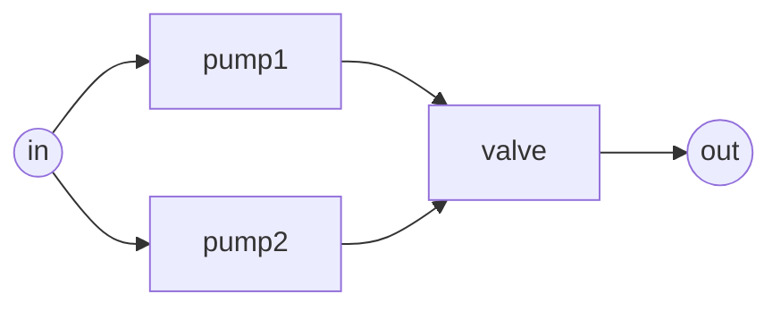
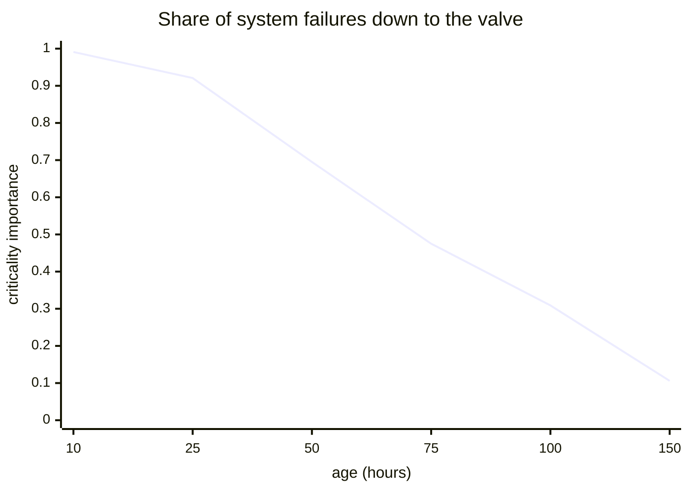

# Lesson 4: Which component matters?

!!! abstract "In this lesson"
    You will learn:

    - the one idea behind every importance measure: when a component is
      **critical**;
    - Birnbaum importance, the leverage of a component, and why it ignores
      how good the component itself is;
    - what could be gained or lost: improvement potential, risk reduction
      worth and risk achievement worth;
    - criticality importance, which component the failures are down to, in
      its failure-oriented and success-oriented forms, and why only the first
      can rank components in series;
    - Fussell–Vesely importance, and why every ranking depends on *when* you
      ask.

    **Before you start:** [Lesson 2](systems.md) (series and parallel) and
    [Lesson 3](structure.md) (cut sets and the pivotal decomposition). About
    35 minutes.

## The question

Your system fails too often, and you can afford to improve one component.
Which one? A different day brings a different question: the system has
failed, and you must decide where to look first. Or you need to take a
component out of service for maintenance while the system runs: which one can
you afford to lose?

Each of these asks "which component matters most?", and each has a different
answer, because *matters* means something different each time. This lesson
builds every importance measure from a single idea and shows which question
each one answers.

We will use the course's running example: two pumps in parallel feeding a
valve. A pump fails (over the period of interest) with probability 0.1, the
valve with probability 0.05, independently.



```python
import numpy as np
import surpyval as surv
from repyability import NonRepairableRBD

fail = surv.FixedEventProbability.from_params   # takes the FAILURE probability
edges = [("in", "pump1"), ("in", "pump2"),
         ("pump1", "valve"), ("pump2", "valve"), ("valve", "out")]
rbd = NonRepairableRBD(
    edges, {"pump1": fail(0.1), "pump2": fail(0.1), "valve": fail(0.05)}
)
rbd.sf()   # -> 0.9405   R = (1 - 0.1 * 0.1) * 0.95
rbd.ff()   # -> 0.0595   Q = 1 - R
```

We write $p_i$ for component $i$'s reliability, $R$ for the system's and
$Q = 1 - R$ for the system's unreliability. $R(1_i)$ and $R(0_i)$ are the
system reliability with component $i$ held working and held failed.

## The key idea: a critical component

Component $i$ is **critical** when the rest of the system is in a state in
which $i$ alone decides the outcome: the system works if $i$ works, and fails
if $i$ fails.

In the example:

- `pump1` is critical exactly when `pump2` has failed and the valve works.
  With `pump2` still running, `pump1` makes no difference; with the valve
  failed, nothing does. So $\Pr(\text{pump1 critical}) = 0.1 \times 0.95 =
  0.095$.
- The valve is critical whenever at least one pump works:
  $\Pr(\text{valve critical}) = 1 - 0.1^2 = 0.99$.

Notice that whether a component is critical depends only on the *other*
components, never on the component itself. That independence is what makes
the formulas below so simple.

## Structural importance: before you have any data

At the start of a design there may be no reliability data at all. You can
still ask how often a component is critical if every *other* component is
equally likely to be working or failed. That is the **structural
importance**: the fraction of the states of the other components in which
$i$ is critical.

For `pump1` the other two components have four states, and `pump1` is
critical in one of them (`pump2` failed, valve working): 0.25. The valve is
critical in three of its four (at least one pump working): 0.75.

```python
rbd.structural_importance()
# {'pump1': 0.25, 'pump2': 0.25, 'valve': 0.75}
rbd.structural_importance()["valve"]   # -> 0.75
```

It depends only on the diagram, so it says where redundancy is thin before
anyone has measured anything: here, the valve is a single point of failure.

## Birnbaum importance: the leverage of a component

Now use the real probabilities. The **Birnbaum importance** is the
probability that component $i$ is critical:

$$
I_B(i) = \Pr(i \text{ is critical}) = R(1_i) - R(0_i)
$$

The second form follows from the definition: the system's state differs
between "$i$ working" and "$i$ failed" exactly when $i$ is critical.

By hand, for `pump1`: holding it working, the system works if the valve does,
so $R(1_{\text{pump1}}) = 0.95$; holding it failed, both `pump2` and the valve
must work, so $R(0_{\text{pump1}}) = 0.9 \times 0.95 = 0.855$. The difference
is $0.095$, as before. For the valve: $0.99 - 0 = 0.99$.

```python
rbd.birnbaum_importance()
# {'pump1': 0.095, 'pump2': 0.095, 'valve': 0.99}
rbd.birnbaum_importance()["valve"]   # -> 0.99
```

### Why it measures leverage

Recall the pivotal decomposition from [Lesson 3](structure.md): conditioning
on component $i$,

$$
R = p_i\,R(1_i) + (1 - p_i)\,R(0_i).
$$

The system reliability is a *straight line* in $p_i$, and its slope is
$R(1_i) - R(0_i) = I_B(i)$. So the Birnbaum importance is the derivative
$\partial R / \partial p_i$: the gain in system reliability per unit gain in
component reliability. Raising the valve's reliability by 0.001 raises the
system's by $0.99 \times 0.001$:

```python
better = NonRepairableRBD(
    edges, {"pump1": fail(0.1), "pump2": fail(0.1), "valve": fail(0.049)}
)
better.sf() - rbd.sf()   # -> 0.00099   = 0.99 * 0.001
```

The same improvement in a pump would buy ten times less. This is the measure
to use when the question is *where does a small improvement pay most?*

!!! note "What Birnbaum importance ignores"
    $I_B(i)$ does not depend on $p_i$ at all: it describes where the
    component sits and how reliable the rest of the system is, not how good
    the component is. A superb component and a terrible one in the same
    position have the same Birnbaum importance. The measures below bring the
    component's own reliability back in.

## What could be gained, or lost

Three measures compare the system as it is with the system when one
component is made perfect or taken away.

**Improvement potential**, $R(1_i) - R$, is the most you could gain by
making component $i$ perfect. From the straight line above it equals
$I_B(i)\,(1 - p_i)$: leverage times room for improvement. Valve:
$0.99 - 0.9405 = 0.0495$; pump: $0.95 - 0.9405 = 0.0095$.

**Risk reduction worth** (RRW), $Q / Q(1_i)$, is the factor by which a
perfect component $i$ would divide the system's unreliability. A perfect
valve leaves only the double pump failure, $Q = 0.01$: $0.0595 / 0.01 =
5.95$. A perfect pump leaves the valve: $0.0595 / 0.05 = 1.19$.

**Risk achievement worth** (RAW), $Q(0_i) / Q$, is how many times more likely
the system is to fail while component $i$ is failed, or out of service. With
the valve out, the system is certainly down: $1 / 0.0595 = 16.8$. With one
pump out, the system rests on the other pump and the valve:
$(1 - 0.855) / 0.0595 = 2.44$.

```python
rbd.improvement_potential()     # {'pump1': 0.0095, 'pump2': 0.0095, 'valve': 0.0495}
rbd.risk_reduction_worth()      # {'pump1': 1.19, 'pump2': 1.19, 'valve': 5.95}
rbd.risk_achievement_worth()    # {'pump1': 2.437, 'pump2': 2.437, 'valve': 16.807}
rbd.risk_achievement_worth()["valve"]   # -> 16.807
```

RAW is the planning measure for maintenance and surveillance: taking a pump
out for service multiplies the risk by 2.4; the valve cannot be taken out
while the system runs at all. RRW and improvement potential bound what any
improvement of a component can buy.

## Criticality importance: which component are the failures down to?

After a system failure, a natural question is *which component caused it?*
Say component $i$ caused a failure if $i$ had failed **and** was critical:
repairing $i$ alone would have saved the system. The **failure-oriented
criticality importance** is the probability of that, given that the system
has failed:

$$
I_{CR}(i) = \Pr(i \text{ failed and critical} \mid \text{system failed})
= \frac{I_B(i)\,(1 - p_i)}{1 - R}
$$

Three steps give the formula:

1. If $i$ has failed and is critical, the system has failed, so
   "$i$ failed and critical, and system failed" is the same event as
   "$i$ failed and critical".
2. Whether $i$ is critical depends only on the other components, which are
   independent of $i$, so $\Pr(i \text{ failed and critical}) = (1 - p_i)
   \cdot I_B(i)$.
3. Dividing by $\Pr(\text{system failed}) = 1 - R$ gives the conditional
   probability.

By hand: the valve accounts for $0.99 \times 0.05 / 0.0595 = 0.832$ of the
system's failures, each pump for $0.095 \times 0.1 / 0.0595 = 0.160$.

```python
rbd.criticality_importance()
# {'pump1': 0.1597, 'pump2': 0.1597, 'valve': 0.8319}
rbd.criticality_importance()["valve"]   # -> 0.8319
```

Unlike Birnbaum importance, this measure weighs each component's position
*and* its own unreliability, so it answers *which components are the system's
failures down to?* That makes it the natural measure for prioritising
reliability improvements by their effect, and for diagnosis: after a failure,
check the valve first.

!!! note "The shares need not add to 1"
    When both pumps are down and the valve works, *both* pumps are critical
    (repairing either would restore the system), so that failure counts in
    both pumps' shares. When all three are down, no single component is
    critical, and that failure counts for no one. The shares say in what
    fraction of failures each component was decisive; they are not a
    partition of the failures.

### The success-oriented form, and why it is not the default

There is a mirror image: given that the system **works**, the probability that
component $i$ works and is critical,

$$
I_{CR}^{\text{success}}(i) = \frac{I_B(i)\,p_i}{R}.
$$

It answers "what is holding the system up?". But it has a serious flaw.
For a component in series with the rest of the system, a working system
always has the component working and critical (if it failed, the system
would fail). So the value is exactly 1, for **every** series component,
however unreliable. In a series system $I_B(i) = \prod_{j \ne i} p_j$, so
$I_B(i)\,p_i = R$ and the ratio is 1.

Take two components in series, `a` failing with probability 0.1 and `b` with
0.2:

```python
chain = NonRepairableRBD(
    [("in", "a"), ("a", "b"), ("b", "out")], {"a": fail(0.1), "b": fail(0.2)}
)
chain.criticality_importance(kind="success")   # {'a': 1.0, 'b': 1.0}
chain.criticality_importance()                  # {'a': 0.2857, 'b': 0.6429}
chain.criticality_importance()["b"]   # -> 0.6429
```

The success-oriented form cannot tell `a` from `b`; the failure-oriented form
says `b`, which fails twice as often, accounts for 64% of the system's
failures and `a` for 29% (the remaining 7%, both failed together, is down to
neither alone). This is why RePyability's `criticality_importance` returns the
failure-oriented form by default; pass `kind="success"` for the other.

!!! tip "Precision for very reliable systems"
    The failure-oriented form divides by $1 - R$. For a system with
    $R = 0.999999999$, computing $1 - R$ by subtraction keeps only a few
    significant digits. RePyability computes the system unreliability directly
    from the components' unreliabilities, through the minimal cut sets, so the
    shares keep their full precision however reliable the system is.

## Fussell–Vesely: the cut-set view

[Lesson 3](structure.md) described a system failure as the occurrence of a
minimal cut set: a set of components that have all failed. The
**Fussell–Vesely importance** is the share of the system's unreliability that
comes through cut sets containing component $i$:

$$
FV(i) = \frac{P(\text{some minimal cut set containing } i \text{ has failed})}{Q}
\approx \frac{\sum_{C \ni i} \prod_{j \in C} q_j}{Q}
$$

where $q_j = 1 - p_j$. The approximation is the rare-event one of
[Lesson 3](structure.md): the sum over the minimal cut sets $C$ that contain
$i$ counts the failures of two of them at once twice. The example has two
minimal cut sets, $\{\text{valve}\}$ (probability 0.05) and
$\{\text{pump1}, \text{pump2}\}$ (probability 0.01), and each component
is in one of them, so here the two agree:

$$
FV(\text{valve}) = \frac{0.05}{0.0595} = 0.840, \qquad
FV(\text{pump1}) = \frac{0.01}{0.0595} = 0.168.
$$

```python
rbd.fussell_vesely()
# {'pump1': 0.1681, 'pump2': 0.1681, 'valve': 0.8403}
rbd.fussell_vesely()["valve"]   # -> 0.8403
```

RePyability computes the exact share, which is never more than 1. Many
safety-analysis tools report the sum, which `method="rare_event"` gives: it
is close while failures are rare, but where cut sets overlap (a bridge) and
failure is likely, it can approach 2.

It is close to the failure-oriented criticality, but asks a slightly
different question: in what fraction of failures did component $i$
*contribute* (a cut set containing it had occurred), rather than in what
fraction was it *decisive*. The valve contributes to the failures in which
all three components are down, but is not decisive in them; that is the gap
between 0.840 and 0.832. Fussell–Vesely is the standard measure in
probabilistic safety assessment, where fault trees are analysed through their
cut sets.

## Side by side

| Measure | Question it answers | Pump | Valve |
|---|---|---|---|
| Structural | Where is the structure thin (no data)? | 0.25 | 0.75 |
| Birnbaum | Where does a small improvement pay most? | 0.095 | 0.99 |
| Improvement potential | How much would a perfect component add? | 0.0095 | 0.0495 |
| Risk reduction worth | By what factor would it cut the risk? | 1.19 | 5.95 |
| Risk achievement worth | How much riskier while it is out? | 2.44 | 16.8 |
| Criticality (failure) | Which components are the failures down to? | 0.160 | 0.832 |
| Fussell–Vesely | What share of the risk involves it? | 0.168 | 0.840 |

Here every measure ranks the valve first, because it is both a single point
of failure and not much better than a pump. They need not agree: in a
parallel pair, for instance, the *better* unit has the higher Birnbaum
importance (exercise 2). Pick the measure for the question you are asking.

## The answer depends on when you ask

With lifetimes instead of fixed probabilities, every measure becomes a
function of time. Give the pumps Weibull lives with $\alpha = 100$ hours and
$\beta = 2$, and the valve $\alpha = 200$ hours and $\beta = 1.5$ (the
course's running example):

```python
W = surv.Weibull.from_params
life = NonRepairableRBD(
    edges, {"pump1": W([100, 2]), "pump2": W([100, 2]), "valve": W([200, 1.5])}
)
hours = np.array([10, 25, 50, 75, 100, 150])
shares = life.criticality_importance(hours)
shares["valve"].round(3)   # array([0.991, 0.921, 0.695, 0.475, 0.309, 0.106])
shares["pump1"].round(3)   # array([0.009, 0.075, 0.269, 0.418, 0.485, 0.467])
life.criticality_importance(100)["pump1"]   # -> 0.485
```



Early in life the pumps rarely fail together, and 99% of the (few) system
failures are down to the valve. As the pumps wear out, double pump failures
take over: somewhere between 75 and 100 hours each pump's share passes the
valve's. A maintenance plan built on the early ranking would neglect the
pumps exactly when they start to matter. Always ask "which component matters
**at what age**?", or, for units already in service, given their current
state (see [Condition-based evaluation](../guide/condition-based.md)).

## On a repairable system

For a system whose components are repaired ([Lesson 6](availability.md)),
the same measures are evaluated at the components' long-run availabilities.
The failure-oriented criticality is then each component's share of the
system's **downtime**. For the user guide's plant (two pumps with MTTF 10
hours in parallel, a valve with MTTF 50 hours, all repaired in an hour on
average), the valve causes 70% of the downtime:

```python
from repyability import RepairableRBD

def unit(rate):
    return {
        "reliability": surv.Exponential.from_params([rate]),
        "repairability": surv.Exponential.from_params([1.0]),
    }

plant = RepairableRBD(
    [("s", "A"), ("s", "B"), ("A", "C"), ("B", "C"), ("C", "t")],
    {"A": unit(0.1), "B": unit(0.1), "C": unit(0.02)},
)
plant.criticality_importance()   # {'A': 0.2924, 'B': 0.2924, 'C': 0.7018}
plant.criticality_importance()["C"]   # -> 0.7018
```

## Pitfalls

!!! warning "Common mistakes"
    - **Using one measure for every question.** Birnbaum answers "where does
      a small improvement pay?", criticality "what are the failures down
      to?", RAW "what can I take out of service?". Averaging them answers
      nothing.
    - **Reading Birnbaum as "how bad is it".** It ignores the component's own
      reliability. Use criticality or improvement potential for that.
    - **Ranking series components with the success-oriented criticality.**
      It is 1 for all of them.
    - **Forgetting time and state.** Rankings change as parts age, and
      differ for a fleet in service from a fleet of new units.
    - **Forgetting dependence.** All these measures assume components fail
      independently. [Lesson 5](dependence.md) shows how common causes break
      that; RePyability's probability-based measures raise an error on an RBD
      with common-cause groups rather than give a misleading answer.

## Summary

!!! success "Key ideas"
    - A component is **critical** when the rest of the system is in a state
      where it alone decides the outcome; this depends only on the other
      components.
    - **Birnbaum** importance is the probability of being critical, and the
      derivative $\partial R / \partial p_i$: the leverage of a component,
      whatever its own reliability.
    - **Improvement potential** and **RRW** bound what a perfect component
      would buy; **RAW** measures the risk while a component is out.
    - **Failure-oriented criticality**, $I_B(i)(1 - p_i)/(1 - R)$, is the
      share of system failures a component is decisive in; it is
      RePyability's default. The success-oriented form is 1 for every series
      component.
    - **Fussell–Vesely** is the share of the risk through cut sets containing
      the component.
    - Rankings change over time: ask "which component matters, and when?".

## Exercises

**1.** Two components in series: `a` has reliability 0.99, `b` 0.9. Compute
their Birnbaum importances and failure-oriented criticalities by hand. Which
would you improve first, and why?

??? success "Answer"
    In series, a component is critical whenever the other works:
    $I_B(a) = 0.9$ and $I_B(b) = 0.99$. The system fails with probability
    $1 - 0.99 \times 0.9 = 0.109$, so the criticalities are
    $0.9 \times 0.01 / 0.109 = 0.083$ for `a` and
    $0.99 \times 0.1 / 0.109 = 0.908$ for `b`. Improve `b`: it has slightly
    more leverage, and it is behind 91% of the failures.

    ```python
    ex1 = NonRepairableRBD(
        [("in", "a"), ("a", "b"), ("b", "out")], {"a": fail(0.01), "b": fail(0.1)}
    )
    ex1.birnbaum_importance()["b"]      # -> 0.99
    ex1.criticality_importance()["b"]   # -> 0.9083
    ex1.criticality_importance()["a"]   # -> 0.0826
    ```

**2.** Two components in parallel: `a` with reliability 0.9 and `b` with
0.99. Which has the larger Birnbaum importance? Why is that not a paradox?

??? success "Answer"
    In parallel, a component is critical when the *other* has failed:
    $I_B(a) = 1 - 0.99 = 0.01$ and $I_B(b) = 1 - 0.9 = 0.1$. The better unit,
    `b`, has ten times the leverage, because it is the one left carrying the
    system whenever the weaker `a` is down, which happens often. Birnbaum
    importance is about position and the rest of the system, not about the
    component's own quality. (Their failure-oriented criticalities are both
    1: the pair only fails when both have failed, and then repairing either
    one would save it.)

    ```python
    pair = NonRepairableRBD(
        [("in", "a"), ("in", "b"), ("a", "out"), ("b", "out")],
        {"a": fail(0.1), "b": fail(0.01)},
    )
    pair.birnbaum_importance()["b"]   # -> 0.1
    pair.birnbaum_importance()["a"]   # -> 0.01
    ```

**3.** Show by hand that the success-oriented criticality of the valve in the
running example is exactly 1, and explain what that value means.

??? success "Answer"
    $I_B(\text{valve}) = 0.99$, $p_{\text{valve}} = 0.95$ and $R = 0.9405$,
    so $0.99 \times 0.95 / 0.9405 = 1$. Whenever the system works, the valve
    is working (it is in series), and it is critical (if it failed, the
    system would fail). The value is true, but it is true of every series
    component, so it cannot rank them.

    ```python
    rbd.criticality_importance(kind="success")["valve"]   # -> 1.0
    ```

**4.** In the running example, a technician wants to take `pump1` out of
service for a day of maintenance while the system keeps running. By what
factor does that raise the risk of a system failure that day? What if they
wanted to service the valve instead?

??? success "Answer"
    That is the risk achievement worth. With `pump1` out, the system needs
    `pump2` and the valve: $Q = 1 - 0.9 \times 0.95 = 0.145$, against
    $0.0595$ normally, a factor of 2.44. With the valve out the system cannot
    run at all (a factor of 16.8, $Q = 1$): the valve can only be serviced
    with the system shut down, or after installing a bypass.

    ```python
    rbd.risk_achievement_worth()["pump1"]   # -> 2.437
    ```

**5.** Using the lifetime version of the example (`life`), find which
component the failures are mostly down to at 50 hours and at 150 hours.
Explain the change.

??? success "Answer"
    At 50 hours the valve accounts for 70% of the failures and each pump for
    27%; at 150 hours the valve for 11% and each pump for 47%. The pumps wear
    out ($\beta = 2$), so double pump failures, rare early on, dominate
    later. Pump maintenance matters more and more as the system ages.

    ```python
    life.criticality_importance(50)["valve"]    # -> 0.695
    life.criticality_importance(150)["pump1"]   # -> 0.467
    ```

## Where next

- [Lesson 5: When redundancy disappoints](dependence.md) drops the
  assumption that components fail independently.
- In the user guide, [Importance measures](../guide/importance.md) covers
  every option (known states, parameter sensitivity, repairable systems), and
  [Condition-based evaluation](../guide/condition-based.md) evaluates
  importance given each component's current age.
- [Concepts](../concepts.md#importance-measures-which-one-and-why) has a
  one-page summary of the measures.
