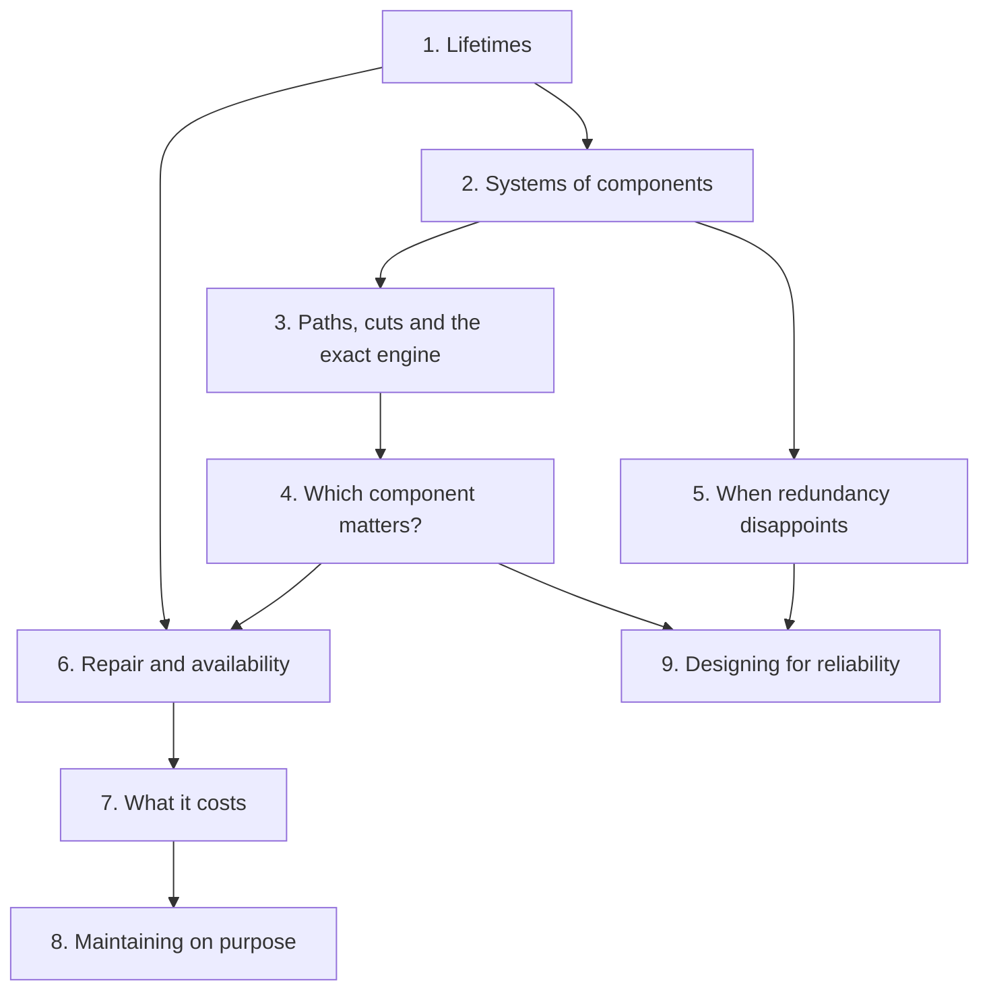
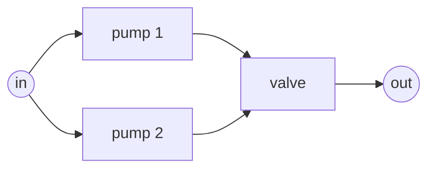

# Learn reliability engineering

This is a short course in **system reliability engineering**, taught with
RePyability. It starts from a single part's lifetime and ends with designing
and maintaining whole systems. Every idea is introduced with a concrete
question, worked out by hand with small numbers, and then computed with
RePyability, so you learn both the engineering and the tool, and can check
one against the other.

If you already know the theory and want to get something done, the
[User guide](../guide/index.md) is organised by task, and the
[Tutorial](../tutorial.md) is a single end-to-end walkthrough. This course is
for understanding *why* the numbers are what they are.

## Who it is for

Engineers, analysts and students who know some probability and a little
Python, and want to reason about how systems fail: which part matters, how
reliable a design is, what redundancy really buys, when to maintain, and what
it all costs. No reliability background is assumed.

You will need:

- **Probability:** the probability of an event, complements, independence,
  conditional probability and expectation. The refresher below covers what
  the course uses.
- **Python:** enough to run the examples and change the numbers. Every code
  block on these pages runs as written, in order, and the numbers quoted in
  them are checked automatically by the test suite.

## The lessons



| Lesson | The question it answers |
|---|---|
| [1. Lifetimes](lifetimes.md) | When does a part fail? Reliability, hazard, MTTF, the exponential and the Weibull. |
| [2. Systems of components](systems.md) | Parts fail; does the system? Series, parallel and $k$-out-of-$n$ systems. |
| [3. Paths, cuts and the exact engine](structure.md) | What about systems that are not series-parallel? Path sets, cut sets, and how RePyability computes exactly. |
| [4. Which component matters?](importance.md) | Where should effort go? Importance measures, and the different questions they answer. |
| [5. When redundancy disappoints](dependence.md) | What if parts do not fail independently? Standby, load sharing and common causes. |
| [6. Repair and availability](availability.md) | Once parts are repaired, how much of the time is the system up? |
| [7. What it costs](costs.md) | What does running the system cost, on average and in a bad year? |
| [8. Maintaining on purpose](maintenance.md) | Should parts be replaced before they fail, and when? |
| [9. Designing for reliability](design.md) | How reliable must each part be, and where should redundancy go? |

Each lesson takes 25 to 40 minutes. Lessons 1 to 4 are the core; after
them, follow your interest along the arrows.

## How each lesson works

Every lesson has the same shape:

1. **The question**: a concrete engineering situation.
2. **The idea**: intuition first, with a diagram where there is structure.
3. **By hand**: the formula, worked through with numbers you can check in
   your head.
4. **In RePyability**: the same calculation in code, and what the output
   means.
5. **Pitfalls**: the usual ways to get it wrong.
6. **Summary** and **exercises**, with worked answers you can reveal.

## A probability refresher

The course uses a handful of rules. If they are familiar, skip ahead.

**Complement.** The probability that an event does not happen is one minus
the probability that it does. If a part works with probability 0.9, it fails
with probability $1 - 0.9 = 0.1$.

**Independence and products.** Events are independent when knowing that one
happened says nothing about the other. The probability that independent
events *all* happen is the product of their probabilities: two independent
parts, each working with probability 0.9, both work with probability
$0.9 \times 0.9 = 0.81$.

**"At least one" through the complement.** The probability that at least one
of several independent events happens is one minus the probability that none
does. At least one of the two parts works with probability
$1 - 0.1 \times 0.1 = 0.99$. This one rule is the whole of parallel
redundancy ([Lesson 2](systems.md)).

**Conditional probability.** The probability of $A$ given that $B$ has
happened is $\Pr(A \mid B) = \Pr(A \text{ and } B) / \Pr(B)$. "Given that the
pump has run 500 hours, will it run another 200?" ([Lesson 1](lifetimes.md))
and "given that the system has failed, which part caused it?"
([Lesson 4](importance.md)) are both conditional probabilities.

**Total probability.** If you split the possibilities into cases, the
probability of an event is the probability-weighted average over the cases:
$\Pr(A) = \Pr(A \mid B)\Pr(B) + \Pr(A \mid \text{not } B)\Pr(\text{not } B)$.
[Lesson 3](structure.md) builds RePyability's exact engine from this rule.

**Expectation.** The expected value of a random quantity is its
probability-weighted average: the long-run mean over many repetitions. Mean
lifetimes, mean costs per hour and mean times to repair are all expectations.

```python
# The rules above, as arithmetic:
p = 0.9
1 - p               # -> 0.1    complement
p * p               # -> 0.81   both of two independent parts work
1 - (1 - p) ** 2    # -> 0.99   at least one of them works
```

## Notation

| Symbol | Meaning | Lesson |
|---|---|---|
| $T$ | A part's time to failure (a random variable) | 1 |
| $R(t)$, $F(t)$ | Reliability $\Pr(T > t)$ and unreliability $1 - R(t)$ | 1 |
| $f(t)$, $h(t)$ | Density of the time to failure, and hazard rate $f/R$ | 1 |
| MTTF | Mean time to failure, $\int_0^\infty R(t)\,dt$ | 1 |
| $\alpha$, $\beta$ | Weibull scale (characteristic life) and shape | 1 |
| $p_i$, $q_i$ | Probability that component $i$ works, and fails ($q_i = 1 - p_i$) | 2 |
| $R$, $Q$ | System reliability and unreliability at a given time | 2 |
| $I_B(i)$ | Birnbaum importance of component $i$ | 4 |
| MTTR | Mean time to repair | 6 |
| $A$ | Availability: the long-run fraction of time up | 6 |
| $c_p$, $c_u$ | Cost of a planned replacement and of a failure | 8 |

Times are in hours throughout, but any unit works if you use it
consistently. Every term is also defined, with a link to the lesson that
teaches it, in the [glossary](glossary.md).

## The running example

Most lessons return to one small system, so that each new idea lands on
something familiar: **two pumps in parallel feeding a valve**. Either pump
can supply the flow, but everything passes through the one valve.



It appears in three forms:

- with fixed probabilities (a pump fails with probability 0.1 and the valve
  with 0.05) for hand calculations;
- with lifetimes (pumps Weibull with $\alpha = 100$ h and $\beta = 2$, the
  valve $\alpha = 200$ h and $\beta = 1.5$) to see how things change with
  age;
- as a repairable plant (pumps with an MTTF of 10 h, the valve 50 h, repairs
  taking an hour or two) for availability and cost.

It is small enough to work by hand, and it already shows the two themes that
run through the whole course: redundancy (the pumps) and single points of
failure (the valve).

## Setting up

Install RePyability (it brings [surpyval](https://github.com/derrynknife/SurPyval),
which provides the lifetime distributions) and start Python:

```bash
pip install repyability
```

Then begin with [Lesson 1: Lifetimes](lifetimes.md).
