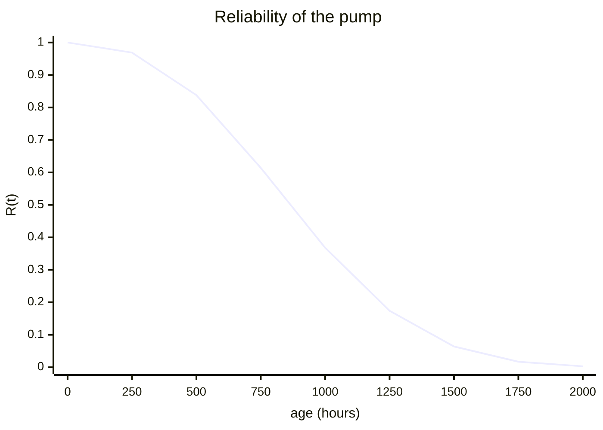
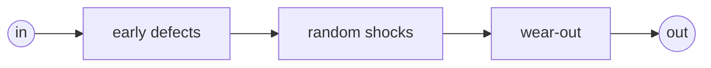
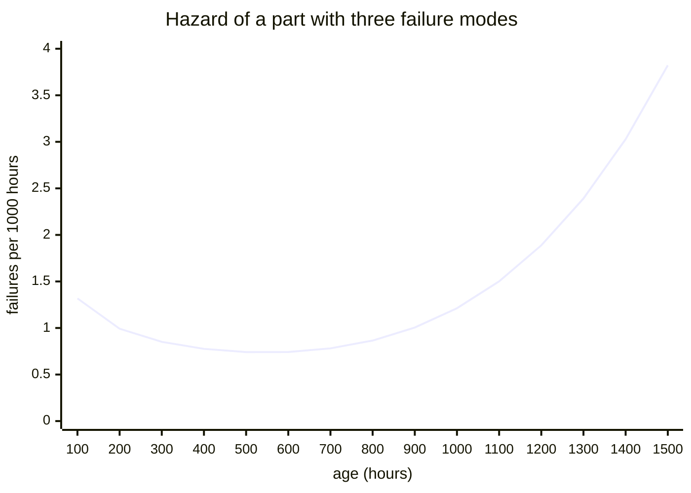

# Lesson 1: Lifetimes

!!! abstract "In this lesson"
    You will learn:

    - how to describe *when* a part fails: its reliability $R(t)$,
      unreliability $F(t)$, density $f(t)$ and hazard rate $h(t)$;
    - what the mean time to failure (MTTF) does, and does not, tell you;
    - how the exponential and Weibull distributions describe random failure
      and wear-out, and why the Weibull shape is the most useful single
      number in maintenance;
    - how to read a lifetime model in Python, and how RePyability treats one
      part as the simplest possible system.

    **Before you start:** basic probability (the probability of an event,
    complements, conditional probability). About 30 minutes.

## The question

A supplier tells you their pump has a *mean time to failure of 887 hours*.
You need a pump to run a 200-hour campaign without stopping. How likely is a
new one to make it? And the spare in the store has already run 500 hours on
another job: is it as good as a new one?

"887 hours" cannot answer either question. Pumps do not all last 887 hours:
some fail in their first week and some run for years. To answer, you need the
whole distribution of the time to failure. This lesson builds that picture,
and by the end of it you will answer both questions.

## The time to failure is a random variable

Imagine putting a large number of new pumps to work at time zero and writing
down when each one fails. The time to failure, $T$, varies from pump to pump;
its probability distribution is the pump's **lifetime model**. Two functions
describe it.

The **unreliability** $F(t)$ is the probability that a unit has failed by age
$t$: the fraction of the population that has failed by then.

$$
F(t) = \Pr(T \le t)
$$

The **reliability**, also called the survival function, is its complement:
the probability that a unit is still working at age $t$, or the fraction of
the population still working.

$$
R(t) = \Pr(T > t) = 1 - F(t)
$$

Every reliability curve starts at $R(0) = 1$ (everything works when new) and
falls towards 0 (eventually everything fails). Here is the supplier's pump,
whose model you will meet properly in a moment:



Almost every pump survives its first 250 hours, most are gone by 1250, and
hardly any see 2000. Most of this course is about computing curves like this
one, first for parts and then for whole systems.

A third function says *when* failures happen. The **density**
$f(t) = dF/dt$ is the fraction of the original population that fails per
hour around age $t$. The area under $f$ between two ages is the fraction that
fails between them.

## The hazard rate: the risk right now

The person running the pump asks a different question: *given that it is
still working now, how likely is it to fail in the next hour?* That is the
**hazard rate** (engineers also say failure rate):

$$
h(t) = \frac{f(t)}{R(t)}
$$

Among the units still working at age $t$, a fraction of about
$h(t)\,\Delta t$ fails in the next short interval $\Delta t$. The density
counts failures against the whole original population; the hazard counts them
against the survivors only.

!!! example "The difference, in numbers"
    Start 1000 pumps. At 500 hours, $R(500) = 0.838$, so 838 are still
    running, and the density is $f(500) = 0.00074$ per hour: about 0.74 of
    the original 1000 pumps fail in the next hour. As a share of the 838
    survivors that is $0.74 / 838 = 0.00088$ per hour, which is $h(500)$.

The shape of $h(t)$ is the most useful single thing to know about a part:

- a **falling** hazard means early failures (infant mortality): weak units
  fail first, and the survivors are the strong ones;
- a **constant** hazard means failures from outside causes (shocks,
  overloads) that do not care how old the part is;
- a **rising** hazard means wear-out: the older the part, the more likely it
  is to fail soon.

The hazard and the reliability determine each other. Since
$f = -dR/dt$, the hazard is $h = -\frac{d}{dt}\ln R(t)$, and integrating,

$$
R(t) = \exp\!\left(-H(t)\right), \qquad H(t) = \int_0^t h(u)\,du,
$$

where $H(t)$ is the **cumulative hazard**. Keep this in mind: it explains the
bathtub curve at the end of the lesson.

## The mean time to failure

The **MTTF** is the average life, $\operatorname{E}[T]$. For a lifetime it
equals the area under the reliability curve:

$$
\text{MTTF} = \int_0^\infty R(t)\,dt
$$

One way to see this: follow the whole population through time. At each age
$t$, a fraction $R(t)$ of the units is still alive and "earning" life, so the
total life earned per unit is the area under $R$.

The MTTF is a single average over the whole population, and it hides the
shape. You will meet two consequences again and again:

- **It is not a typical life.** For many parts, half of them or more fail
  before the MTTF.
- **It is not a failure rate.** $1/\text{MTTF}$ equals the hazard only for the
  exponential distribution, next.

## The exponential: failures that ignore age

The exponential distribution has a constant hazard $\lambda$:

$$
R(t) = e^{-\lambda t}, \qquad h(t) = \lambda, \qquad
\text{MTTF} = \frac{1}{\lambda}
$$

Its defining property is that it has **no memory**. The probability that a
unit which has survived to age $s$ survives a further $t$ is

$$
\Pr(T > s + t \mid T > s) = \frac{R(s + t)}{R(s)}
= \frac{e^{-\lambda (s + t)}}{e^{-\lambda s}} = e^{-\lambda t} = R(t),
$$

exactly the probability that a new unit survives $t$. A used exponential part
is as good as new.

Take a part with MTTF 1000 hours, so $\lambda = 0.001$ per hour. Lifetime
models in Python come from
[surpyval](https://github.com/derrynknife/SurPyval), the library that fits
them to data; RePyability takes them as they are.

```python
import numpy as np
import surpyval as surv

unit = surv.Exponential.from_params([0.001])   # rate: 0.001 per hour
unit.mean()                    # -> 1000.0   MTTF = 1 / rate
unit.sf(200)                   # -> 0.8187   R(200) = exp(-0.2)
unit.sf(700) / unit.sf(500)    # -> 0.8187   200 more hours, after 500
unit.hf(300)                   # -> 0.001    the hazard at every age
unit.sf(unit.mean())           # -> 0.3679   only 37% reach the MTTF
```

`sf` is the reliability (survival function), `ff` the unreliability, `df`
the density, `hf` the hazard and `qf` the inverse of $F$ (quantiles). The
last line is worth remembering: only $e^{-1} = 36.8\%$ of exponential parts
live as long as their MTTF.

The exponential suits parts that fail from outside causes rather than from
age, such as electronics in their useful life. Its lack of memory has a
practical consequence you will prove in [Lesson 8](maintenance.md):
replacing an exponential part before it fails buys nothing.

## The Weibull: the shape tells the story

The Weibull distribution adds a **shape** $\beta$ to a **scale** $\alpha$:

$$
R(t) = \exp\!\left[-\left(\frac{t}{\alpha}\right)^{\beta}\right], \qquad
h(t) = \frac{\beta}{\alpha}\left(\frac{t}{\alpha}\right)^{\beta - 1}
$$

- The scale $\alpha$ is the **characteristic life**: $R(\alpha) = e^{-1}$
  for every shape, so 63.2% of units have failed by age $\alpha$.
- The shape $\beta$ sets the hazard's direction: falling for $\beta < 1$
  (early failures), constant for $\beta = 1$ (the Weibull is then the
  exponential), rising for $\beta > 1$ (wear-out). The larger $\beta$, the
  more tightly the lives cluster around $\alpha$.

Here are three parts with the same scale, $\alpha = 1000$ hours, and
different shapes:

```python
for beta in (0.5, 1, 3):
    part = surv.Weibull.from_params([1000, beta])
    print(beta, part.sf([200, 1000]).round(3), (1000 * part.hf([200, 1000])).round(3))
# 0.5 [0.639 0.368] [1.118 0.5  ]
# 1 [0.819 0.368] [1. 1.]
# 3 [0.992 0.368] [0.12 3.  ]
```

| | $\beta = 0.5$ | $\beta = 1$ | $\beta = 3$ |
|---|---|---|---|
| $R(200)$ | 0.639 | 0.819 | 0.992 |
| $R(1000)$ | 0.368 | 0.368 | 0.368 |
| $h(200)$, per 1000 h | 1.118 | 1.0 | 0.12 |
| $h(1000)$, per 1000 h | 0.5 | 1.0 | 3.0 |
| MTTF (h) | 2000 | 1000 | 893 |

With $\beta = 0.5$, 36% of the parts are gone within 200 hours, but the
survivors get *better*: their hazard halves between 200 and 1000 hours. With
$\beta = 3$ almost none fail early, but by 1000 hours the hazard is 25 times
what it was at 200. Same $\alpha$, three very different parts, and the MTTF
($\alpha\,\Gamma(1 + 1/\beta)$ for a Weibull) says little about the
difference.

### Answering the question

The supplier's pump is a Weibull with $\alpha = 1000$ hours and
$\beta = 2.5$: it wears out. That is where "887 hours" came from.

```python
pump = surv.Weibull.from_params([1000, 2.5])   # alpha (hours), beta
pump.mean()                     # -> 887.26   the supplier's MTTF
pump.sf(200)                    # -> 0.9823   a new pump survives the campaign
pump.sf(700) / pump.sf(500)     # -> 0.792    the spare that has run 500 h
pump.ff(pump.mean())            # -> 0.5236   52% fail before the MTTF
np.exp(-200 / pump.mean())      # -> 0.7982   what "exponential, MTTF 887" says
```

A new pump makes the campaign 98.2% of the time; the spare that has already
run 500 hours only 79.2% of the time. Age matters because the pump wears out.
If you had assumed an exponential life with the same MTTF, you would have
said 79.8% for both: far too pessimistic about the new pump, and slightly
optimistic about the used one. The MTTF alone could not have told you
either.

## Percentiles and B-lives

Warranty and maintenance planning often use the **B-life**: $B_{10}$ is the
age by which 10% of units have failed, $F(B_{10}) = 0.1$. For a Weibull,
solving $F(t) = p$ gives

$$
B_p = \alpha\left(-\ln(1 - p)\right)^{1/\beta}
$$

so the pump's $B_{10}$ is $1000 \times (-\ln 0.9)^{0.4} = 406.5$ hours: plan
on one pump in ten failing by then. The median life ($B_{50}$) is 863.6 hours,
less than the MTTF: a few long-lived pumps pull the mean up.

```python
pump.qf(0.10)    # -> 406.51   B10: 10% have failed
pump.qf(0.50)    # -> 863.63   the median life
```

## The bathtub curve

Real populations often mix failure modes: early failures from manufacturing
defects, random failures from outside causes, and wear-out. A part survives to
age $t$ only if no mode has struck by then. If the modes act independently,
their reliabilities multiply:

$$
R(t) = R_{\text{early}}(t)\,R_{\text{random}}(t)\,R_{\text{wear}}(t)
$$

and because $R = e^{-H}$, multiplying reliabilities means **adding hazards**:
$h(t) = h_{\text{early}}(t) + h_{\text{random}}(t) + h_{\text{wear}}(t)$.

"The part fails at the first of several causes" is exactly the logic of a
*series system*, which [Lesson 2](systems.md) builds on. So RePyability can
compute the combined hazard by putting the three modes in series, as three
blocks between an input and an output:



```python
from repyability import NonRepairableRBD

modes = {
    "early": surv.Weibull.from_params([2000, 0.5]),       # falling hazard
    "random": surv.Exponential.from_params([1 / 5000]),   # constant hazard
    "wear": surv.Weibull.from_params([1500, 5]),          # rising hazard
}
life = NonRepairableRBD(
    [("in", "early"), ("early", "random"), ("random", "wear"),
     ("wear", "out")],
    modes,
)
ages = np.arange(100, 1501, 100)
(1000 * life.hf(ages)).round(3)   # failures per 1000 hours
# array([1.318, 0.992, 0.851, 0.776, 0.741, 0.742, 0.781, 0.865, 1.005,
#        1.212, 1.501, 1.888, 2.391, 3.028, 3.822])
1000 * life.hf(500)               # -> 0.741   the bottom of the bathtub
```



This is the classic **bathtub curve**: a falling hazard early on, a flat
stretch of useful life, and a rising hazard as wear-out takes over. Each part
of the tub calls for a different response: burn-in or better quality control
for early failures, nothing age-based for random failures, and preventive
replacement for wear-out ([Lesson 8](maintenance.md)).

## One part as the simplest system

A block diagram with a single block is a system that is exactly its part.
It is a useful first step in RePyability, because every system method then
works on it:

```python
from repyability import NodeState

single = NonRepairableRBD([("in", "pump"), ("pump", "out")], {"pump": pump})
single.sf(200)                     # -> 0.9823   the same as pump.sf(200)
single.bx_life(10)                 # -> 406.51   B10
single.time_to_reliability(0.9)    # -> 406.51   when R falls to 0.9
single.sf_given_state(200, {"pump": NodeState(age=500)})   # -> 0.792   the spare
single.mean_time_to_failure(seed=0)   # -> 886.7   by simulation (exact 887.26)
```

`sf_given_state` conditions on each part's current age: the spare's 79.2%,
computed for you. The system's MTTF is estimated by Monte-Carlo simulation
(100,000 simulated lifetimes by default), so it carries a small sampling
error, here under 0.1%; the `seed` makes the number reproducible.

Where do the models come from? From failure data: the times at which units
failed, and the ages of units still running (censored observations).
Fitting them is surpyval's job; the [Tutorial](../tutorial.md) shows a fit
with censored data in its first step.

## Pitfalls

!!! warning "Common misreadings"
    - **The MTTF is not a guaranteed life.** 52% of the pumps fail before
      it, and 63% of exponential parts do.
    - **"Failure rate" has two meanings.** Datasheets often quote
      $1/\text{MTTF}$ as a failure rate. It equals the hazard only for the
      exponential; for a part that wears out, the hazard of a new unit is far
      lower, and that of an old one far higher.
    - **A constant failure rate is an assumption, not a fact.** Mechanical
      parts usually wear out ($\beta > 1$). Assuming an exponential makes a
      used part look as good as new, and hides the case for preventive
      maintenance.
    - **A fitted model describes the data it came from.** Extrapolating it
      far beyond the ages observed, or to a harsher duty, is risky.

## Summary

!!! success "Key ideas"
    - The time to failure is random. $R(t)$ is the fraction of units still
      working at age $t$, and $F(t) = 1 - R(t)$ the fraction failed.
    - The hazard $h(t) = f(t)/R(t)$ is the risk of failing now, for a unit
      that has survived so far. Its shape (falling, flat or rising) matters
      more than any single number.
    - $\text{MTTF} = \int_0^\infty R(t)\,dt$ is an average that hides the
      shape; often half the units or more fail before it.
    - The exponential has a constant hazard and no memory: an old unit is as
      good as new.
    - The Weibull's shape $\beta$ says whether failures are early
      ($\beta < 1$), random ($\beta = 1$) or wear-out ($\beta > 1$); its
      scale $\alpha$ is the age by which 63.2% have failed.
    - Independent failure modes act like blocks in series: reliabilities
      multiply and hazards add.

## Exercises

**1.** An exponential part has an MTTF of 2000 hours. What is the probability
that it survives its first 1000 hours?

??? success "Answer"
    $\lambda = 1/2000$ per hour, so $R(1000) = e^{-1000/2000} = e^{-0.5}
    = 0.6065$.

    ```python
    surv.Exponential.from_params([1 / 2000]).sf(1000)   # -> 0.6065
    ```

**2.** The same part has already run 3000 hours. What is the probability that
it survives another 1000?

??? success "Answer"
    Still 0.6065. The exponential has no memory:
    $R(4000)/R(3000) = e^{-0.5}$. Its past tells you nothing about its
    future.

    ```python
    part = surv.Exponential.from_params([1 / 2000])
    part.sf(4000) / part.sf(3000)   # -> 0.6065
    ```

**3.** A bearing's life is Weibull with $\alpha = 1000$ hours and
$\beta = 2$. What is its $B_{10}$ life?

??? success "Answer"
    $B_{10} = 1000 \times (-\ln 0.9)^{1/2} = 1000 \times 0.3246 = 324.6$
    hours.

    ```python
    surv.Weibull.from_params([1000, 2]).qf(0.1)   # -> 324.6
    ```

**4.** For the same bearing, compare the hazard at 100 hours and at 1000
hours. What does the ratio tell you?

??? success "Answer"
    $h(t) = \frac{2}{1000}\cdot\frac{t}{1000}$, so $h(100) = 0.0002$ and
    $h(1000) = 0.002$ per hour: ten times higher. With $\beta = 2$ the hazard
    grows in proportion to age, so an old bearing is far riskier than a
    young one: a candidate for preventive replacement.

    ```python
    bearing = surv.Weibull.from_params([1000, 2])
    bearing.hf(1000) / bearing.hf(100)   # -> 10.0
    ```

**5.** A component's life is Weibull with $\alpha = 1000$ hours and
$\beta = 0.5$. Would replacing it with a new one every 500 hours make it more
reliable? Compare a new unit and a 500-hour-old unit over the next 100 hours.

??? success "Answer"
    No: it would make things worse. With $\beta < 1$ the hazard *falls* with
    age, so a unit that has survived 500 hours is more reliable than a new
    one. A new unit survives the next 100 hours with probability 0.729; a
    500-hour-old unit with probability 0.935. Replacing it would throw away
    a proven unit for an unproven one. What helps here is *burn-in*: running
    new units for a while before service, so the weak ones fail on the test
    bench.

    ```python
    early = surv.Weibull.from_params([1000, 0.5])
    early.sf(100)                   # -> 0.729
    early.sf(600) / early.sf(500)   # -> 0.935
    ```

## Where next

- [Lesson 2: Systems of components](systems.md) combines parts into
  systems: series, parallel and $k$-out-of-$n$.
- In the user guide, [Reliability of a system](../guide/reliability.md)
  covers every reliability function of an RBD, and
  [Condition-based evaluation](../guide/condition-based.md) covers
  conditioning on each part's age.
