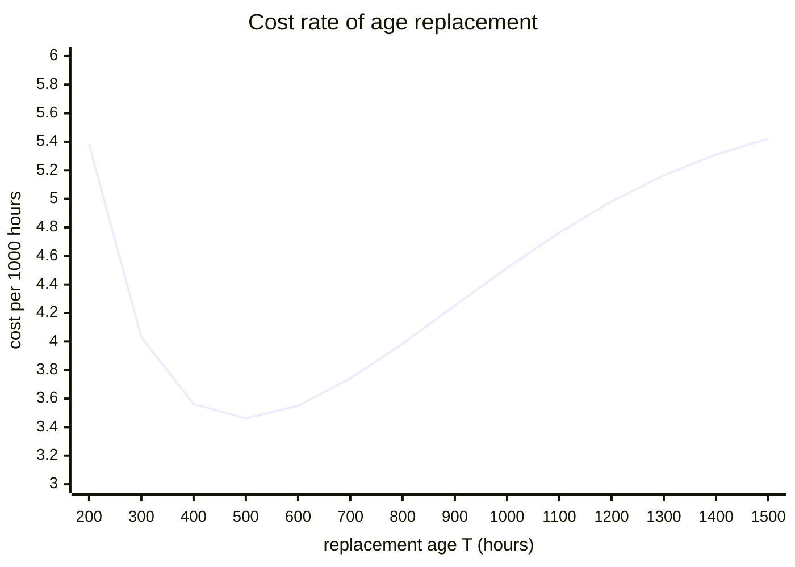
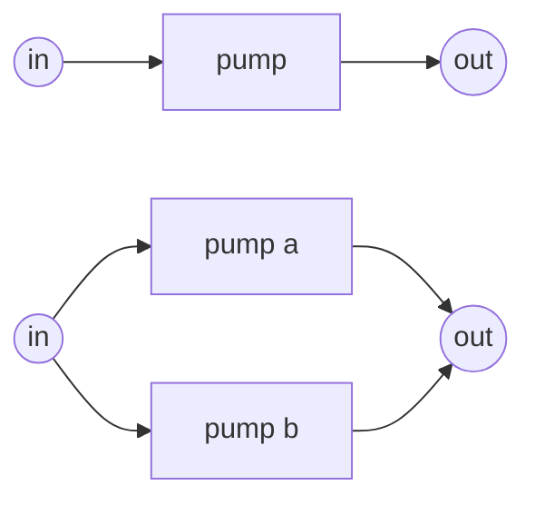

# Lesson 8: Maintaining on purpose

!!! abstract "In this lesson"
    You will learn:

    - why replacing a part before it fails can pay, and exactly when it
      cannot;
    - the cost per hour of an **age-replacement** policy, derived from first
      principles, and how to find the best replacement age;
    - why a part that does not wear out should never be replaced early;
    - **block replacement**, its appeal and its waste;
    - why the best interval changes once the part sits in a system, and how
      RePyability prices a maintenance policy for a whole system, exactly and
      by simulation;
    - **hidden failures**, found only by a periodic test, and how the test
      interval sets a safety function's probability of failing on demand.

    **Before you start:** [Lesson 1](lifetimes.md) (the hazard rate and the
    Weibull shape), [Lesson 6](availability.md) (availability) and
    [Lesson 7](costs.md) (cost rates). About 40 minutes.

## The question

Take the pump from [Lesson 1](lifetimes.md): a Weibull life with
$\alpha = 1000$ hours and $\beta = 2.5$, so it wears out. When a pump fails in
service it costs 5 (in some unit of money: a callout, collateral damage,
disruption); replacing it at a time of your choosing costs 1. Should you
replace pumps before they fail? If so, at what age? And does the answer
change when the pump has a standby next to it?

## The trade-off

Replacing early and replacing late both cost money:

- replace **too early**, and you pay the planned cost often and throw away
  life the pump still had;
- replace **too late**, and most pumps fail first, so you pay the failure
  cost anyway.

If the pump wears out, there is a best age in between. To find it you need
the cost of a policy per hour, over the long run.

## Age replacement: the cost per hour from first principles

The **age-replacement** policy is: replace the pump when it fails, or when it
reaches age $T$, whichever comes first. Either way a new pump goes in, and
life starts again. The history splits into **cycles**, each running from one
replacement to the next, and each one is a fresh, independent copy of the
same random experiment.

That structure gives the long-run cost per hour by a classical result, the
**renewal-reward theorem**: when a process renews in independent cycles, the
long-run cost per unit time is

$$
\text{cost rate} = \frac{\text{expected cost of a cycle}}
                        {\text{expected length of a cycle}}.
$$

(Over a long time you complete many cycles; the total cost is about the
number of cycles times the mean cost of one, and the total time is the number
of cycles times the mean length of one.)

Both pieces are easy to write down:

- A cycle ends in a planned replacement if the pump survives to $T$
  (probability $R(T)$), costing $c_p$, and in a failure otherwise
  (probability $F(T)$), costing $c_u$. So the expected cost of a cycle is
  $c_p R(T) + c_u F(T)$.
- A cycle lasts $\min(\text{life}, T)$. By the same argument as the MTTF in
  [Lesson 1](lifetimes.md), its mean is the area under the reliability curve,
  now stopping at $T$: $\int_0^T R(t)\,dt$.

So the cost rate of replacing at age $T$ is

$$
C(T) = \frac{c_p\,R(T) + c_u\,F(T)}{\int_0^T R(t)\,dt}.
$$

### By hand, at 500 hours

At $T = 500$ hours, $R(500) = 0.838$: 83.8% of cycles end in a planned
replacement and 16.2% in a failure. The expected cost of a cycle is
$1 \times 0.838 + 5 \times 0.162 = 1.648$. The mean cycle length,
$\int_0^{500} R(t)\,dt$, is 476.0 hours (a little under 500, because some
cycles end early in failure). So

$$
C(500) = \frac{1.648}{476.0} = 0.003462 \text{ per hour}.
$$

Running to failure instead ($T \to \infty$) makes every cycle end in a
failure, costing 5, with mean length the MTTF, 887.3 hours: $5 / 887.3 =
0.005635$ per hour. Replacing at 500 hours saves 39%.

### In RePyability

[`NonRepairable`](../guide/maintenance.md#age-replacement-nonrepairable)
evaluates the policy for one component:

```python
import numpy as np
import surpyval as surv
from repyability import NonRepairable

pump = surv.Weibull.from_params([1000, 2.5])
unit = NonRepairable(pump)
unit.set_costs_planned_and_unplanned(cp=1, cu=5)

unit.avg_replacement_time(500)   # -> 476.0     the mean cycle length
unit.cost_rate(500)              # -> 0.003462  per hour
5 / pump.mean()                  # -> 0.005635  running to failure
```

Evaluating $C(T)$ over a range of ages shows the trade-off (per 1000 hours,
to keep the numbers readable):

```python
ages = np.arange(200, 1501, 100)
(1000 * unit.cost_rate(ages)).round(3)
# array([5.382, 4.031, 3.562, 3.462, 3.55 , 3.741, 3.985, 4.252, 4.516,
#        4.763, 4.982, 5.165, 5.31 , 5.421])
```



Replacing very early is expensive (many planned replacements); replacing late
creeps back up towards the run-to-failure rate of 5.635 per 1000 hours. The
bottom is near 500 hours, and `find_optimal_replacement` locates it:

```python
unit.find_optimal_replacement()   # -> 493.0   hours
policy = unit.optimal_replacement_policy()
policy.cost_rate                  # -> 0.003462
1 - policy.cost_rate / (5 / pump.mean())   # -> 0.386   saved against running to failure
```

Replace each pump at 493 hours (or at failure, if that comes first) and save
39% of the cost of running to failure.

??? note "For the curious: the condition for the best age"
    Setting $dC/dT = 0$ and simplifying (using $f = h R$) gives the
    condition the best age $T^*$ satisfies:

    $$
    h(T^*)\int_0^{T^*} R(t)\,dt - F(T^*) = \frac{c_p}{c_u - c_p}.
    $$

    The left side grows with $T$ when the hazard rises, so there is one
    solution; the higher the failure cost $c_u$, the smaller the right side
    and the earlier the best age. Check it for the pump, where
    $c_p/(c_u - c_p) = 1/4$:

    ```python
    best = unit.find_optimal_replacement()
    pump.hf(best) * unit.avg_replacement_time(best) - pump.ff(best)   # -> 0.25
    ```

## When replacing early never pays

Preventive replacement swaps an old part for a new one. That only helps if
the new one is **less likely to fail soon** than the old one, that is, if the
hazard rises with age. Look at the exponential (constant hazard). With
$R(t) = e^{-\lambda t}$ the formula above becomes

$$
C(T) = \lambda c_u + \lambda c_p\,\frac{e^{-\lambda T}}{1 - e^{-\lambda T}},
$$

which is larger than $\lambda c_u$, the run-to-failure rate, for **every**
finite $T$. Replacing an exponential part only adds planned replacements: the
new part is no better than the one you removed. The same holds for a falling
hazard ($\beta < 1$), where the new part is actually *worse* (Lesson 1,
exercise 5).

RePyability says so rather than returning a meaningless age:

```python
ageless = NonRepairable(surv.Exponential.from_params([0.001]))   # MTTF 1000 h
ageless.set_costs_planned_and_unplanned(cp=1, cu=10)
ageless.cost_rate(500)      # -> 0.01154   worse than...
ageless.optimal_replacement_policy().cost_rate   # -> 0.01   ...running to failure
ageless.find_optimal_replacement()   # -> inf   never replace early
```

!!! note "Parts that cannot fail at first"
    Some parts have a **failure-free period**: no unit fails before an age
    $\gamma$ (a Weibull with an offset). If such a part does not wear out
    after $\gamma$, the best policy is to replace it exactly at $\gamma$:
    every cycle then costs $c_p$, no unit ever fails, and the rate is
    $c_p / \gamma$. `find_optimal_replacement` checks that age too, and
    returns it only if it beats running to failure:

    ```python
    dormant = NonRepairable(surv.Weibull.from_params([10, 0.5], gamma=1000))
    dormant.set_costs_planned_and_unplanned(cp=1, cu=5)
    dormant.find_optimal_replacement()   # -> 1000.0
    dormant.optimal_replacement_policy().cost_rate   # -> 0.001   = 1 / 1000
    ```

    In general a replacement age is only worth scheduling if it is cheaper
    than running to failure, whose rate is $c_u/\text{MTTF}$ (or 0 when some
    units never fail at all: they are then kept for good).

## Block replacement

Age replacement needs you to track each unit's age. The simpler **block
replacement** policy replaces at fixed calendar times $T, 2T, 3T, \ldots$,
whatever the unit's age, and at failures in between. It suits fleets of
identical parts serviced together (lamps in a building, filters in a plant)
and planned shutdowns.

The price of the simplicity is waste: a unit that failed and was replaced
shortly before a block time is replaced again at that time, with most of its
life ahead of it. For a part with a constant hazard, block replacement is
pure cost: failures stay a Poisson process at rate $\lambda$ whatever the
replacements, so

$$
C = \lambda c_u + \frac{c_p}{T},
$$

the run-to-failure rate plus the cost of the replacements.

## Maintenance in a system

So far the pump stood alone, and a replacement took no time. In a real plant
neither is true:

- a planned replacement takes time, during which the pump is down: a
  **planned outage**;
- whether an outage stops production depends on the structure. A pump with a
  standby can be replaced while its partner carries the load; a pump that is
  a single point of failure stops the plant.

So the best interval for a component depends on the system around it, and
only a system-level model can say what a maintenance policy is worth.

### Scheduling it in RePyability

In a [`RepairableRBD`](../guide/repairable.md), a component's dict takes a
`"preventive"` schedule:

| Key | Meaning |
|---|---|
| `interval` | The interval $T$ (required; `inf` means no preventive maintenance). |
| `policy` | `"age"` (the default): $T$ after the unit was last put into service as new, so a failure restarts the clock. `"block"`: at $T, 2T, \ldots$, skipped while the unit is down. |
| `duration` | How long a replacement takes: a time-to-maintain model, or `"instant"` (the default). |
| `cost` | Charged at each preventive replacement. |

A replacement renews the unit, so the failure it was heading for never
happens. Take the pump, repaired in about 23 hours after a failure (at a cost
of 5000) and replaced preventively in about 7 hours (at a cost of 1000), with
lost production at 500 per hour, once alone and once with a standby:



```python
from repyability import RepairableRBD

def pump_spec(interval, policy="age"):
    return {
        "reliability": surv.Weibull.from_params([1000, 2.5]),
        "repairability": surv.LogNormal.from_params([3.0, 0.5]),  # about 23 h
        "replace_cost": 5000.0,
        "preventive": {
            "interval": interval,
            "policy": policy,
            "duration": surv.Weibull.from_params([8, 3]),         # about 7 h
            "cost": 1000.0,
        },
    }

def alone(interval, policy="age"):
    return RepairableRBD(
        [("in", "pump"), ("pump", "out")],
        {"pump": pump_spec(interval, policy)},
        downtime_cost_rate=500.0,
    )

def with_standby(interval, policy="age"):
    return RepairableRBD(
        [("in", "a"), ("in", "b"), ("a", "out"), ("b", "out")],
        {"a": pump_spec(interval, policy), "b": pump_spec(interval, policy)},
        downtime_cost_rate=500.0,
    )
```

### The exact cost rate, cycle by cycle

For age replacement, the renewal-reward argument still works; the cycle now
also contains the downtime. A cycle is up for $\min(\text{life}, T)$, then
down for a repair (if it failed) or a planned replacement (if it survived to
$T$), so its mean length is

$$
C_T = \int_0^T R(t)\,dt + F(T)\cdot\text{MTTR} + R(T)\cdot\text{MTTP},
$$

with MTTP the mean time to perform the preventive replacement. Per unit time,
the component then fails $F(T)/C_T$ times, is replaced preventively
$R(T)/C_T$ times, and is up a fraction $\int_0^T R / C_T$ of the time: its
availability. The system's availability and costs follow as in
[Lesson 6](availability.md) and [Lesson 7](costs.md), and
`expected_cost_rate` does all of it exactly:

```python
alone(float("inf")).expected_cost_rate()   # -> 18.0    run to failure
alone(580).expected_cost_rate()            # -> 13.14   replaced at age 580 h
alone(float("inf")).mean_availability()    # -> 0.975
alone(580).mean_availability()             # -> 0.9806
```

Planned replacement raises the lone pump's availability, although every
replacement stops production for about 7 hours. Each one prevents some
failures, which stop production for about 23 hours, and are more expensive.

### Choosing the interval

Sweep the interval for both systems (costs per hour):

```python
for interval in (300, 400, 500, 600, 800, float("inf")):
    print(interval, round(alone(interval).expected_cost_rate(), 2),
          round(with_standby(interval).expected_cost_rate(), 2))
# 300 16.92 8.19
# 400 14.36 7.21
# 500 13.35 6.99
# 600 13.14 7.15
# 800 13.84 8.01
# inf 18.0 11.3
with_standby(500).expected_cost_rate()   # -> 6.985
```

| Interval (h) | 300 | 400 | 500 | 600 | 800 | never |
|---|---|---|---|---|---|---|
| Alone | 16.92 | 14.36 | 13.35 | 13.14 | 13.84 | 18.00 |
| With a standby | 8.19 | 7.21 | 6.99 | 7.15 | 8.01 | 11.30 |

Replacement pays in both systems, but not at the same interval. The lone
pump's planned stops cost production, so it is best replaced *less* often,
at about 580 hours. A pump with a standby can be replaced at almost no cost in
production, so the pair is best replaced at about 500 hours. On its own,
ignoring downtime, the pump is best replaced at 493 hours. Three different
answers for the same pump: the structure and the downtime move the optimum.

### Simulating a policy

The simulation prices the same policy over a finite window, with its spread:

```python
year = alone(580).availability(t_simulation=8760.0, N=500, seed=0)
year.system_failures / year.n_simulations          # -> 3.666   failures a year
year.system_planned_outages / year.n_simulations   # -> 11.82   planned stops a year
year.cost.by_category["preventive"]                # -> 11824.0
```

A planned outage counts as downtime in every availability output, but not as
a failure: `system_planned_outages` counts them separately. (The first year
has slightly fewer planned stops than the long run's 12.3 a year, because
every simulated year starts with a new pump.)

Now compare block replacement at the same interval:

```python
block = alone(580, "block").availability(t_simulation=8760.0, N=500, seed=0)
block.system_planned_outages / block.n_simulations   # -> 14.71
block.cost.cost_rate    # -> 14.15   per hour, against...
year.cost.cost_rate     # -> 13.01   ...for age replacement
```

Block replacement stops the plant more often (it replaces pumps that are
nearly new) and costs more. The long-run values are exact for it too:

```python
alone(580, "block").expected_cost_rate()          # -> 14.06   against 13.14 for age
with_standby(580, "block").expected_cost_rate()   # -> 12.2    against 7.10 for age
with_standby(580, "block").mean_availability()    # -> 0.9901  against 0.9996 for age
```

With a standby, block replacement is far worse: both pumps are replaced at the
same block times, so every replacement stops the plant, and the standby does
nothing for the planned stops. Age replacement renews each pump on its own
clock, so one is almost always running while the other is replaced. The
calendar ties the components together, and the exact values account for it:
they average the system over the block interval rather than combining each
pump's own average. Block replacement could still be the right choice if
grouping the work saves money that this model does not see, such as one
shutdown for several parts, or with staggered block times.

!!! note "Exact or simulated?"
    For age and block replacement, `expected_cost_rate`, `mean_availability`
    and the other long-run methods are exact. For block replacement they are
    computed numerically, to about one part in a million: a repair can run
    over a block time, and components replaced at the same times go down
    together. The simulation (`availability` or `cost`) gives the spread over
    a finite window. See [Costs](../guide/costs.md#preventive-maintenance) in
    the user guide for every detail of the schedule.

## Failures nobody sees

So far a failure has been noticed at once: the pump stops, and its repair
starts. Some failures are silent. A relief valve that has seized, a standby
pump that will not start or a smoke detector with a dead sensor looks just
like a working one, until it is needed, or until someone tests it. Such a
failure is **hidden**: the part is down, and nobody knows. The maintenance
that finds it is a periodic **proof test** (an inspection), every $\tau$
hours.

**By hand.** Take a part whose hidden failures come at a constant rate
$\lambda$, tested every $\tau$, with the test and any repair taking no time.
At a time $t$ after a test it has failed, unseen, with probability
$1 - e^{-\lambda t} \approx \lambda t$. Averaged over the interval, that is

$$
U = \frac{1}{\tau}\int_0^\tau \left(1 - e^{-\lambda t}\right) dt
  = 1 - \frac{1 - e^{-\lambda\tau}}{\lambda\tau}
  \approx \frac{\lambda\tau}{2}:
$$

a failure lies hidden for half an interval on average. For a safety device
this is its average **probability of failure on demand** (PFDavg): the chance
that it does not act when called on. With $\lambda = 2 \times 10^{-6}$ per
hour and a yearly test ($\tau = 8760$ h), $\lambda\tau/2 = 0.00876$.

Two such devices in parallel (1oo2), tested together, are down only when
both have failed since the last test:
$\frac{1}{\tau}\int_0^\tau (1 - e^{-\lambda t})^2\,dt \approx (\lambda\tau)^2/3$.
That is more than the $(\lambda\tau/2)^2$ you would get by multiplying their
average unavailabilities, because both have gone untested for the same time:
their failures are independent, but their exposure is not.

In RePyability an `"inspection"` in a component's dict makes its failures
hidden, found only by a test every `interval`:

```python
def valve(interval):
    return {
        "reliability": surv.Exponential.from_params([2e-6]),   # hidden failures
        "repairability": "instant",
        "inspection": {"interval": interval},
    }

one = RepairableRBD([("s", "v"), ("v", "t")], {"v": valve(8760.0)})
one.mean_unavailability()     # -> 0.008709   PFDavg, about λτ/2
pair = RepairableRBD(
    [("s", "v1"), ("s", "v2"), ("v1", "t"), ("v2", "t")],
    {"v1": valve(8760.0), "v2": valve(8760.0)},
)
pair.mean_unavailability()    # -> 1.01e-4    about (λτ)²/3 = 1.02e-4
```

Redundancy did far more than halve the PFDavg here: it cut it by a factor
of 86, and halving the test interval would quarter it again. Tests with a
duration, and repairs that take time, are simulated (see
[Costs](../guide/costs.md#hidden-failures-and-inspection)).

**Choosing the test interval.** Each test costs $c_i$, and each hour the part
lies failed costs $c_d$. The cost rate is then about
$c_i/\tau + c_d\,\lambda\tau/2$: the first term falls as the interval grows,
the second rises. Setting its derivative to zero gives the best interval,

$$
\tau^* \approx \sqrt{\frac{2\,c_i}{\lambda\,c_d}}.
$$

Unlike age replacement, testing pays even for a constant hazard: a test does
not make the part younger, it finds the failures that have already
happened.

## Repair that does not renew

Everything above assumes a replacement (or repair) makes the part as good as
new. Many repairs do not: fixing a leak in an ageing gearbox leaves the
gearbox as old as it was ("minimal repair"). Then failures come faster and
faster, and the maintenance question becomes *when to overhaul or replace the
whole unit*. The [`Repairable`](../guide/maintenance.md#overhaul-under-minimal-repair-repairable)
class answers it for one unit, with the same trade-off between planned and
unplanned costs.

## Pitfalls

!!! warning "Common mistakes"
    - **Scheduling replacement of parts that do not wear out.** If
      $\beta \le 1$ (or the hazard is flat), preventive replacement can only
      add cost. Check the shape of the hazard first.
    - **A failure that costs little more than a replacement.** The saving
      shrinks as $c_u / c_p$ falls towards 1 (exercise 3).
    - **Optimising a component in isolation.** Downtime and structure move
      the best interval; evaluate the policy in the system.
    - **Forgetting the model's inputs.** The best age depends strongly on the
      Weibull shape and the cost ratio, both estimates: check how the answer
      moves when they change.
    - **Reading a short simulation as the long run.** Simulated windows start
      with new parts; use a long window, or the exact rate, for long-run
      comparisons.
    - **Multiplying the PFDs of redundant channels.** Channels tested
      together have gone untested for the same time; average the product over
      the interval, as RePyability does.
    - **Testing every channel at once.** A test that takes a channel off-line
      takes the whole function off-line if every channel is tested together.

## Summary

!!! success "Key ideas"
    - Age replacement renews the part in independent cycles, so its long-run
      cost rate is (expected cost of a cycle) / (expected length of a cycle):
      $C(T) = \big(c_p R(T) + c_u F(T)\big) / \int_0^T R$.
    - A best replacement age exists only when the hazard rises (wear-out);
      for an exponential part, or $\beta \le 1$, never replace early.
    - A replacement age is only worth it if it beats running to failure,
      $c_u / \text{MTTF}$.
    - Block replacement is simpler to organise but replaces nearly new
      units; for a constant hazard it only adds cost.
    - In a system, planned outages matter: the best interval depends on the
      structure and the cost of downtime. RePyability prices age replacement
      exactly, and any policy by simulation, with planned outages counted as
      downtime but not as failures.
    - A hidden failure lies unseen until a proof test: half an interval on
      average, so a tested part's PFDavg is about $\lambda\tau/2$, and the
      test interval trades test costs against hidden downtime, near
      $\tau^* = \sqrt{2c_i/(\lambda c_d)}$.

## Exercises

**1.** For the pump ($\alpha = 1000$, $\beta = 2.5$, $c_p = 1$, $c_u = 5$),
compute the cost rate of replacing at 300 hours from the formula, using
RePyability only for the cycle length. Is 300 hours better or worse than
running to failure?

??? success "Answer"
    $R(300) = 0.952$, so a cycle costs $1 \times 0.952 + 5 \times 0.048 =
    1.193$ on average, and lasts $\int_0^{300} R = 295.8$ hours: $C(300) =
    0.00403$ per hour. Running to failure costs $0.00564$, so 300 hours is
    better, but not as good as 493 hours ($0.00346$).

    ```python
    R300 = pump.sf(300)
    (1 * R300 + 5 * (1 - R300)) / unit.avg_replacement_time(300)   # -> 0.004031
    ```

**2.** An exponential part has an MTTF of 1000 hours; a planned replacement
costs 1 and a failure 10. Show that replacing it every 500 hours costs more
than running to failure.

??? success "Answer"
    $\lambda = 0.001$. Running to failure costs $\lambda c_u = 0.01$ per
    hour. At $T = 500$: $C = 0.01 + 0.001 \times e^{-0.5}/(1 - e^{-0.5}) =
    0.01 + 0.00154 = 0.01154$. Each planned replacement is wasted: the new
    part is no less likely to fail than the old one.

    ```python
    0.01 + 0.001 * np.exp(-0.5) / (1 - np.exp(-0.5))   # -> 0.01154
    ```

**3.** How do the best age and the saving change for the pump if a failure
costs 10 instead of 5? And if it costs only 2?

??? success "Answer"
    With $c_u = 10$ the best age falls to about 355 hours (failures are
    dearer, so replace earlier). With $c_u = 2$ it rises to about 884 hours,
    and the saving against running to failure shrinks to about 8%: when a
    failure costs little more than a planned replacement, preventive
    replacement barely pays.

    ```python
    dear = NonRepairable(pump)
    dear.set_costs_planned_and_unplanned(cp=1, cu=10)
    dear.find_optimal_replacement()   # -> 354.6
    cheap = NonRepairable(pump)
    cheap.set_costs_planned_and_unplanned(cp=1, cu=2)
    cheap.find_optimal_replacement()   # -> 883.6
    1 - cheap.optimal_replacement_policy().cost_rate / (2 / pump.mean())   # -> 0.079
    ```

**4.** A part with a constant hazard of 0.01 per hour is block-replaced every
100 hours. A failure costs 10 and a planned replacement 2. What does the
policy cost per hour, and what would running to failure cost?

??? success "Answer"
    $C = \lambda c_u + c_p / T = 0.01 \times 10 + 2 / 100 = 0.12$ per hour,
    against $0.1$ for running to failure: the block replacements add 20% for
    nothing.

**5.** In the system example, explain why the pair of pumps is best replaced
*more* often than the lone pump, although each pump is the same.

??? success "Answer"
    What drives the best age is the ratio of the cost of a failure to the
    cost of a planned replacement (exercise 3), and in a system both include
    lost production. For the lone pump, a planned replacement costs about
    $1000 + 7 \times 500 \approx 4600$ and a failure about
    $5000 + 23 \times 500 \approx 16\,400$: a ratio of about 3.6. A pump
    with a standby rarely stops production either way, so its costs stay
    near 1000 and 5000: a ratio of 5. The higher ratio favours replacing
    earlier. The numbers agree with exercise 3: a ratio of 5 gave 493 hours
    and a ratio of 2 gave 884, and the lone pump's 3.6 lands in between, at
    580.

    ```python
    mttp = surv.Weibull.from_params([8, 3]).mean()        # about 7.1 h
    mttr = surv.LogNormal.from_params([3.0, 0.5]).mean()  # about 22.8 h
    (5000 + 500 * mttr) / (1000 + 500 * mttp)   # -> 3.58
    ```

**6.** A fire pump's hidden failures come at $10^{-4}$ per hour. A test
costs 2000, and each hour the pump lies failed is valued at 500. How often
should it be tested, and what does that cost per hour?

??? success "Answer"
    $\tau^* \approx \sqrt{2 \times 2000 / (10^{-4} \times 500)} = 283$ hours,
    about every 12 days. The cost rate is then about
    $2000/283 + 500 \times 10^{-4} \times 283 / 2 = 14.1$ per hour: half
    tests, half hidden downtime, as at any such optimum. RePyability's exact
    rate agrees:

    ```python
    fire_pump = RepairableRBD(
        [("s", "p"), ("p", "t")],
        {"p": {
            "reliability": surv.Exponential.from_params([1e-4]),
            "repairability": "instant",
            "downtime_cost": 500.0,
            "inspection": {"interval": 283.0, "cost": 2000.0},
        }},
    )
    fire_pump.expected_cost_rate()   # -> 14.08
    ```

## Where next

- [Lesson 9: Designing for reliability](design.md) turns from operating a
  system to designing one.
- In the user guide, [Maintenance policies](../guide/maintenance.md) covers
  `NonRepairable` and `Repairable` in full, and
  [Costs](../guide/costs.md#preventive-maintenance) the preventive schedule
  of a `RepairableRBD`.
