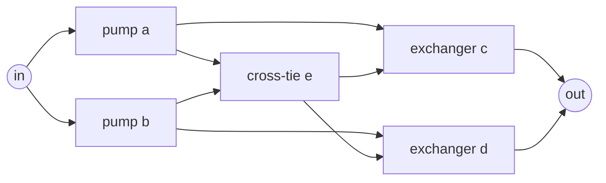
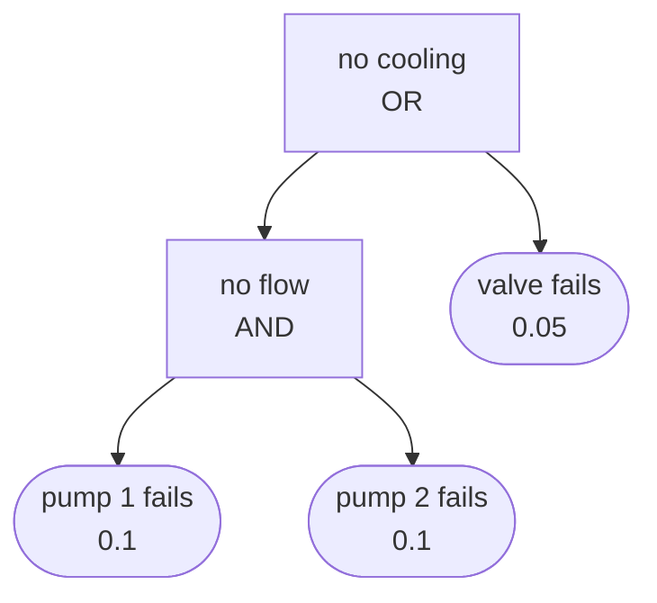
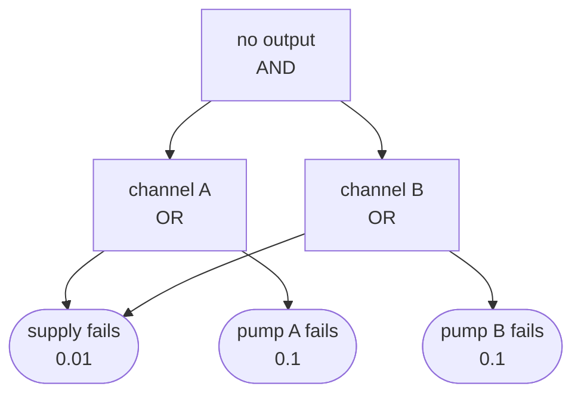

# Lesson 3: Paths, cuts and the exact engine

!!! abstract "In this lesson"
    You will learn:

    - why some systems cannot be reduced to series and parallel pieces;
    - the **structure function**, which defines a system's reliability as a
      sum over every combination of working and failed components;
    - **minimal path sets** and **minimal cut sets**, and what they reveal,
      such as single points of failure;
    - why path probabilities cannot be added, and the **rare-event
      approximation** that safety analysts use instead;
    - the **pivotal decomposition**, and how RePyability builds its exact
      engine on it, after reducing the series and parallel parts;
    - to read a **fault tree**, the same logic seen from the side of
      failure, and why an event that feeds several gates must be counted
      once.

    **Before you start:** [Lesson 2](systems.md) (series, parallel and the
    reduction of series-parallel systems). About 30 minutes.

## The question

A cooling system has two pumps, `a` and `b`, each feeding its own heat
exchanger, `c` and `d`. A cross-tie valve, `e`, joins the two lines, so that
either pump can feed either exchanger through it. Each of the five
components works (over the period of interest) with probability 0.9. What is
the probability that the plant gets cooling?



Try the reduction of [Lesson 2](systems.md). The pump `a` is not in series
with `c` (water from `a` can also leave through the cross-tie), nor in
parallel with anything. The cross-tie is neither in series nor in parallel
with any block. There is no group to replace by one block, so the reduction
stops before it starts. This arrangement is the classic **bridge**, and it is
common: cross-ties, ring mains and meshed networks all contain bridges.

In a block diagram the arrows say which way success can flow. The cross-tie
can carry water from pump `a`'s line to exchanger `d`, or from pump `b`'s line
to exchanger `c`, so it has arrows in from both pumps and out to both
exchangers:

```python
import itertools
import numpy as np
import surpyval as surv
from repyability import NonRepairableRBD

fail = surv.FixedEventProbability.from_params   # takes the FAILURE probability
bridge_edges = [
    ("in", "a"), ("in", "b"),       # two pumps
    ("a", "c"), ("b", "d"),         # each feeds its own exchanger
    ("a", "e"), ("b", "e"),         # either pump can feed the cross-tie
    ("e", "c"), ("e", "d"),         # which can feed either exchanger
    ("c", "out"), ("d", "out"),
]
bridge = NonRepairableRBD(bridge_edges, {n: fail(0.1) for n in "abcde"})
bridge.sf()   # -> 0.97848
```

RePyability has the answer: 0.97848. This lesson shows where it comes from,
and three ways of thinking about a system that work for any structure.

## The definition: the structure function

Describe the state of the components by a vector $x$, with $x_i = 1$ if
component $i$ works and $x_i = 0$ if it has failed. The **structure function**
$\varphi(x)$ is 1 if, in that state, the working components connect the input
to the output, and 0 otherwise.

With independent components, the probability of a particular state is the
product of $p_i$ for the working components and $q_i = 1 - p_i$ for the
failed ones. The system's reliability is the total probability of the states
in which it works:

$$
R = \sum_{x} \varphi(x) \prod_{i} p_i^{x_i}\, q_i^{1 - x_i}
$$

For two components in parallel, each working with probability 0.9, there are
four states:

| $x_1$ | $x_2$ | $\varphi(x)$ | Probability |
|---|---|---|---|
| 1 | 1 | 1 | $0.9 \times 0.9 = 0.81$ |
| 1 | 0 | 1 | $0.9 \times 0.1 = 0.09$ |
| 0 | 1 | 1 | $0.1 \times 0.9 = 0.09$ |
| 0 | 0 | 0 | $0.1 \times 0.1 = 0.01$ |

$R = 0.81 + 0.09 + 0.09 = 0.99$, the parallel formula of Lesson 2.

The same definition works for the bridge; it only needs 32 states. The
library can evaluate $\varphi$ for any state (`is_system_working`), so you
can carry out the definition literally:

```python
total, working_states = 0.0, 0
for states in itertools.product([True, False], repeat=5):
    state = dict(zip("abcde", states))
    probability = np.prod([0.9 if up else 0.1 for up in states])
    if bridge.is_system_working(state, method="p"):
        total += probability
        working_states += 1
working_states   # -> 16   of the 32 states work
total            # -> 0.97848
```

This **state enumeration** is exact and makes the meaning of system
reliability plain. It is also hopeless beyond a few dozen components: $n$
components have $2^n$ states, over a million million for 40 components. The
rest of the lesson finds better ways.

## Paths and cuts

Two kinds of component set describe a structure.

A **path set** is a set of components whose working guarantees that the
system works, whatever the others do. A **minimal path set** has no smaller
path set inside it: every component in it is needed. For the bridge they are
the four routes the water can take:

```python
sorted(sorted(p) for p in bridge.get_min_path_sets(include_in_out_nodes=False))
# [['a', 'c'], ['a', 'd', 'e'], ['b', 'c', 'e'], ['b', 'd']]
```

`{a, c}` is pump `a` through its own exchanger; `{a, e, d}` is pump `a`
through the cross-tie to exchanger `d`.

A **cut set** is a set of components whose failure guarantees that the
system fails. A **minimal cut set** has no smaller cut set inside it:

```python
sorted(sorted(c) for c in bridge.get_min_cut_sets())
# [['a', 'b'], ['a', 'd', 'e'], ['b', 'c', 'e'], ['c', 'd']]
```

Both pumps; both exchangers; or one pump, the cross-tie and the *other* line's
exchanger. The two lists are dual: a cut set must break every path, so it
contains at least one component from each minimal path set, and a path set
contains at least one component from each minimal cut set.

Cut sets are how engineers find weak spots. A minimal cut set with a single
component is a **single point of failure**: that component alone can fail the
system. The bridge has none, which is what the cross-tie buys. The pumps and
valve of the running example have one:

```python
pumps_valve = NonRepairableRBD(
    [("in", "p1"), ("in", "p2"), ("p1", "v"), ("p2", "v"), ("v", "out")],
    {"p1": fail(0.1), "p2": fail(0.1), "v": fail(0.05)},
)
sorted(sorted(c) for c in pumps_valve.get_min_cut_sets())
# [['p1', 'p2'], ['v']]
```

Series and parallel systems are the two extremes. A series system of $n$
components has one minimal path set (all of them) and $n$ minimal cut sets of
one component each. A parallel system is the reverse.

## Why you cannot add paths

"The system works if at least one minimal path set works." It is tempting to
add up the probabilities of the paths:

| Path | Probability that every component in it works |
|---|---|
| $\{a, c\}$ | $0.9^2 = 0.81$ |
| $\{b, d\}$ | $0.81$ |
| $\{a, e, d\}$ | $0.9^3 = 0.729$ |
| $\{b, e, c\}$ | $0.729$ |
| **Sum** | **3.078** |

A "probability" of 3.078 is impossible. The paths share components, so their
events overlap: a state in which every component works is counted four times.
The probability of a union is the sum of the probabilities *minus* the
overlaps. For two events,

$$
\Pr(A \cup B) = \Pr(A) + \Pr(B) - \Pr(A \cap B).
$$

With the two routes `{a, c}` and `{b, d}` alone (the cross-tie failed), the
overlap is both routes working, $0.81 \times 0.81$:
$0.81 + 0.81 - 0.6561 = 0.9639$. For four overlapping paths, the full
**inclusion–exclusion** formula has fifteen terms, and for real systems it
runs to millions.

### The rare-event approximation

Safety analysts, who work with fault trees and cut sets, use the other side.
The system fails if at least one minimal cut set has entirely failed, and
when failures are rare the overlaps between cut-set events are tiny, so

$$
Q = 1 - R \approx \sum_{\text{minimal cut sets } C}\ \prod_{i \in C} q_i .
$$

For the bridge, $0.1^2 + 0.1^2 + 0.1^3 + 0.1^3 = 0.022$, against the exact
$1 - 0.97848 = 0.02152$: 2% too high. Make the components ten times better
($q = 0.01$) and the approximation gives $0.000202$, against the exact
$0.00020195$: 0.02% too high.

```python
better = NonRepairableRBD(bridge_edges, {n: fail(0.01) for n in "abcde"})
better.ff()                    # -> 0.00020195
2 * 0.01**2 + 2 * 0.01**3      # -> 0.000202   the rare-event approximation
```

The approximation always errs on the high side (the sum of the probabilities
of events is never less than the probability of their union), so it is a
safe, conservative number, and a good one when the $q_i$ are small. It is
also how many tools compute the Fussell–Vesely importance of
[Lesson 4](importance.md). RePyability does not need it: it computes the
exact values.

## Pivotal decomposition: divide and conquer

The idea that cracks the bridge is to *condition* on one awkward component.
Either the cross-tie works or it has failed. By the law of total probability
(see the [refresher](index.md#a-probability-refresher)),

$$
R = p_e\, R(\text{system} \mid e \text{ works})
  + q_e\, R(\text{system} \mid e \text{ failed}).
$$

Each conditional system is series-parallel, and Lesson 2 solves it:

- **Cross-tie working.** Either pump can reach either exchanger, so the
  system needs at least one pump and at least one exchanger:
  $(a \parallel b)$ in series with $(c \parallel d)$, giving
  $(1 - 0.1^2)(1 - 0.1^2) = 0.9801$.

    ```mermaid
    flowchart LR
        s((in)) --> a[pump a] & b[pump b]
        a & b --> c[exchanger c] & d[exchanger d]
        c & d --> t((out))
    ```

- **Cross-tie failed.** The two lines are separate: $(a - c)$ in parallel
  with $(b - d)$, giving $1 - (1 - 0.81)^2 = 0.9639$.

    ```mermaid
    flowchart LR
        s((in)) --> a[pump a] --> c[exchanger c] --> t((out))
        s --> b[pump b] --> d[exchanger d] --> t
    ```

Weighting the two cases by the cross-tie's probabilities:

$$
R = 0.9 \times 0.9801 + 0.1 \times 0.9639 = 0.88209 + 0.09639 = 0.97848.
$$

RePyability can hold any component working or failed, so each case can be
checked separately:

```python
bridge.sf(working_nodes=["e"])   # -> 0.9801   cross-tie working
bridge.sf(broken_nodes=["e"])    # -> 0.9639   cross-tie failed
0.9 * bridge.sf(working_nodes=["e"]) + 0.1 * bridge.sf(broken_nodes=["e"])   # -> 0.97848
```

This is the **pivotal decomposition** (also called the Shannon expansion),
with `e` as the pivot. It works for any component and any structure: pivot on
a component, and each of the two smaller systems has one component fewer to
worry about. Pivoting on a different component gives the same answer by a
different route (exercise 3). It also underlies the importance measures of
[Lesson 4](importance.md): the difference between the two cases,
$R(e \text{ works}) - R(e \text{ failed})$, is the cross-tie's Birnbaum
importance.

## How RePyability computes exactly

RePyability's engine works in two stages.

**First, it reduces what it can.** Any series chain, parallel group or
$k$-out-of-$n$ group of blocks is replaced by one block, whose reliability
comes from the formulas of [Lesson 2](systems.md): $p_1 p_2 \cdots$ in
series, $1 - q_1 q_2 \cdots$ in parallel. The new blocks can form new chains
and groups, so this repeats until nothing more can be reduced, exactly as you
reduced the cooling circuit by hand in Lesson 2. A series-parallel diagram,
however large, reduces to a single block.

**Then it pivots on what is left.** The bridge does not reduce at all: the
cross-tie `e` joins the two lines, so no two of its blocks are simply in
series or in parallel. For such a *core* the engine applies the pivotal
decomposition over and over, to the core's minimal path sets:

1. Pick the block that appears in the most path sets, and split into two
   cases.
2. If it works, remove it from every path set that contains it (it no longer
   needs to be satisfied). If it has failed, delete every path set that
   contains it (those paths are broken).
3. Repeat on each case until it is trivial: a path set that has become empty
   means the system works (probability 1); no path sets left means it has
   failed (probability 0).

Many branches of this tree lead to the same sub-problem, and the engine
solves each one only once and reuses its answer. When a core sits inside a
larger diagram, its blocks may themselves be reduced groups, and the rest of
the diagram is reduced around it. Both stages depend only on the diagram,
not on the probabilities, so they are worked out once per RBD and then
replayed for any probabilities: every time in an array, every importance
measure, every step of an allocation search. The result is exact, with no
approximation and no simulation.

You can hand the engine any component probabilities directly:

```python
bridge.system_probability({"a": 0.9, "b": 0.9, "c": 0.9, "d": 0.9, "e": 0.9})
# array([0.97848])
bridge.system_probability({"a": 0.95, "b": 0.8, "c": 0.9, "d": 0.99, "e": 0.5})[0]   # -> 0.979425
```

With `method="c"` the same computation gives the probability that the
system fails, and returns its complement; the two give the same value.

Reduction is what keeps large redundant plants cheap. Thirty stages in
series, each a duplicated pair of units, have $2^{30}$ (over a billion)
minimal path sets, one for each way of choosing a unit from every stage. The
diagram reduces to a single block, so the engine never lists them:

```python
stages = 30
edges, models, previous = [], {}, ["in"]
for i in range(stages):
    pair = [f"a{i}", f"b{i}"]
    edges += [(p, unit) for p in previous for unit in pair]   # each stage feeds the next
    models.update({unit: fail(0.1) for unit in pair})
    previous = pair
edges += [(p, "out") for p in previous]
plant = NonRepairableRBD(edges, models)
plant.sf()                    # -> 0.7397
(1 - 0.1**2) ** stages        # -> 0.7397   each stage fails only if both units fail
2**stages                     # -> 1073741824   minimal path sets, never listed
```

!!! note "What exactness costs"
    Reducing is cheap, so series-parallel diagrams of any size are
    evaluated at once. The work is in the core. Pivoting on path sets, as
    above, grows with the number of the core's minimal path sets and how
    they overlap, not with $2^n$, but densely meshed structures multiply
    them: a chain of $k$ bridges in series has $4^k$ (4, 16, 64, ...). So
    a core with many path sets is pivoted on differently: block by block,
    in an order that follows the graph, each sub-problem known by how many
    working inputs each block still to come already has, not by its path
    sets. This *binary decision diagram* grows with how wide the mesh is,
    not with how many paths it has, and fifty bridges in series take a
    hundredth of a second. A mesh too wide even for that is left to the
    simulations. The [performance notes](../guide/saving.md#performance)
    in the guide say more.

## The same logic, upside down: fault trees

A block diagram asks how the system works. Safety engineers usually ask the
opposite question, how it can fail, and draw the answer as a **fault
tree**. It starts from an undesired **top event**, here "no cooling", and
works down through **gates** to the **basic events** that cause it: an OR
gate occurs when any of its inputs occurs, an AND gate when all of them do,
and a VOTE gate when at least $k$ of its $n$ inputs do. This is the tree of
the pumps-and-valve system:



Read it from the top: cooling is lost if the valve fails, or if there is no
flow, which needs both pumps to fail. It is the diagram turned inside out.
Blocks in series fail when any of them fails, so they become an OR gate;
blocks in parallel fail only when all of them do, an AND gate; and a block
that needs $k$ of $n$ units working fails when $n - k + 1$ of them have
failed, a VOTE gate.

| Block diagram (works when...) | Fault tree (fails when...) |
|---|---|
| series: every block works | OR gate: any input occurs |
| parallel: any block works | AND gate: every input occurs |
| $k$ of $n$ blocks work | VOTE gate: $n - k + 1$ of $n$ inputs occur |

=== "By hand"

    Work up from the leaves. No flow needs both pumps to fail:
    $0.1 \times 0.1 = 0.01$. The top event occurs unless neither the
    valve fails nor the flow stops:
    $1 - (1 - 0.05)(1 - 0.01) = 0.0595$, which is $1 - 0.9405$, the
    diagram's unreliability.

    The minimal cut sets can be read off the tree from the top: an OR gate
    offers each of its inputs as an alternative, and an AND gate needs all
    of its inputs together. So the top event occurs through `{valve}` or
    through `{pump 1, pump 2}`: the same cut sets as the diagram's.

=== "In RePyability"

    ```python
    from repyability import FaultTree

    tree = FaultTree(
        {
            "no cooling": ("or", ["no flow", "valve"]),
            "no flow": ("and", ["pump 1", "pump 2"]),
        },
        {"pump 1": 0.1, "pump 2": 0.1, "valve": 0.05},   # probability each occurs
    )
    tree.top_event_probability()   # -> 0.0595
    [sorted(c) for c in tree.minimal_cut_sets()]
    # [['valve'], ['pump 1', 'pump 2']]
    FaultTree.from_rbd(pumps_valve).top_event_probability()   # -> 0.0595   the diagram as a tree
    ```

The two describe one system, and RePyability converts between them:
`FaultTree.from_rbd` turns a diagram into its tree, and `to_rbd` a tree into
its diagram.

**Repeated events.** A tree makes something easy to draw that a diagram
makes awkward: an event that feeds several gates. Two channels, either of
which will do, share a power supply that fails with probability 0.01; each
channel also fails if its own pump (0.1) does:



Each channel fails with probability $1 - 0.99 \times 0.9 = 0.109$, but the
two are not independent: they share the supply. Pivot on it, as in the
pivotal decomposition above. If the supply fails (0.01), both channels fail.
If it works (0.99), both fail only if both pumps do ($0.1^2$). So the top
event has probability $0.01 + 0.99 \times 0.01 = 0.0199$. Multiplying the
channels as if they were independent would give $0.109^2 = 0.0119$, 40% too
low: the shared supply is a common cause that fails both channels at once.

```python
shared = FaultTree(
    {
        "no output": ("and", ["channel A", "channel B"]),
        "channel A": ("or", ["supply", "pump A"]),
        "channel B": ("or", ["supply", "pump B"]),
    },
    {"supply": 0.01, "pump A": 0.1, "pump B": 0.1},
)
shared.top_event_probability()   # -> 0.0199
```

RePyability evaluates trees with the engine of this lesson: every branch that
shares nothing with the rest of the tree is reduced to one block, and the
pivotal decomposition is applied to what the repeated events tie together.
The result is exact, repeated events included. The
[Fault trees](../guide/fault-trees.md) guide covers the rest: trees over
time, ranking the cut sets, importance measures and the conversions.

## Pitfalls

!!! warning "Common mistakes"
    - **Adding path probabilities.** Paths overlap; their probabilities can
      sum to more than 1. Use the union, not the sum.
    - **Forcing a structure into series and parallel.** Cross-ties, shared
      supplies and ring mains usually are not series-parallel. Draw the
      diagram as it is, and let the exact engine evaluate it.
    - **Drawing one physical component as two independent blocks.** If one
      power supply feeds both pumps, it is a single component that appears
      in several path sets, not two independent copies; treating it as two
      makes the system look far more reliable than it is. RePyability lets
      [one component appear in several places](../guide/building.md#one-component-in-several-places).
    - **Trusting the rare-event approximation for unreliable parts.** It is
      conservative, and accurate only when failure probabilities are small.

## Summary

!!! success "Key ideas"
    - The structure function $\varphi(x)$ defines system reliability as the
      total probability of the working states; enumerating the $2^n$ states
      is exact but only feasible for tiny systems.
    - Minimal path sets are the minimal ways to succeed; minimal cut sets the
      minimal ways to fail. A cut set of one component is a single point of
      failure.
    - Path probabilities cannot be added (the paths overlap). The rare-event
      approximation, the sum over minimal cut sets of the product of their
      unreliabilities, is conservative and accurate when failures are rare.
    - The pivotal decomposition,
      $R = p_i R(i \text{ works}) + q_i R(i \text{ failed})$, splits any
      system into two simpler ones.
    - RePyability first reduces every series, parallel and $k$-out-of-$n$
      group to one block, then applies the pivotal decomposition to
      whatever is left (through its path sets, or a decision diagram built
      from its graph when it has many), reusing repeated sub-problems. Every
      system reliability is exact, and series-parallel diagrams of any size
      are fast.
    - A fault tree describes the same logic from the side of failure: an OR
      gate is a series block, an AND gate a parallel one, a VOTE gate a
      $k$-out-of-$n$ block, and the cut sets are the same. An event that
      feeds several gates must be counted once, by pivoting on it, not
      multiplied as if its appearances were independent.

## Exercises

**1.** List the minimal path sets and minimal cut sets of the pumps-and-valve
system (two pumps in parallel feeding a valve). Which component is a single
point of failure?

??? success "Answer"
    Path sets: `{p1, v}` and `{p2, v}`. Cut sets: `{v}` and `{p1, p2}`. The
    valve is a cut set on its own: a single point of failure.

    ```python
    sorted(sorted(p) for p in pumps_valve.get_min_path_sets(include_in_out_nodes=False))
    # [['p1', 'v'], ['p2', 'v']]
    len(pumps_valve.get_min_cut_sets())   # -> 2
    ```

**2.** A system has two minimal path sets, `{a, b}` and `{a, c}`, and every
component works with probability 0.9. Find its reliability by
inclusion–exclusion, and check it by reducing the diagram.

??? success "Answer"
    Both paths work only when `a`, `b` and `c` all work, so
    $R = 0.81 + 0.81 - 0.9^3 = 0.891$. The diagram is `a` in series with
    `b` and `c` in parallel: $0.9 \times (1 - 0.1^2) = 0.891$.

    ```python
    shared = NonRepairableRBD(
        [("in", "a"), ("a", "b"), ("a", "c"), ("b", "out"), ("c", "out")],
        {n: fail(0.1) for n in "abc"},
    )
    shared.sf()   # -> 0.891
    ```

**3.** Solve the bridge again, pivoting on pump `a` instead of the
cross-tie. Do you get the same answer?

??? success "Answer"
    With `a` working, the system works if `c` works, or if `d` works and
    either `b` or `e` does: $1 - 0.1 \times [1 - 0.9 \times (1 - 0.1^2)]
    = 0.9891$. With `a` failed, only `b` can pump, through `d` or through
    the cross-tie to `c`: $0.9 \times [1 - 0.1 \times (1 - 0.81)] =
    0.8829$. Then $R = 0.9 \times 0.9891 + 0.1 \times 0.8829 = 0.97848$, the
    same: any pivot works.

    ```python
    bridge.sf(working_nodes=["a"])   # -> 0.9891
    bridge.sf(broken_nodes=["a"])    # -> 0.8829
    ```

**4.** Every component of the bridge now works with probability 0.99. How
far off is the rare-event approximation? And if they work with probability
0.7?

??? success "Answer"
    At 0.99 the approximation, 0.000202, is 0.02% above the exact 0.00020195.
    At 0.7 it gives $2 \times 0.09 + 2 \times 0.027 = 0.234$, against an
    exact 0.1984: 18% too high. The approximation is only good when failures
    are rare.

    ```python
    poor = NonRepairableRBD(bridge_edges, {n: fail(0.3) for n in "abcde"})
    poor.ff()                      # -> 0.19836
    2 * 0.3**2 + 2 * 0.3**3        # -> 0.234
    ```

**5.** How many states would state enumeration need for a system of 40
components? Why is the exact engine not limited in the same way?

??? success "Answer"
    $2^{40} \approx 1.1 \times 10^{12}$ states. The engine never lists
    states: it reduces the series and parallel parts to single blocks, and
    pivots only on what is left, working on its path sets (or, when they
    are many, a decision diagram whose size depends on how wide the mesh
    is). A series or parallel system of 40 components
    reduces to one block, and is solved instantly.

    ```python
    2**40   # -> 1099511627776
    ```

**6.** A trip system has three sensors and trips when at least two of them
detect a demand, so it fails when at least two of the three sensors fail.
Each sensor fails on its own with probability 0.05, and all three share a
power supply that fails with probability 0.01. What is the probability that
the trip fails? What would you get by treating each sensor as independent,
failing with $1 - 0.99 \times 0.95$?

??? success "Answer"
    Pivot on the power supply. If it fails (0.01), every sensor is dead and
    the trip fails. If it works (0.99), the trip fails when at least two of
    the three sensors fail on their own: $3q^2 - 2q^3 = 3 \times 0.0025 -
    2 \times 0.000125 = 0.00725$. So the trip fails with probability
    $0.01 + 0.99 \times 0.00725 = 0.01718$. Treating the sensors as
    independent, each failing with $q = 0.0595$, gives $3q^2 - 2q^3 =
    0.0102$: 41% too low. The supply is a single point of failure: `{power}`
    is a minimal cut set of its own.

    ```python
    sensors = FaultTree(
        {
            "no trip": ("vote", 2, ["sensor 1", "sensor 2", "sensor 3"]),
            "sensor 1": ("or", ["power", "s1"]),
            "sensor 2": ("or", ["power", "s2"]),
            "sensor 3": ("or", ["power", "s3"]),
        },
        {"power": 0.01, "s1": 0.05, "s2": 0.05, "s3": 0.05},
    )
    sensors.top_event_probability()   # -> 0.01718
    [sorted(c) for c in sensors.minimal_cut_sets()]
    # [['power'], ['s1', 's2'], ['s1', 's3'], ['s2', 's3']]
    q = 1 - 0.99 * 0.95
    3 * q**2 - 2 * q**3               # -> 0.0102
    ```

## Where next

- [Lesson 4: Which component matters?](importance.md) uses the pivotal
  decomposition to measure how much each component matters.
- In the user guide, [Building an RBD](../guide/building.md) covers every way
  to describe a structure, including path and cut sets,
  [Fault trees](../guide/fault-trees.md) the trees and their conversions, and
  [Concepts](../concepts.md#how-the-system-quantity-is-computed) summarises
  the exact engine.
