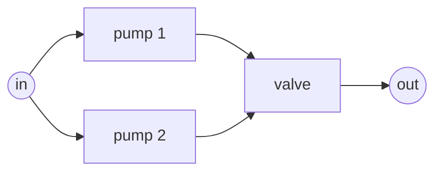
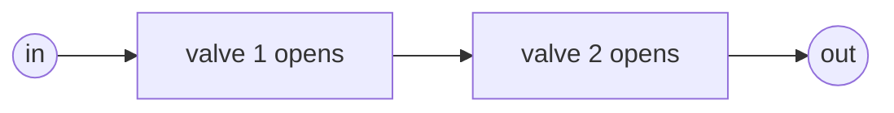
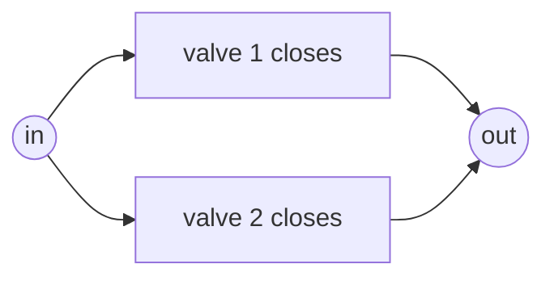
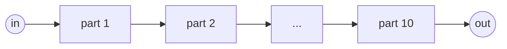
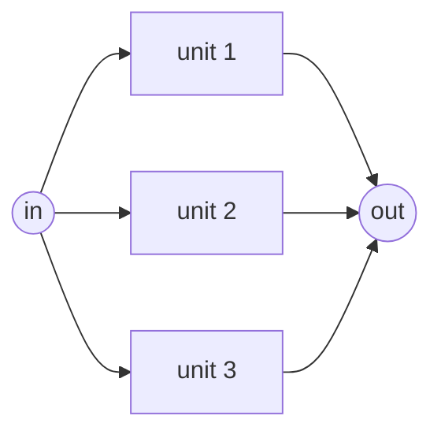
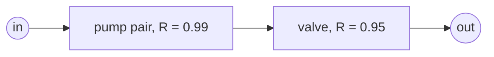
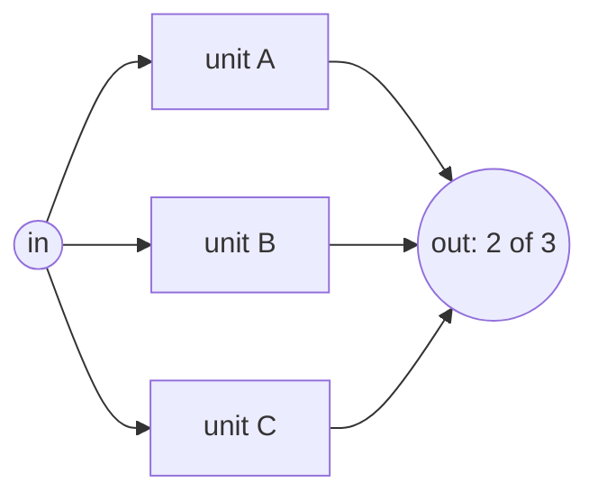
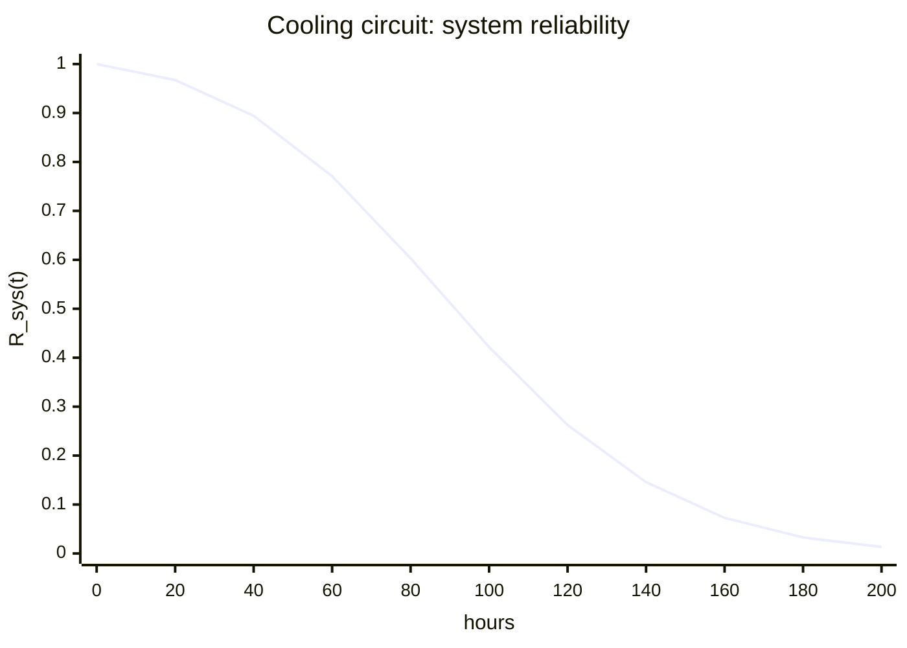
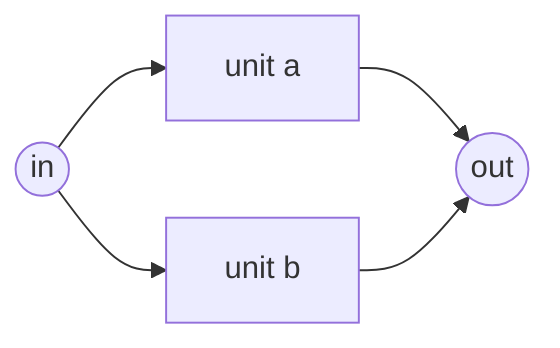

# Lesson 2: Systems of components

!!! abstract "In this lesson"
    You will learn:

    - what a reliability block diagram shows: the logic of success, not the
      wiring;
    - how reliabilities combine in series, in parallel and k-out-of-n, by hand
      and with `NonRepairableRBD`;
    - how component lifetimes become a system reliability curve, and why
      redundancy can make the hazard rise;
    - how to find a system's mean time to failure, exactly and by simulation;
    - how uncertainty about the component models carries to the system.

    **Before you start:** [Lesson 1](lifetimes.md). About 40 minutes.

## The question

A cooling circuit has two identical pumps, either of which can deliver the
full flow, feeding one control valve. From [Lesson 1](lifetimes.md) you can
describe each part: a pump fails to start one time in ten, the valve fails
to open one time in twenty, and over a long run each has a lifetime
distribution. But the plant manager asks about the circuit: when the plant
calls for cooling, what is the probability that water flows? And how likely
is the circuit to run for 50 hours without failing?

The parts alone cannot answer that. Losing one pump does no harm, because the
other carries the flow; losing the valve stops everything. You need a model
of the **logic of success**: which combinations of working parts make the
system work. This lesson builds that model and pushes the component numbers
through it, by hand and with RePyability.

## Reliability block diagrams

A **reliability block diagram** (RBD) draws each component as a **block** on
the way from an **input node** to an **output node**. The system works when
some **path** of working blocks connects the input to the output. Here is the
cooling circuit:



Two paths run through it, one through each pump. If a pump fails, the other
path still works; if the valve fails, both are broken. The valve is a
**single point of failure**, a block whose failure alone fails the system.

An RBD shows **success logic, not wiring**. Plants often fit two valves one
after the other in a pipe, so that the flow can be stopped even if one valve
sticks:

```text
tank ───── valve 1 ───── valve 2 ───── process
```

For the function "let the flow through", both valves must open, so their
blocks are in **series**, one after the other on a single path. For the
function "stop the flow", either valve closing is enough, so their blocks are
in **parallel**, each on a path of its own:





The same two valves give two diagrams, because **reliability is always the
reliability of a function**, such as "stop the flow" or "run for 50 hours".
The second valve makes stopping the flow more reliable and letting it through
less so. State the function before you draw anything.

Two assumptions come with every diagram here: each block is either working
or failed, and blocks fail **independently**, so one failing does not change
the chance that another fails. [Lesson 5](dependence.md) relaxes the second.

## Series: every block must work

In a series system every block lies on the one path, so every block must
work, like a chain that holds only if every link holds.



Write $R_i$ for the reliability of block $i$ and $q_i = 1 - R_i$ for its
unreliability (the $F$ of Lesson 1). The system works only if block 1 works
*and* block 2 works *and* so on, and for independent blocks the probability
of all of these is the product:

$$
R_{\text{sys}} = \prod_{i=1}^{n} R_i = R_1 \, R_2 \cdots R_n
$$

Take ten parts, each with reliability 0.99. The weakest link is 0.99, but the
chain is $0.99^{10} = 0.904$. A chain is **weaker than its weakest link**,
because every block adds one more way to fail: ten parts that each fail one
time in a hundred make a system that fails about one time in ten.

That "about one in ten" is a useful shortcut. Multiplying out the system
unreliability $Q_{\text{sys}}$ gives

$$
Q_{\text{sys}} = 1 - \prod_{i=1}^{n} (1 - q_i)
= \sum_i q_i - \sum_{i<j} q_i q_j + \dots
\approx \sum_i q_i
$$

When the $q_i$ are small their products are far smaller, so unreliabilities
nearly add: $\sum_i q_i = 10 \times 0.01 = 0.1$, against the exact 0.0956.
The sum always overstates $Q_{\text{sys}}$, because it counts more than once
the cases where several blocks fail together; its relative error is at most
about half the sum, 5% here. Trust it while $\sum_i q_i$ is below about 0.1.
For ten parts with $q_i = 0.1$ it gives 1, a certain failure, against the
true 0.651.

```python
import numpy as np
import surpyval as surv
from math import comb
from scipy.integrate import quad
from repyability import NonRepairableRBD

0.99**10        # -> 0.9044   ten parts in series
1 - 0.99**10    # -> 0.0956   exact; the shortcut gives 0.1
1 - 0.9**10     # -> 0.6513   exact; the shortcut gives 1.0
```

### In RePyability

`NonRepairableRBD` models a system whose failed blocks stay failed (repair
comes in [Lesson 6](availability.md)). It needs the diagram's **edges**, as
`(from, to)` pairs of node names, and a dict giving each block a **model**.
For a fixed probability of failure, such as failing on a demand, the model is
surpyval's `FixedEventProbability`. The input and output nodes need no model:
they are the one node that no edge enters and the one that no edge leaves.

```python
parts = [f"part {i}" for i in range(1, 11)]
chain = ["in"] + parts + ["out"]
series_edges = list(zip(chain[:-1], chain[1:]))  # ("in", "part 1"), ("part 1", "part 2"), ...
series = NonRepairableRBD(
    series_edges,
    {part: surv.FixedEventProbability.from_params(0.01) for part in parts},
)
series.sf()   # -> 0.9044   system reliability
series.ff()   # -> 0.0956   system unreliability
```

`sf` is the reliability (the survival function of Lesson 1) and `ff` the
unreliability. No time is needed, because fixed probabilities do not change
with time.

!!! warning "The parameter is the probability of failure"
    `FixedEventProbability.from_params(0.01)` is a part that **fails** with
    probability 0.01. Passing its reliability, 0.99, by mistake gives a part
    that fails 99 times in 100, and this chain a reliability of
    $0.01^{10} = 10^{-20}$. If a result looks absurdly low, check this first.

## Parallel: one block is enough

In a **parallel** system each block has a path of its own, so one working
block is enough. This is **active redundancy**: all the units run together,
and the system fails only when all have failed.



"Every unit has failed" is again an *and*, so for independent blocks the
**unreliabilities multiply**:

$$
Q_{\text{sys}} = \prod_{i=1}^{n} q_i,
\qquad
R_{\text{sys}} = 1 - \prod_{i=1}^{n} (1 - R_i)
$$

With units of reliability 0.9:

| Units | $Q_{\text{sys}}$ | $R_{\text{sys}}$ | Gained by the last unit |
|---|---|---|---|
| 1 | 0.1 | 0.9 | |
| 2 | 0.01 | 0.99 | 0.09 |
| 3 | 0.001 | 0.999 | 0.009 |

Each unit divides the unreliability by ten, but buys a tenth as much
absolute reliability as the one before, at the same price: the **diminishing
returns** of redundancy. [Lesson 5](dependence.md) adds a harder limit, a
common cause that fails every unit at once.

In RePyability, a parallel diagram fans out from the input to every unit and
back in to the output:

```python
def parallel(n, q):
    """n identical units in parallel, each failing with probability q."""
    units = [f"unit {i}" for i in range(1, n + 1)]
    edges = [("in", u) for u in units] + [(u, "out") for u in units]
    models = {u: surv.FixedEventProbability.from_params(q) for u in units}
    return NonRepairableRBD(edges, models)

parallel(1, 0.1).sf()   # -> 0.9
parallel(2, 0.1).sf()   # -> 0.99
parallel(3, 0.1).sf()   # -> 0.999
```

Spares that wait switched off (*standby* redundancy) behave differently: see
[Redundancy models](../guide/redundancy-models.md).

## Reducing a series-parallel system

The cooling circuit mixes both patterns: the pumps are in parallel, and the
pair is in series with the valve. Such a **series-parallel** system can be
solved by **reduction**: replace a group of blocks purely in series, or
purely in parallel, by one equivalent block, and repeat until one block is
left. Take pumps with $q = 0.1$ and a valve with $q = 0.05$.

**Step 1.** The pumps are in parallel, so the pair fails only if both fail,
with probability $0.1 \times 0.1 = 0.01$. Replace them by one block with
reliability 0.99:



**Step 2.** Two blocks remain, in series:
$R_{\text{sys}} = 0.99 \times 0.95 = 0.9405$.

```python
q_pair = 0.1 * 0.1          # step 1: the pair fails only if both pumps fail
(1 - q_pair) * (1 - 0.05)   # -> 0.9405   step 2: the pair in series with the valve
```

The circuit delivers water on about 94 demands in 100. Its unreliability,
0.0595, is close to $0.01 + 0.05$ (the series shortcut), which shows where
the failures come from: the valve causes five times as many as the pump
pair.

In RePyability you describe the whole diagram and let the library evaluate
it:

```python
edges = [
    ("in", "pump1"), ("in", "pump2"),         # the flow splits into two branches
    ("pump1", "valve"), ("pump2", "valve"),   # which rejoin at the valve
    ("valve", "out"),                         # then one path to the output
]
models = {
    "pump1": surv.FixedEventProbability.from_params(0.1),   # fails 1 time in 10
    "pump2": surv.FixedEventProbability.from_params(0.1),
    "valve": surv.FixedEventProbability.from_params(0.05),  # fails 1 time in 20
}
rbd = NonRepairableRBD(edges, models)
rbd.sf()   # -> 0.9405
rbd.ff()   # -> 0.0595
```

Each edge is one arrow of the diagram: the two edges leaving `"in"` start
two branches, the two entering `"valve"` join them, and the edge out of the
valve puts it in series with everything before. RePyability reduces the
diagram just as you did, and evaluates any part that cannot be reduced by a
method that handles every diagram exactly ([Lesson 3](structure.md)).

## k-out-of-n: enough of them must work

Sometimes one unit is not enough, yet not all are needed: three pumps may
each deliver half the flow, so that any two meet the demand. Such a system is
**k-out-of-n**: it works while at least $k$ of its $n$ units work.



For $n$ identical, independent units of reliability $p$, the number of
working units has a binomial distribution, and the system works when that
number is $k$ or more:

$$
R_{\text{sys}} = \sum_{j=k}^{n} \binom{n}{j} p^{j} (1-p)^{n-j}
$$

Here $\binom{n}{j}$, "n choose j", counts the ways of picking which $j$ units
work. For 2-out-of-3 with $p = 0.9$:

- all three work: $0.9^3 = 0.729$;
- exactly two work: three ways (any one unit may be the failed one), each
  with probability $0.9^2 \times 0.1 = 0.081$, so 0.243;
- the system works in either case: $R_{\text{sys}} = 0.729 + 0.243 = 0.972$.

```python
p = 0.9
sum(comb(3, j) * p**j * (1 - p)**(3 - j) for j in (2, 3))   # -> 0.972
```

The extreme cases are familiar: **1-out-of-n is parallel** (one unit is
enough: 0.999 here) and **n-out-of-n is series** (all must work: 0.729), with
2-out-of-3 between them.

In RePyability, draw the units as parallel branches and give `k` to the node
that the branches **enter**: that node is reached only when at least `k` of
its incoming branches are reached through working blocks. Here the branches
enter the output node:

```python
units = ["A", "B", "C"]
vote_edges = [("in", u) for u in units] + [(u, "out") for u in units]
three = {u: surv.FixedEventProbability.from_params(0.1) for u in units}

NonRepairableRBD(vote_edges, three, k={"out": 2}).sf()   # -> 0.972
NonRepairableRBD(vote_edges, three, k={"out": 1}).sf()   # -> 0.999   the default: parallel
NonRepairableRBD(vote_edges, three, k={"out": 3}).sf()   # -> 0.729   series
```

If three pumps fed the valve instead, `k={"valve": 2}` would mean "at least
two pumps working, and the valve too". The units need not be identical:
RePyability handles any models, where the binomial formula would not apply.

## Reliability over time

So far each block had one fixed probability. Over a period of running, each
block has a lifetime instead, and its reliability $R_i(t)$ falls with time.
The diagram does not change, so the same formula holds at every instant, with
$R_i(t)$ in place of $R_i$. For the cooling circuit, with $R_{\text{p}}$ for
a pump and $R_{\text{v}}$ for the valve:

$$
R_{\text{sys}}(t) = \left[1 - \left(1 - R_{\text{p}}(t)\right)^2\right] R_{\text{v}}(t)
$$

Give the pumps a Weibull lifetime with scale $\alpha = 100$ h and shape
$\beta = 2$, and the valve one with $\alpha = 200$ h and $\beta = 1.5$, so
that each $R(t) = e^{-(t/\alpha)^\beta}$. (In practice you would fit these to
failure data with [surpyval](https://github.com/derrynknife/SurPyval).) At
$t = 50$ h:

- each pump: $R_{\text{p}}(50) = e^{-(50/100)^2} = e^{-0.25} = 0.7788$;
- the pump pair: $1 - (1 - 0.7788)^2 = 0.9511$;
- the valve: $R_{\text{v}}(50) = e^{-(50/200)^{1.5}} = e^{-0.125} = 0.8825$;
- the system: $0.9511 \times 0.8825 = 0.8393$.

```python
pump = surv.Weibull.from_params([100, 2])      # alpha = 100 h, beta = 2
valve = surv.Weibull.from_params([200, 1.5])   # alpha = 200 h, beta = 1.5
circuit = NonRepairableRBD(edges, {"pump1": pump, "pump2": pump, "valve": valve})
circuit.sf(50)   # -> 0.8393
```

Both pumps share one model object, which describes a *type* of pump; each
node is still its own pump, failing independently. An array of times gives
the whole curve:

```python
hours = np.arange(0, 201, 20)
np.round(circuit.sf(hours), 4)
# array([1.    , 0.9674, 0.8944, 0.7709, 0.603 , 0.4216, 0.2624, 0.1458,
#        0.0727, 0.0327, 0.0134])
circuit.sf(100)   # -> 0.4216
```



That answers the manager's second question: the circuit runs 50 hours
without failing with probability 0.84. The curve starts flat, while both
pumps are probably running, then falls steeply: by 100 h, the pumps'
characteristic life, fewer than half of circuits still work. `sf` computes
these values exactly, not by simulation.

### Redundancy changes the shape of the hazard

Recall from Lesson 1 the hazard $h(t) = f(t)/R(t)$, the failure rate among
the survivors, where $f(t) = -dR/dt$ is the density. An exponential unit has
a constant hazard $\lambda$: it does not age. Put two of them in parallel:



The pair's reliability is
$R(t) = 1 - (1 - e^{-\lambda t})^2 = 2e^{-\lambda t} - e^{-2\lambda t}$, its
density $f(t) = 2\lambda e^{-\lambda t}(1 - e^{-\lambda t})$, and so

$$
h(t) = \frac{f(t)}{R(t)} = \frac{2\lambda \left(1 - e^{-\lambda t}\right)}{2 - e^{-\lambda t}}
$$

This is 0 at $t = 0$ and rises towards $\lambda$. With $\lambda = 0.01$ per
hour (an MTTF of 100 h for each unit), at 100 h: $e^{-1} = 0.3679$, so
$h = 0.02 \times 0.6321 / 1.6321 = 0.00775$ per hour.

| $t$ (h) | 10 | 50 | 100 | 200 | 400 |
|---|---|---|---|---|---|
| $h(t)$ (per hour) | 0.0017 | 0.0056 | 0.0077 | 0.0093 | 0.0099 |

**The pair's hazard rises with time, although neither unit ages.** A new pair
needs two failures to go down; as time passes, it is ever more likely that
one unit has already failed, leaving a single point of failure with hazard
$\lambda$. In fact $h(t)$ is exactly $\lambda$ times the probability that a
working pair is down to one unit. The pair has lost the exponential's lack of
memory: a new pair survives 100 h with probability 0.600, a pair that has
already run 100 h only with probability $R(200)/R(100) = 0.420$.

```python
unit = surv.Exponential.from_params([0.01])   # lambda = 0.01 per hour
pair = NonRepairableRBD(
    [("in", "a"), ("in", "b"), ("a", "out"), ("b", "out")],
    {"a": unit, "b": unit},
)
lam, t = 0.01, 100
2 * lam * (1 - np.exp(-lam * t)) / (2 - np.exp(-lam * t))   # -> 0.007746   by hand
pair.hf(100)                  # -> 0.007746
pair.sf(100)                  # -> 0.6004   a new pair lasts 100 h
pair.sf(200) / pair.sf(100)   # -> 0.4203   a pair aged 100 h lasts 100 h more
```

`hf` differentiates the exact reliability numerically, so it works for any
diagram, formula or not.

## Mean time to failure of a system

As for a component in Lesson 1, a system's mean time to failure is the area
under its reliability curve:

$$
\text{MTTF}_{\text{sys}} = \int_0^\infty R_{\text{sys}}(t)\,dt
$$

For the exponential pair,
$\int_0^\infty (2e^{-\lambda t} - e^{-2\lambda t})\,dt = 2/\lambda - 1/(2\lambda) = 1.5/\lambda$.
The story of the failures gives the same answer in two stages:

1. **Until the first failure**, the two units act as a series pair, since
   either failure ends the stage. Its reliability is
   $e^{-\lambda t} \cdot e^{-\lambda t} = e^{-2\lambda t}$, an exponential
   with rate $2\lambda$, so the stage lasts $1/(2\lambda)$ on average.
2. **After it**, the survivor is as good as new, because an exponential unit
   does not age, so it lasts a further $1/\lambda$ on average.

$$
\text{MTTF}_{\text{pair}} = \frac{1}{2\lambda} + \frac{1}{\lambda}
= \frac{1.5}{\lambda} = 150 \text{ h for } \lambda = 0.01
$$

RePyability estimates the MTTF of an RBD by **simulation**:
`mean_time_to_failure` draws a lifetime for every block, finds when the last
path breaks, and averages 100 000 such system lifetimes. Pass a `seed` to
make the result repeatable:

```python
pair.mean_time_to_failure(seed=0)   # -> 150.4   exact: 1.5 / 0.01 = 150
ci = pair.mean_time_to_failure_interval(seed=0)
ci.standard_error                   # -> 0.3544
ci.lower, ci.upper                  # (149.70, 151.09)
```

The 0.4 h gap from 150 is simulation error, of the size you should expect.
The two stages are independent exponentials with means 50 and 100 h, so the
pair's lifetime has a standard deviation of $\sqrt{50^2 + 100^2} = 112$ h,
and an average of 100 000 lifetimes is off by about
$112/\sqrt{100\,000} = 0.35$ h: the **standard error** reported. The 95%
interval built from it contains the exact 150.

The MTTF undersells redundancy for short missions. The second unit adds only
50% to the mean life, but it multiplies the **B10 life**, the time by which
10% of systems have failed, by 3.6. A single unit reaches $R = 0.9$ at
$t = -\ln(0.9)/0.01 = 10.5$ h; the pair reaches it when each unit's
unreliability is $\sqrt{0.1} = 0.316$, at $-\ln(0.684)/0.01 = 38.0$ h.

```python
single = NonRepairableRBD([("in", "a"), ("a", "out")], {"a": unit})
single.bx_life(10)   # -> 10.54   h
pair.bx_life(10)     # -> 38.01   h
```

The cooling circuit's MTTF has no neat formula, but the same tools apply:

```python
circuit.mean_time_to_failure(seed=0)   # -> 93.76   h, by simulation
quad(circuit.sf, 0, np.inf)[0]         # -> 93.82   h, by integrating R_sys(t)
circuit.time_to_reliability(0.9)       # -> 38.84   h until R_sys falls to 0.9
circuit.bx_life(10)                    # -> 38.84   h, the same question
```

The circuit lasts 94 h on average, yet one in ten has failed by 39 h. When a
mission must succeed, ask for the time to a reliability target, not the mean.

## How sure are you of the inputs?

The circuit's reliability at 50 h is 0.8393, but that number rests on the
models: a pump scale of exactly 100 h, a valve shape of exactly 1.5. Models
are estimated from data, and a model fitted to twenty failures is not known
exactly. So there are two kinds of uncertainty in the answer. The first is
**aleatory**: the variability the models describe. A reliability of 0.84
means that about 16 circuits in 100 fail by 50 h, and nobody can say which.
The second is **epistemic**: not knowing the models exactly, so that the
0.84 itself is uncertain. More circuits do not reduce the first; more data
reduces the second.

=== "By hand"

    Suppose the pump's scale $\alpha$ is known only to lie between 80 and
    120 h, equally likely anywhere in that range, and everything else is
    known. A pump survives 50 h with probability $e^{-(50/\alpha)^2}$, and
    the valve with $e^{-(50/200)^{1.5}} = 0.8825$. At the two ends of the
    range:

    | $\alpha$ | pump | pair $1 - (1 - R_p)^2$ | circuit |
    |---|---|---|---|
    | 80 h | 0.6766 | 0.8954 | 0.7902 |
    | 120 h | 0.8406 | 0.9746 | 0.8601 |

    The circuit's reliability rises with $\alpha$, so its percentiles are
    those of $\alpha$: the 5th and 95th percentiles of $\alpha$, 82 and
    118 h, give a 90% interval of 0.797 to 0.859.

    Both pumps are the same type, so they share the one unknown $\alpha$:
    if it is low, both pumps are worse. Treating each pump's $\alpha$ as a
    separate unknown would let a bad draw for one pump be offset by a good
    one for the other, and narrow the interval to 0.811 to 0.855, claiming
    more certainty than you have.

=== "In RePyability"

    ```python
    import scipy.stats as st

    alpha = {"alpha": st.uniform(80, 40)}   # uniform between 80 and 120 h
    same_type = circuit.sf_uncertainty(
        50, {("pump1", "pump2"): alpha}, n_draws=10_000, seed=0
    )
    same_type.nominal                        # -> 0.8393   with alpha = 100 h
    same_type.interval(0.9)                  # (0.7974, 0.8587)
    separately = circuit.sf_uncertainty(
        50, {"pump1": alpha, "pump2": alpha}, n_draws=10_000, seed=0
    )
    separately.interval(0.9)                 # (0.8111, 0.8553)   too narrow
    ```

`sf_uncertainty` draws a plausible model for each uncertain node,
`n_draws` times, and computes the circuit exactly for each draw. A tuple of
nodes shares one draw. The uncertainty can also come straight from a fit: for
a model fitted in surpyval, `"fit"` draws its parameters from the fit's own
estimate of how uncertain they are (see the
[guide](../guide/reliability.md#uncertainty-in-the-component-models)).

## Pitfalls

!!! warning "An RBD is not a wiring diagram"
    Draw the blocks from the question "which combinations of working parts
    let the function succeed?", not by copying the piping or circuit layout.

!!! warning "Reliability belongs to a function"
    Each function has its own diagram and its own failure modes. If each of
    two valves in a line fails to open with probability 0.05 and fails to
    close with probability 0.1, the pair lets the flow through with
    probability $0.95^2 = 0.9025$ and stops it with probability
    $1 - 0.1^2 = 0.99$.

    ```python
    0.95**2      # -> 0.9025   both must open
    1 - 0.1**2   # -> 0.99     one closing is enough
    ```

!!! warning "Independence is an assumption"
    The product rules hold only for independent failures. Redundant units
    that share a power supply, a load or a manufacturing batch fail together
    more often than the rules predict. [Lesson 5](dependence.md) models this;
    the guide shows how to draw
    [one component in several places](../guide/building.md#one-component-in-several-places).

!!! warning "Redundancy has running costs"
    Two pumps fail twice as often as one: redundancy trades system failures
    for more component failures, each needing a repair. And a failed unit in
    a parallel group is a **hidden failure**: the system keeps working, so
    nothing raises an alarm, yet the group is one failure from down.
    [Lesson 6](availability.md) brings in repair, and
    [Lesson 8](maintenance.md) maintenance on a schedule.

## Summary

!!! success "Key ideas"
    - An RBD models the success logic of one function, not the wiring: the
      system works while a path of working blocks joins input to output.
    - In series, reliabilities multiply, so a chain is weaker than its
      weakest link. While unreliabilities are small they nearly add:
      $Q_{\text{sys}} \approx \sum_i q_i$.
    - In parallel, unreliabilities multiply, and each extra unit buys less
      absolute reliability than the last.
    - k-out-of-n works while at least $k$ of $n$ units work (a binomial sum);
      1-out-of-n is parallel and n-out-of-n is series. In RePyability, `k`
      goes on the node the branches enter.
    - With lifetimes, the same diagram turns the curves $R_i(t)$ into
      $R_{\text{sys}}(t)$, which `sf(t)` computes exactly. A redundant pair
      of units that do not age has a rising hazard.
    - $\text{MTTF}_{\text{sys}} = \int_0^\infty R_{\text{sys}}(t)\,dt$, which
      is $1.5/\lambda$ for an exponential pair. RePyability estimates it by
      seeded simulation, with a small error you can quantify.
    - The models themselves are uncertain (epistemic uncertainty):
      `sf_uncertainty` carries that to the system reliability. Units of one
      type share their uncertainty, and must be drawn together.

## Exercises

**1.** A series system has five components, each with reliability 0.98. What
is the system reliability? What does the shortcut
$Q_{\text{sys}} \approx \sum_i q_i$ give?

??? success "Answer"
    $0.98^5 = 0.9039$: about one system in ten fails, although each part
    fails only one time in fifty. The shortcut gives $5 \times 0.02 = 0.1$,
    close to the exact unreliability 0.0961 because the sum is small.

    ```python
    0.98**5       # -> 0.9039
    1 - 0.98**5   # -> 0.0961
    ```

**2.** Three identical units in parallel each have reliability 0.8. What is
the system reliability, and how much does the third unit add?

??? success "Answer"
    $1 - 0.2^3 = 0.992$. Two units give $1 - 0.2^2 = 0.96$, so the third adds
    0.032, against 0.16 for the second: diminishing returns.

    ```python
    parallel(3, 0.2).sf()   # -> 0.992
    parallel(2, 0.2).sf()   # -> 0.96
    ```

**3.** A 2-out-of-3 system has units of reliability 0.95. What is its
reliability? Compare it with one unit, and with two units in parallel.

??? success "Answer"
    $3 \times 0.95^2 \times 0.05 + 0.95^3 = 0.135375 + 0.857375 = 0.99275$.
    That beats a single unit (0.95) but not a parallel pair
    ($1 - 0.05^2 = 0.9975$), because it needs two units working rather than
    one.

    ```python
    q05 = {u: surv.FixedEventProbability.from_params(0.05) for u in units}
    NonRepairableRBD(vote_edges, q05, k={"out": 2}).sf()   # -> 0.99275
    ```

**4.** You can make one improvement to the cooling circuit (pumps $q = 0.1$,
valve $q = 0.05$): add a third identical pump in parallel, or fit a valve
that fails half as often ($q = 0.025$). Which helps more, and why?

??? success "Answer"
    The better valve: a third pump gives $(1 - 0.1^3) \times 0.95 = 0.94905$,
    the better valve $0.99 \times 0.975 = 0.96525$. The valve, a single point
    of failure, carries 0.05 of the circuit's unreliability of about 0.06,
    and the pump pair only 0.01, so even perfect pumps would leave the
    circuit at 0.95. [Lesson 4](importance.md) turns this reasoning into
    importance measures.

    ```python
    three_pumps = NonRepairableRBD(
        edges + [("in", "pump3"), ("pump3", "valve")],
        {**models, "pump3": surv.FixedEventProbability.from_params(0.1)},
    )
    three_pumps.sf()    # -> 0.94905
    better_valve = NonRepairableRBD(
        edges, {**models, "valve": surv.FixedEventProbability.from_params(0.025)}
    )
    better_valve.sf()   # -> 0.96525
    ```

**5.** Two identical units, each exponential with an MTTF of 1000 h, run in
parallel. What is the MTTF of the pair? What would a third unit add?

??? success "Answer"
    With $\lambda = 1/1000$ per hour, the pair lasts
    $1/(2\lambda) + 1/\lambda = 500 + 1000 = 1500$ h. Three units pass
    through three stages, ending at the first of three failures (rate
    $3\lambda$, 333 h on average), the first of the remaining two (500 h) and
    the last (1000 h): 1833 h in all. The second unit adds 500 h, the third
    only 333 h; the $n$th adds $\text{MTTF}/n$.

    ```python
    mttf = 1000
    mttf / 2 + mttf              # -> 1500.0
    mttf / 3 + mttf / 2 + mttf   # -> 1833.3
    u = surv.Exponential.from_params([1 / 1000])
    trio = NonRepairableRBD(
        [("in", x) for x in "abc"] + [(x, "out") for x in "abc"],
        {x: u for x in "abc"},
    )
    trio.mean_time_to_failure(seed=0)   # -> 1834   simulated (standard error about 4 h)
    ```

**6.** In the circuit, the valve's shape is also uncertain: anywhere between
1.2 and 1.8. With the pumps' scale known (100 h), what is the 90% interval
for the circuit's reliability at 50 h? Compare it with the pumps' interval
from the lesson, and then make both uncertain at once.

??? success "Answer"
    The valve survives 50 h with probability $e^{-0.25^{\beta}}$, which
    rises with $\beta$: from 0.834 at $\beta = 1.23$ to 0.918 at 1.77 (the
    5th and 95th percentiles). The pair of pumps is fixed at
    $1 - (1 - e^{-0.25})^2 = 0.9511$, so the circuit's interval is
    $0.9511 \times (0.834, 0.918) = (0.793, 0.873)$: wider than the pumps'
    (0.797, 0.859), although the valve's shape is known about as well. The
    valve is in series, so its uncertainty passes straight through, while
    the pair damps its pumps': across the range of $\alpha$ one pump's
    reliability moves by 0.16, the pair's by only 0.08. With both uncertain
    the interval widens to (0.778, 0.883). Uncertainty, like unreliability,
    matters most in the single points of failure, which is where more data
    is worth most.

    ```python
    valve_beta = {"beta": st.uniform(1.2, 0.6)}   # uniform between 1.2 and 1.8
    circuit.sf_uncertainty(50, {"valve": valve_beta}, n_draws=10_000, seed=0).interval(0.9)
    # (0.7930, 0.8727)
    circuit.sf_uncertainty(
        50, {("pump1", "pump2"): alpha, "valve": valve_beta}, n_draws=10_000, seed=0
    ).interval(0.9)
    # (0.7777, 0.8828)
    ```

## Where next

- [Lesson 3](structure.md) handles systems that are not series-parallel,
  such as the bridge, with path sets and cut sets, and shows how `sf`
  evaluates any diagram exactly.
- In the user guide: [Building an RBD](../guide/building.md) (node models,
  [k-out-of-n nodes](../guide/building.md#k-out-of-n-nodes), nested
  diagrams), [Reliability of a system](../guide/reliability.md) (hazard,
  [MTTF intervals](../guide/reliability.md#lifetimes-and-mean-time-to-failure),
  time to a reliability) and [Redundancy models](../guide/redundancy-models.md)
  (standby, repeated and load-sharing units).
